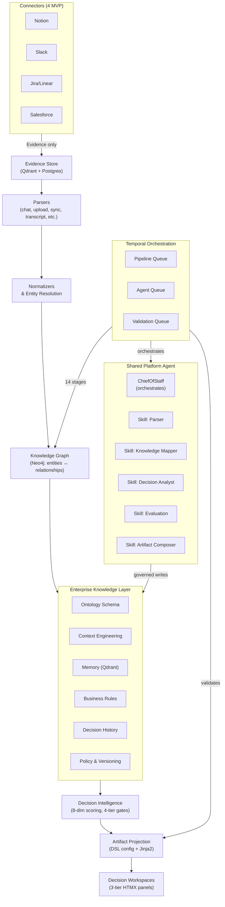

# OntologyAI V6 — Implementation Plan

**Status:** DRAFT — Milestone -1 (Domain Design) must be approved before any code
**Author:** Solution Architect
**Date:** 2026-07-27
**Branch target:** `feature/ontologyai-v6`
**Inputs:** `prd.md` (V6) + codebase audit + V5.2 plan (`PLAN_V5.1.md`) + existing `apps/ai/src/` structure
**Repo:** `/home/aparna/Desktop/iterate_swarm`

---

## 1. Architecture Overview

V6 replaces the V5.2 approach of 9 semi-independent LLM agents with a **Shared Platform Agent + Skills** model. Connectors produce *only* Evidence (no direct state mutations), and Artifacts are read-model projections from the canonical model, not source-of-truth generators. An **Enterprise Knowledge Layer** sits between raw Knowledge and Decision Intelligence, housing ontology, context, memory, business rules, decision history, policy, and versioning.

Temporal orchestrates everything across **three** isolated queues: pipeline, agent, and validation.



### V5.2 → V6 Key Architectural Simplifications

| Dimension | V5.2 | V6 |
|---|---|---|
| **Connectors** | Produce raw dicts + some state writes | Produce **only** `EvidenceRecord` — nothing else |
| **Artifacts** | Bespoke generators (12+ hardcoded) | DSL-driven projection via YAML config + Jinja2 |
| **Agent model** | 9 independent LLM personalities (ChiefOfStaff, IngestionParser, KnowledgeMapper, ConflictResolver, FeasibilityAnalyst, DecisionAnalyst, ArtifactComposer, GovernanceAgent, EvaluationAgent) | 1 **Shared Platform Agent** with ChiefOfStaff orchestrating **5 skills** (Parser, Knowledge, Decision, Evaluation, Artifact) |
| **Knowledge layer** | Flat ontology + adapter | Layered: Ontology → Context → Memory → Rules → History → Policy → Versioning |
| **Neo4j scope** | Underutilized/undefined | Narrow: Entity ↔ Relationship ↔ Evidence Links ↔ Decision Graph only |
| **Temporal queues** | Single queue | 3 queues: `pipeline`, `agent`, `validation` |
| **State model** | `EngagementState` + `MissionState` bridge | Unified **Workspace**-scoped state; `MissionState` fully deprecated |
| **Workflows** | 6 V5.2 + optional legacy | 14 pipeline stages (PRD §10) as Temporal activities; agent workflows remain lightweight orchestrators |

---

## 2. Key Architectural Decisions (ADRs)

### ADR-001: Evidence-Only Connectors

**Status:** Accepted
**Context:** V5.2 connectors produced raw data dicts that bypassed the canonical model, creating consistency problems.
**Decision:** Every connector `fetch()` returns `list[EvidenceRecord]` and nothing else. No direct state mutation, no ontology writes, no artifact generation. The pipeline owns normalization and state propagation.
**Consequences:**
- Connectors become pure adapters — no business logic
- Pipeline stage 2 (normalize) is mandatory before any state change
- Connector SDK shrinks to `connect()`, `fetch()`, `health()`

### ADR-002: Artifacts as Read Models (Projections)

**Status:** Accepted
**Context:** V5.2 artifact generators mixed reading canonical state with LLM generation, creating inconsistency.
**Decision:** Artifacts are **never** source of truth. They are generated (projected) from the canonical model + DSL config + template renderer. Every field in an artifact must be traceable to either an Evidence record or a computed Decision score.
**Consequences:**
- Artifact regeneration is idempotent and deterministic
- Same input → same output (LLM used only for narrative field filling)
- No artifact bypasses validation (PRD §16)

### ADR-003: Artifact DSL Over Bespoke Generators

**Status:** Accepted
**Context:** V5.2 had 12+ hardcoded artifact generators — every new artifact required code changes.
**Decision:** All 18 artifacts (12 external + 6 internal) are defined via declarative YAML schema:

```yaml
# Example: Executive Decision Brief
sections:
  - title: "Executive Decision Brief"
  - summary: { source: "workspace.summary", llm_augment: true }
  - evidence: { source: "evidence.top_findings", limit: 10 }
  - decisions: { source: "decisions.active" }
  - recommendations: { source: "decisions.recommendations" }
  - risks: { source: "decisions.risks", severity_filter: ">=medium" }
  - tradeoffs: { source: "decisions.tradeoffs" }
```

**Consequences:**
- New artifact = new YAML config file (no code)
- Template engine (Jinja2) renders from DSL → output
- LLM operates only on `llm_augment: true` fields

### ADR-004: Shared Platform Agent with Skills

**Status:** Accepted
**Context:** V5.2 had 9 independently-prompted agent personalities, creating prompt drift, inconsistent behavior, and high maintenance overhead.
**Decision:** Replace with one **Shared Platform Agent** whose `ChiefOfStaff` skill orchestrates a registry of deterministic + LLM-augmented **skills**:
- **Parser skill**: Classifies and routes raw input to parsers
- **Knowledge skill**: Pattern-matches entities, relationships, conflicts
- **Decision skill**: Scores feasibility, generates options, computes readiness
- **Evaluation skill**: Validates assertions, checks completeness, detects contradictions
- **Artifact skill**: Fills artifact DSL fields with LLM narrative within template bounds

**Consequences:**
- One LLM persona with typed skill outputs — no prompt duplication
- Skills share one context window budget (layered context engineering)
- New skill = new module registered with ChiefOfStaff (no new agent)

### ADR-005: Enterprise Knowledge Layer

**Status:** Accepted
**Context:** V5.2 had ontology and governance but no structured layer between knowledge and decision-making.
**Decision:** Insert a formal **Enterprise Knowledge Layer** between Knowledge Graph and Decision Intelligence containing:
1. **Ontology Registry** — entity types, relationship types, lifecycle states
2. **Context Store** — layered context assembly (tenant → engagement → stakeholder → evidence slice → ...)
3. **Memory Store** — Qdrant-based semantic memory for recurring patterns
4. **Business Rules Engine** — deterministic rule evaluation (e.g., "if risk>threshold then block")
5. **Decision History** — append-only log of past decisions and their outcomes
6. **Policy Store** — versioned policy documents for governed writes
7. **Versioning** — artifact and state versioning for replay

**Consequences:**
- Decision Intelligence reads from a curated layer, not raw graph
- Policies and rules are auditable and versioned independently of code
- Increased storage/compute cost for the layer

### ADR-006: Neo4j Scope

**Status:** Accepted
**Context:** V5.2 under-defined Neo4j usage. Risk of overloading the graph DB with non-graph data.
**Decision:** Neo4j stores **only**:
- Entity nodes (22 types from PRD §8)
- Relationship edges (typed, with cardinality and provenance)
- Evidence links (evidence → entity edges)
- Decision graph (decision → option → trade-off → outcome paths)

Everything else — sessions, users, tokens, artifacts, settings, workspace state — stays in **PostgreSQL**.

**Consequences:**
- Graph queries are fast and targeted
- PostgreSQL remains the transactional source of truth
- Qdrant handles vector similarity for dedup and memory

### ADR-007: Three Temporal Queues

**Status:** Accepted
**Context:** V5.2 single queue caused pipeline contention: artifact generation blocked evidence ingestion.
**Decision:** Three isolated Temporal task queues:

| Queue | Purpose | Workers |
|---|---|---|
| `ONTOLOGYAI-PIPELINE-QUEUE` | 14-stage knowledge pipeline (PRD §10) | Dedicated pipeline workers |
| `ONTOLOGYAI-AGENT-QUEUE` | Agent skill execution (ChiefOfStaff, skills) | AI workers (LLM-backed) |
| `ONTOLOGYAI-VALIDATION-QUEUE` | Validation engine, governance checks | Lightweight deterministic workers |

**Consequences:**
- Pipeline stages don't block agent responses
- Validation can scale independently
- Slightly more complex Temporal deployment but cleaner isolation

---

## 3. Domain Model (Milestone -1 Deliverable)

### 3.1 Entity Taxonomy (22 Types, PRD §8)

| # | Entity | Description | Lifecycle States | Key Relationships | Persistence |
|---|--------|-------------|-----------------|-------------------|-------------|
| 1 | **Evidence** | A piece of raw or parsed information | ingested, normalized, linked, conflicting, stale | links_to → Entity, sourced_from → Source | Neo4j (node) |
| 2 | **Source** | Origin of evidence | active, degraded, disconnected | produces → Evidence | Postgres |
| 3 | **Stakeholder** | Person/group with interest | identified, engaged, at_risk, blocked | owns → Entity, participates_in → Decision | Neo4j (node) |
| 4 | **OrgUnit** | Organizational entity | active, restructuring, dissolved | contains → OrgUnit, owns → Capability | Postgres |
| 5 | **Capability** | Business capability | assessed, developing, mature, deprecated | depends_on → Capability, enabled_by → System | Neo4j (node) |
| 6 | **Process** | Business process | mapped, analyzed, improved, retired | consumes → Capability, produces → Artifact | Neo4j (node) |
| 7 | **System** | IT system/app | live, sunset, migrating | supports → Process, stores → Data | Postgres |
| 8 | **Requirement** | Functional/non-functional need | proposed, accepted, in_progress, verified, rejected | constrains → Solution, traced_to → Evidence | Neo4j (node) |
| 9 | **BusinessRule** | Policy or constraint | active, superseded, deprecated | governs → Decision, triggers → Validation | Neo4j (node) |
| 10 | **Assumption** | Unverified belief | unvalidated, validated, invalidated | supports → Option, refuted_by → Evidence | Neo4j (node) |
| 11 | **Constraint** | Limitation or boundary | active, waived, removed | restricts → Solution | Postgres |
| 12 | **Risk** | Potential negative outcome | identified, analyzed, mitigated, accepted, realized | affects → Decision, mitigated_by → Option | Neo4j (node) |
| 13 | **Decision** | A choice with rationale | draft, assessed, approved, superseded | evaluates → Option, resolves → Conflict | Neo4j (node) |
| 14 | **Option** | Alternative course of action | proposed, scored, selected, discarded | evaluated_by → Decision, has → TradeOff | Neo4j (node) |
| 15 | **TradeOff** | Pros/cons of an option | open, resolved | belongs_to → Option | Postgres |
| 16 | **KPI** | Measurable indicator | baseline_set, tracking, met, missed | measures → Outcome, owned_by → Stakeholder | Postgres |
| 17 | **Project** | Work effort | initiated, planning, executing, monitoring, closed | delivers → Artifact, implements → Decision | Postgres |
| 18 | **Artifact** | Projected document | draft, valid, published, superseded | projects_from → Workspace, contains → Section | Postgres |
| 19 | **ArtifactVersion** | Versioned snapshot of artifact | current, archived | versions → Artifact | Postgres |
| 20 | **Conflict** | Contradiction between evidence/entities | open, resolving, resolved, dismissed | involves → Entity, resolved_by → Decision | Neo4j (node) |
| 21 | **ValidationResult** | Outcome of validation | pending, passed, failed, blocked | validates → Artifact, checks → Rule | Postgres |
| 22 | **FeasibilityScore** | Multi-dimension score | computed, stale, superseded | scores → Option, feeds → Decision | Postgres |
| 23 | **AuditEvent** | Immutable audit record | logged | records → Action | Postgres |
| 24 | **Workspace** (new) | Scoped decision workspace | active, archived, closed | contains → Entity, produces → Artifact | Postgres |

### 3.2 Relationship Taxonomy

| Relationship | Source Type | Target Type | Cardinality | Neo4j? | Semantics |
|---|---|---|---|---|---|
| `produces_evidence` | Source | Evidence | 1:N | Yes | Source yields one or more evidence records |
| `links_to` | Evidence | Entity | N:M | Yes | Evidence refers to one or more entities |
| `conflicts_with` | Evidence | Evidence | N:M | Yes | Evidence contradicts other evidence |
| `supports` | Evidence | Entity | N:M | Yes | Evidence supports an entity/claim |
| `refutes` | Evidence | Entity | N:M | Yes | Evidence refutes an entity/claim |
| `owned_by` | Entity | Stakeholder | N:1 | Yes | Stakeholder owns an entity |
| `depends_on` | Capability | Capability | M:N | Yes | Capability dependency |
| `enabled_by` | Capability | System | M:N | Yes | Tech enablement |
| `governs` | BusinessRule | Decision | 1:N | Yes | Rule applies to decisions |
| `evaluates` | Decision | Option | 1:N | Yes | Decision considers options |
| `resolves` | Decision | Conflict | N:M | Yes | Decision resolves conflicts |
| `triggers` | Event | Action | 1:N | Postgres | Event triggers pipeline action |
| `produces` | Workflow | Artifact | 1:N | Postgres | Pipeline produces artifact |
| `contains` | Workspace | Entity | 1:N | Postgres | Scoping relationship |

### 3.3 Evidence Model

```yaml
EvidenceRecord:
  id: string (ULID)
  tenant_id: string
  source: string              # connector name, "chat", "upload", etc.
  source_type: enum(connector, chat, upload, transcript, spreadsheet, email, screenshot, api)
  timestamp: datetime
  confidence: float [0, 1]    # parser-assigned confidence
  provenance:
    connector_version: string
    extraction_method: string
    raw_checksum: string
    retry_count: int
  structured_data: dict       # normalized key-value payload
  raw_content: string | null  # original text/context (not stored for large blobs)
  embeddings: float[] | null  # Qdrant vector (set after normalization)
  entity_refs: string[]       # resolved entity IDs (set after entity resolution)
  source_refs: string[]       # original external IDs (message URLs, doc IDs etc.)
```

### 3.4 Decision Workspace Contract (PRD §17)

Every workspace answers exactly 9 questions:

| # | Question | Source | Type |
|---|----------|--------|------|
| 1 | What is happening? | Workspace summary + evidence | Narrative + Evidence |
| 2 | Why does this matter? | Impact analysis | Score + Narrative |
| 3 | What evidence supports it? | Evidence links | List[EvidenceRecord] |
| 4 | What options exist? | Option generation | List[Option] |
| 5 | What is recommended? | Decision scoring | Decision + Justification |
| 6 | What are the trade-offs? | Trade-off analysis | List[TradeOff] |
| 7 | What happens if nothing changes? | Impact projection | Narrative + Risk |
| 8 | Who owns the decision? | Stakeholder resolution | Stakeholder |
| 9 | What changes downstream? | Blast-radius analysis | List[Entity] |

### 3.5 Artifact DSL Schema (PRD §11-12)

```yaml
# apps/ai/src/artifacts/registry/executive_brief.yaml
artifact:
  id: "executive-decision-brief"
  name: "Executive Decision Brief"
  type: external  # or "internal"
  audience: ["CEO", "board", "executives"]
  model_dependencies:
    - workspace.summary
    - evidence.top_findings
    - decisions.active
    - decisions.recommendations
    - decisions.risks
    - decisions.tradeoffs

sections:
  - name: "Header"
    type: "title"
    source: "workspace.title"

  - name: "Executive Summary"
    type: "summary"
    source: "workspace.summary"
    llm_augment: true

  - name: "Key Evidence"
    type: "evidence_list"
    source: "evidence.top_findings"
    config:
      max_items: 10
      sort_by: "confidence"
      min_confidence: 0.7

  - name: "Active Decisions"
    type: "decision_table"
    source: "decisions.active"
    config:
      include_tradeoffs: true

  - name: "Recommendations"
    type: "recommendation_list"
    source: "decisions.recommendations"
    llm_augment: true

  - name: "Risk Assessment"
    type: "risk_matrix"
    source: "decisions.risks"
    config:
      severity_filter: ">=medium"

  - name: "Downstream Impact"
    type: "impact_analysis"
    source: "decisions.blast_radius"
```

### 3.6 Pipeline Stage Definitions (14 Stages, PRD §10)

```mermaid
flowchart LR
    S1[1. Ingest] --> S2[2. Parse]
    S2 --> S3[3. Normalize]
    S3 --> S4[4. Dedupe]
    S4 --> S5[5. Alias Resolve]
    S5 --> S6[6. Entity/Relationship Build]
    S6 --> S7[7. Conflict Detection]
    S7 --> S8[8. Knowledge Graph Update]
    S8 --> S9[9. Gap Analysis]
    S9 --> S10[10. Decision Analysis]
    S10 --> S11[11. Feasibility Scoring]
    S11 --> S12[12. Artifact Projection]
    S12 --> S13[13. Validation]
    S13 --> S14[14. Publish]
```



| Stage | Name | Queue | Deterministic? | Description |
|-------|------|-------|----------------|-------------|
| 1 | Ingest | pipeline | Yes | Accept raw input, store in Evidence store |
| 2 | Parse | pipeline | LLM-augmented | Classify input, extract structured data |
| 3 | Normalize | pipeline | Yes | Convert to canonical `EvidenceRecord` shape |
| 4 | Dedupe | pipeline | Yes | Qdrant similarity + rule-based entity merge |
| 5 | Alias Resolve | pipeline | Yes | Resolve aliases to canonical entity IDs |
| 6 | Entity/Relationship Build | pipeline | LLM-augmented | Pattern-match entities and relationships |
| 7 | Conflict Detection | pipeline | Yes | Detect contradictions between evidence |
| 8 | Knowledge Graph Update | pipeline | Yes | Write entity/relationship/evidence to Neo4j |
| 9 | Gap Analysis | pipeline | Yes | Identify missing coverage |
| 10 | Decision Analysis | agent | LLM-augmented | Generate options, score feasibility |
| 11 | Feasibility Scoring | pipeline | Yes | Compute 8-dimension scores |
| 12 | Artifact Projection | agent | LLM-augmented | Render artifacts from DSL config |
| 13 | Validation | validation | Yes | Check 6 block conditions (PRD §16) |
| 14 | Publish | validation | Yes | Make artifact available in workspace |

### 3.7 Validation Rules (6 Block Conditions, PRD §16)

```yaml
validation_rules:
  - id: V001
    name: "Requirement evidence check"
    condition: "Every Requirement must link to ≥1 Evidence"
    severity: block
  - id: V002
    name: "Claim traceability"
    condition: "Every claim in artifact must trace to Evidence or computed score"
    severity: block
  - id: V003
    name: "Model-artifact consistency"
    condition: "No artifact section conflicts with the canonical model"
    severity: block
  - id: V004
    name: "KPI completeness"
    condition: "Every KPI must have baseline + owner"
    severity: block
  - id: V005
    name: "Numeric reconciliation"
    condition: "All numeric claims reconcile with source evidence"
    severity: block
  - id: V006
    name: "Policy compliance"
    condition: "No policy or governance rule is violated"
    severity: block
```

### 3.8 Graph Patterns (Neo4j vs Postgres)

**Neo4j (entity-relationship graph):**
- Entity nodes: Evidence, Stakeholder, Capability, Process, Requirement, BusinessRule, Assumption, Risk, Decision, Option, Conflict
- Relationship edges: `links_to`, `conflicts_with`, `supports`, `refutes`, `owned_by`, `depends_on`, `enabled_by`, `governs`, `evaluates`, `resolves`
- Decision subgraph: Decision → Option → TradeOff → Outcome
- Purpose: Graph traversal for blast-radius, dependency analysis, decision lineage

**Postgres (transactional/relational):**
- Source, OrgUnit, System, Constraint, KPI, Project, Artifact, ArtifactVersion, ValidationResult, FeasibilityScore, AuditEvent, Workspace
- Session, user, token, workspace settings
- All relational joins, pagination, and CRUD operations
- Purpose: Transactional consistency, workspace state management, artifact storage

---

## 4. 7-Milestone Implementation Roadmap

### Milestone -1: Domain/Ontology Design (NO CODE)

**Goal:** Freeze all schema and behavioral contracts before writing any code.

**Expected outcome:** This document (§3) approved; Mermaid diagrams reviewed; no ambiguity in entity/relationship/evidence/decision models.

**Files to create:**
| File | Purpose |
|------|---------|
| `docs/v6/entity_taxonomy.md` | 22 entity types with fields, lifecycle, validation rules |
| `docs/v6/relationship_taxonomy.md` | All relationship types, cardinality, Neo4j/Postgres split |
| `docs/v6/evidence_model.md` | EvidenceRecord schema, normalizer contracts |
| `docs/v6/decision_workspace.md` | 9-question contract, scoring model |
| `docs/v6/artifact_registry/` | One YAML per artifact (18 total) |
| `docs/v6/graph_patterns.md` | Which edges live in Neo4j vs Postgres |
| `docs/v6/pipeline_stages.md` | 14 stages with I/O contracts |
| `docs/v6/validation_rules.md` | 6 block conditions with test cases |

**Files to modify (documentation only):**
- `prd.md` — frozen; already V6

**Key design decisions:**
- All schema decisions lock before Milestone 0
- No code changes during -1 — only design artifacts
- Entity IDs use ULID format for distributed generation

**Acceptance criteria:**
- All 22 entities defined with fields, lifecycle states, and relationship types
- All 14 pipeline stages defined with input/output contracts
- All 18 artifacts have DSL YAML configs
- All 6 validation rules have executable test cases
- Neo4j scope clearly bounded (entity/relationship/evidence/decision only)
- Design reviewed by ≥2 stakeholders

---

### Milestone 0: Platform Foundation

**Goal:** Build infrastructure: databases, queues, SDK contracts, and dependency setup.

**Files to create:**
| File | Purpose |
|------|---------|
| `docker-compose.v6.yml` | Add Neo4j 5 (with APOC), shared volume |
| `apps/core/migrations/004_v6_entities.sql` | 18 new Postgres tables (workspaces, sources, systems, constraints, KPIs, projects, artifacts, versions, validation results, feasibility scores, audit events + relationship/join tables) |
| `apps/ai/src/connectors/v6_contract.py` | V6 Connector contract — `fetch() -> list[EvidenceRecord]` only |
| `apps/ai/src/connectors/notion_connector.py` | Notion MVP connector |
| `apps/ai/src/connectors/slack_connector_v6.py` | Slack MVP connector (V6 contract) |
| `apps/ai/src/connectors/jira_connector.py` | Jira/Linear MVP connector |
| `apps/ai/src/connectors/salesforce_v6.py` | Salesforce MVP connector (V6 contract) |
| `apps/ai/src/evidence/v6_models.py` | V6 EvidenceRecord schema |
| `apps/ai/src/evidence/normalizer_registry.py` | Normalizer registry |
| `apps/ai/src/temporal/queues.py` | 3-queue constant definitions |
| `apps/ai/src/session/workspace_store.py` | Workspace CRUD (Postgres) |
| `config/neo4j/init.cypher` | Initial Neo4j constraints + indexes |

**Files to modify:**
| File | Change |
|------|--------|
| `docker-compose.yml` | Add Neo4j 5 service definition |
| `apps/ai/pyproject.toml` | Add: `neo4j`, `slack-sdk`, `jira`, `notion-client`, `simple-salesforce`, `Jinja2`, `PyYAML` |
| `apps/core/go.mod` | Add: `github.com/neo4j/neo4j-go-driver/v5` |
| `apps/ai/src/connectors/base.py` | Refactor `fetch()` to return `list[EvidenceRecord]` |
| `apps/ai/src/orchestration/queue.py` | Add `ONTOLOGYAI_PIPELINE_QUEUE`, `ONTOLOGYAI_AGENT_QUEUE`, `ONTOLOGYAI_VALIDATION_QUEUE` |
| `apps/ai/src/worker.py` | 3-worker bootstrap (pipeline, agent, validation) |

**Files to delete:**
| File | Reason |
|------|--------|
| `apps/ai/src/orchestration/queue.py` (full rewrite) | V5.2 single queue replaced by 3-queue model |

**Key design decisions:**
- Neo4j 5 with APOC plugin for graph algorithms
- Postgres migrations for 18 new tables (V6 entities only — V5.2 tables remain for backward compat)
- Connector V6 contract returns typed `EvidenceRecord` only; old `_add_metadata` helper retired
- Temporal 3-queue bootstrap uses one `Worker` per queue (can be same process or different)
- Qdrant collection `v6_evidence_embeddings` created for evidence vectors

**Acceptance criteria:**
- `docker compose -f docker-compose.v6.yml up` brings Neo4j 5 + APOC
- 18 new Postgres tables exist and are indexed
- 4 MVP connectors compile and return `list[EvidenceRecord]`
- 3 Temporal queues registered and resolvable
- All Python + Go dependencies install
- 901 existing Python tests + 74 Go tests remain green (no regression)

---

### Milestone 0.5: Vertical Slice Proof

**Goal:** Run one complete end-to-end flow from a mock connector through the entire pipeline to a published workspace artifact. This proves the architecture is sound before scaling to all 4 connectors.

**Scope:** Single mock connector → Evidence → Normalization → Entity → Neo4j → Knowledge Model → Decision → One Artifact (Executive Brief) → Validation → Workspace

**Files to create:**
| File | Purpose |
|------|---------|
| `apps/ai/src/connectors/mock_connector.py` | Mock connector returning test evidence |
| `apps/ai/src/pipeline/vertical_slice.py` | Orchestrator for the end-to-end flow |
| `apps/ai/tests/v6/test_vertical_slice.py` | Integration test for the complete flow |
| `config/neo4j/test_data.cypher` | Seed data for integration tests |
| `apps/core/internal/v6/query_test.go` | Neo4j query integration test |

**Entities covered (first wave):**
- Evidence, Source, Stakeholder, Requirement, Decision, Workspace

**Acceptance criteria:**
- Mock connector produces EvidenceRecord
- Evidence normalization succeeds (structured_data populated)
- Entity resolution creates Neo4j nodes
- Graph traversal returns correct triples
- Decision can be created with evidence backing
- One artifact (Executive Brief) is projected via DSL
- Validation passes (all evidence-backed claims)
- Workspace shows published artifact
- Pipeline runs in <30s on local Docker

**Decision:** If this vertical slice fails, fix the architecture before adding more connectors. If it passes, Milestone 1 becomes a scaling exercise.

---

### Milestone 1: Evidence & Knowledge

**Goal:** Implement the pipeline stages from Ingest through Knowledge Graph Update (stages 1–8).

**Files to create:**
| File | Purpose |
|------|---------|
| `apps/ai/src/evidence/parsers/__init__.py` | Parser registry |
| `apps/ai/src/evidence/parsers/chat_parser.py` | Chat message parser |
| `apps/ai/src/evidence/parsers/upload_parser.py` | File upload parser |
| `apps/ai/src/evidence/parsers/connector_parser.py` | Connector sync parser |
| `apps/ai/src/evidence/parsers/transcript_parser.py` | Meeting transcript parser |
| `apps/ai/src/evidence/parsers/spreadsheet_parser.py` | Spreadsheet parser |
| `apps/ai/src/evidence/parsers/email_parser.py` | Email export parser |
| `apps/ai/src/evidence/parsers/screenshot_parser.py` | Screenshot (OCR) parser |
| `apps/ai/src/evidence/normalizers/notion_normalizer.py` | Normalizer for Notion evidence |
| `apps/ai/src/evidence/normalizers/slack_normalizer.py` | Normalizer for Slack evidence |
| `apps/ai/src/evidence/normalizers/jira_normalizer.py` | Normalizer for Jira evidence |
| `apps/ai/src/evidence/normalizers/salesforce_normalizer.py` | Normalizer for Salesforce evidence |
| `apps/ai/src/knowledge/entity_resolver.py` | Entity resolution + dedup engine |
| `apps/ai/src/knowledge/graph_builder.py` | Neo4j entity/relationship builder |
| `apps/ai/src/knowledge/conflict_detector.py` | Conflict detection engine |
| `apps/ai/src/knowledge/gap_analyzer.py` | Gap analysis engine |
| `apps/ai/src/knowledge/alias_resolver.py` | Alias resolution (rule + similarity) |
| `apps/ai/src/agents/skills/knowledge_skill.py` | Platform Agent Knowledge skill |
| `apps/ai/src/agents/skills/parser_skill.py` | Platform Agent Parser skill |

**Files to modify:**
| File | Change |
|------|--------|
| `apps/ai/src/evidence/normalizer.py` | Refactor to use normalizer registry pattern |
| `apps/ai/src/ontology/adapter.py` | Add mapping: EvidenceRecord → Neo4j entity nodes |
| `apps/ai/src/agents/authority_manifest.py` | Add V6 skill authorities |

**Key design decisions:**
- Entity resolution first pass: Qdrant cosine similarity (0.85+ threshold) → rule-based merge → LLM-augmented classification for ambiguous cases
- Neo4j writes are batched (100 nodes/transaction) for performance
- Conflict detection is deterministic: same evidence + same claim = check contradiction via structured_data hash
- Gap analysis: compare required entity types per workspace with existing nodes
- **Entity implementation waves (progressively validated):**
  - **First wave** (Milestone 0.5 + early Milestone 1): Evidence, Source, Stakeholder, Requirement, Decision, Workspace
  - **Second wave** (mid Milestone 1): Capability, Process, System, Risk, KPI, Project
  - **Third wave** (late Milestone 1): BusinessRule, Assumption, Constraint, TradeOff, ValidationResult, FeasibilityScore, AuditEvent, Artifact, ArtifactVersion, OrgUnit, EnterpriseKnowledge

**Acceptance criteria:**
- 9 parsers produce valid `EvidenceRecord` from raw input
- 4 normalizers map connector data to canonical structure
- Entity resolution correctly merges duplicate entities (≥90% precision on test set)
- Neo4j graph builder creates entity/relationship nodes with evidence links
- Conflict detector catches contradictory evidence with >80% recall
- Gap analyzer correctly identifies missing entity coverage
- All pipeline stages 1–8 pass Temporal replay tests

---

### Milestone 2: Decision Intelligence

**Goal:** Implement stages 9–11: Gap Analysis → Decision Analysis → Feasibility Scoring.

**Files to create:**
| File | Purpose |
|------|---------|
| `apps/ai/src/decision/feasibility_scorer.py` | 8-dimension scoring engine |
| `apps/ai/src/decision/readiness_gates.py` | 4-tier readiness computation |
| `apps/ai/src/decision/tradeoff_analyzer.py` | Trade-off analysis engine |
| `apps/ai/src/decision/recommendation_engine.py` | Evidence-backed recommendation generator |
| `apps/ai/src/decision/option_generator.py` | Options generation from evidence gaps |
| `apps/ai/src/decision/workspace_contract.py` | 9-question workspace answer builder |
| `apps/ai/src/agents/skills/decision_skill.py` | Platform Agent Decision skill |
| `apps/ai/src/agents/skills/evaluation_skill.py` | Platform Agent Evaluation skill |

**Files to modify:**
| File | Change |
|------|--------|
| `apps/ai/src/schemas/engagement_state.py` | Add V6 decision fields (readiness, feasibility, options) |
| `apps/ai/src/ontology/governance.py` | Add decision-scoped write policies |

**Key design decisions:**
- 8-dimension scoring is **deterministic code** with evidence-derived inputs — LLM only for narrative
- Readiness gate computation is pure math: weighted sum → tier
- Trade-off analysis compares ranked option pairs
- Recommendation engine requires ≥1 evidence link per option
- Workspace contract assembly is template-driven (predefined narrative structures filled from model)

**Feasibility scoring dimensions:**
| Dimension | Weight | Source | Scale |
|-----------|--------|--------|-------|
| Business Value | 25% | Stakeholder scoring, KPI targets | 0–100 |
| Technical Complexity | 15% | System dependency analysis | 0–100 (inverted) |
| Operational Fit | 15% | Capability maturity | 0–100 |
| Financial Impact | 20% | Cost/benefit from evidence | -100–100 |
| Compliance Risk | 10% | BusinessRule check | 0–100 (inverted) |
| Data Readiness | 5% | Evidence coverage score | 0–100 |
| Change Effort | 5% | Org impact analysis | 0–100 (inverted) |
| Stakeholder Alignment | 5% | Stakeholder sentiment from evidence | 0–100 |

**Acceptance criteria:**
- 8-dimension scorer produces deterministic scores from same inputs
- 4-tier gates correctly classify (85+ publish, 70–84 caveats, 60–69 review, <60 block)
- Trade-off analyzer highlights top 3 pros/cons per option
- Recommendation engine never recommends without evidence backing
- Workspace contract returns all 9 answers
- Option generator produces ≥2 options per decision with evidence gaps noted

---

### Milestone 3: Artifact Projection

**Goal:** Implement stages 12–14: Artifact Projection → Validation → Publish.

**Files to create:**
| File | Purpose |
|------|---------|
| `apps/ai/src/artifacts/__init__.py` | Artifact module init |
| `apps/ai/src/artifacts/dsl_loader.py` | YAML DSL config loader |
| `apps/ai/src/artifacts/template_engine.py` | Jinja2 template renderer |
| `apps/ai/src/artifacts/registry/` | 18 YAML artifact configs |
| `apps/ai/src/artifacts/evidence_linker.py` | Auto-link artifact fields to Evidence |
| `apps/ai/src/artifacts/validator.py` | 6 block conditions + validation logic |
| `apps/ai/src/artifacts/versioning.py` | Artifact version manager |
| `apps/ai/src/artifacts/projection_engine.py` | Main projection orchestrator |
| `apps/ai/src/agents/skills/artifact_skill.py` | Platform Agent Artifact skill |
| `apps/ai/src/temporal/pipeline_workflow.py` | 14-stage pipeline Temporal workflow |

**Files to modify:**
| File | Change |
|------|--------|
| `apps/ai/src/evidence/models.py` | Add artifact-linking fields |
| `apps/ai/src/session/workspace_store.py` | Add artifact CRUD |

**Files to delete:**
| File | Reason |
|------|--------|
| `apps/ai/src/runtime/artifact_export.py` | Replaced by DSL + projection engine |
| `apps/ai/src/runtime/n8n_compiler.py` | V5.2 runtime compiler — not in V6 scope |
| `apps/ai/src/runtime/custom_agent_compiler.py` | V5.2 runtime compiler — not in V6 scope |

**Key design decisions:**
- DSL loader validates YAML against a JSON Schema before loading
- Jinja2 templates are sandboxed (no arbitrary Python execution)
- Evidence linker traverses workspace entity → evidence links → matching artifact fields
- Validation is fully deterministic: same model state → same validation outcome
- Artifact versioning is append-only; published artifacts never mutate
- 6 block conditions checked in order; first failure short-circuits with error report

**Acceptance criteria:**
- 18 YAML artifact configs load and validate
- Jinja2 renderer produces all 18 artifact types from DSL
- Evidence linker auto-populates artifact fields with linked Evidence
- 6 block conditions correctly block invalid artifact publication
- Artifact versioning: publish creates new version, never mutates old
- Full pipeline (stages 1–14) executes end-to-end

---

### Milestone 4: Workflow & Governance

**Goal:** Temporal pipeline orchestration, HITL signals, governance agent, audit.

**Files to create:**
| File | Purpose |
|------|---------|
| `apps/ai/src/temporal/pipeline_orchestrator.py` | 14-stage orchestrator with error handling |
| `apps/ai/src/temporal/pipeline_activities.py` | Deterministic pipeline activities |
| `apps/ai/src/temporal/agent_activities.py` | LLM-augmented agent activities |
| `apps/ai/src/temporal/validation_activities.py` | Validation activities |
| `apps/ai/src/governance/blast_radius.py` | Blast-radius analyzer |
| `apps/ai/src/governance/approval_router.py` | HITL approval routing |
| `apps/ai/src/governance/audit_logger.py` | Audit event logging |
| `apps/ai/src/governance/governed_writes_v6.py` | V6 governed-write decorator |
| `apps/ai/src/agents/shared_platform_agent.py` | Shared Platform Agent (ChiefOfStaff + skills) |

**Files to modify:**
| File | Change |
|------|--------|
| `apps/ai/src/ontology/governance.py` | Bridge to V6 governance until fully migrated |
| `apps/ai/src/workers.py` (rewrite) | 3-queue worker bootstrap with continue-as-new at 500 events |
| `apps/core/internal/web/handler.go` | V6 route map (workspaces, evidence endpoints) |
| `apps/core/internal/web/sse_hub.go` | Add workspace-scoped SSE channels |

**Files to delete:**
| File | Reason |
|------|--------|
| `apps/ai/src/agents/cofounder/router.py` | Replaced by ChiefOfStaff skill orchestrator |
| `apps/ai/src/agents/cofounder/` | V5.2 agent personality directory |

**Key design decisions:**
- Pipeline orchestrator uses Temporal `continueAsNew` at 500 history events
- HITL signals use existing `SignalWorkflow("hitl-approval")` pattern (reuse from V5.2)
- Governance agent enforces: no evidence = no artifact; no traceability = block; unresolved conflict = reject
- Blast-radius computed via Neo4j graph traversal (entity → relationship → dependent entities)
- Audit events are immutable; stored in Postgres `audit_events` table
- Shared Platform Agent routes incoming messages to skills via intent classification

**Acceptance criteria:**
- 3-queue Temporal workers start independently
- Pipeline orchestrator executes all 14 stages with continue-as-new
- HITL signals block high-blast-radius actions
- Governance agent correctly blocks invalid publishes
- Audit events logged for every state change
- `continueAsNew` fires at ≤500 events

---

### Milestone 5: Evaluation & UX

**Goal:** HTMX decision workspace, observability, evaluation metrics, backward compat.

**Files to create:**
| File | Purpose |
|------|---------|
| `apps/core/internal/web/templates/decision_workspace.html` | Main workspace panel |
| `apps/core/internal/web/templates/partials/workspace_evidence.html` | Evidence panel partial |
| `apps/core/internal/web/templates/partials/workspace_decisions.html` | Decisions panel partial |
| `apps/core/internal/web/templates/partials/workspace_artifacts.html` | Artifacts panel partial |
| `apps/core/internal/web/templates/partials/workspace_approvals.html` | Approvals panel partial |
| `apps/core/internal/web/templates/partials/workspace_graph.html` | Knowledge graph visualization |
| `apps/ai/src/evaluation/metrics_collector.py` | 12 evaluation metric collectors |
| `apps/ai/src/evaluation/test_matrix.py` | V6 test matrix runner |
| `apps/core/internal/web/handler_v6.go` | V6 route handlers (new file, clean break) |

**Files to modify:**
| File | Change |
|------|--------|
| `apps/core/internal/web/handler.go` | Add V6 routes (keep V5.2 routes for backward compat) |
| `apps/core/internal/web/sse_hub.go` | Add workspace-scoped SSE subscriptions |
| `apps/ai/src/worker.py` | Wire Prometheus metrics for pipeline stages |

**Files to delete:**
| File | Reason |
|------|--------|
| `apps/core/internal/web/templates/command_center.html` | Replaced by decision_workspace.html |
| `apps/core/internal/web/templates/partials/command_chat.html` | Merged into workspace evidence panel |

**Key design decisions:**
- 3-tier HTMX architecture: workspace overview (tier 1) → evidence/decisions/artifacts panels (tier 2) → detail drill-downs (tier 3)
- SSE streams per workspace (not global) for targeted updates
- Prometheus metrics: pipeline stage latency, error rate, throughput
- 12 evaluation metrics match PRD §22 exactly
- V5.2 routes deprecated but kept for 1 version with a deprecation header

**Evaluation metrics (PRD §22):**
| # | Metric | Collection |
|---|--------|------------|
| 1 | Parser accuracy | % of parsed evidence with confidence ≥0.8 |
| 2 | Entity merge accuracy | Precision/recall on dedup test set |
| 3 | Conflict detection rate | % of true conflicts detected |
| 4 | Evidence coverage | % of workspace entities with ≥1 evidence link |
| 5 | Traceability coverage | % of artifact claims with traceable source |
| 6 | Artifact completeness | % of DSL sections populated |
| 7 | Decision readiness | Average readiness score across workspaces |
| 8 | Feasibility calibration | Variance between scored and actual outcomes |
| 9 | Human override rate | % of governance blocks overridden |
| 10 | Stakeholder usefulness | Survey score (target >4.0/5.0) |
| 11 | Regeneration correctness | Same inputs → same outputs test |
| 12 | Freshness | Age of oldest evidence in active workspaces |

**Test matrix (PRD §25):**
| Layer | Tests | Count |
|-------|-------|-------|
| Unit | Parsers, merge logic, scoring, template rendering, validators | 150+ |
| Integration | Connectors, evidence flow, artifact projection, approval gates | 50+ |
| Temporal | Replay, pause/resume, retries, signals, updates, continue-as-new | 30+ |
| Adversarial | Conflicting sources, missing fields, duplicates, stale data, prompt injection, malformed files, inconsistent numbers | 25+ |
| E2E | Executive brief → PRD → Architecture → RTM → Delivery plan → Measurement pack | 5 |

**Acceptance criteria:**
- All HTMX panels render with real workspace data
- SSE streams deliver real-time pipeline updates to correct workspace
- Prometheus metrics visible in Grafana
- 12 evaluation metrics collected and reportable
- Full test matrix passes (260+ tests)
- V5.2 backward-compat routes return deprecation header
- 901 Python + 74 Go tests remain green

---

## 5. Risk Assessment

### Top Risks

| # | Risk | Likelihood | Impact | Mitigation |
|---|------|-----------|--------|------------|
| R1 | **Domain model instability** — 22 entities + 14 stages is complex; early schema changes cause cascading rework | Medium | High | Milestone -1 freezes all schemas before code; design review with ≥2 stakeholders |
| R2 | **Neo4j performance** — graph queries on 22 entity types with complex traversals may be slow | Medium | Medium | Narrow Neo4j scope (ADR-006); batch writes (100 txns); APOC for path finding; benchmark before Milestone 2 |
| R3 | **Artifact DSL expressiveness** — YAML config may not cover all 18 artifact shapes | Medium | Medium | DSL supports `llm_augment: true` for narrative fields; fallback to custom Jinja2 templates if DSL insufficient |
| R4 | **Evidence quality** — connector data may be inconsistent, incomplete, or contradictory | High | Medium | Multiple parsers; confidence scoring; conflict detection; validation gates block low-quality evidence from artifacts |
| R5 | **Temporal queue contention** — 3 queues add deployment complexity | Low | Medium | Queues can run in same process; scale workers per queue independently; monitoring per-queue latency |
| R6 | **Migration complexity from V5.2** — 14 existing workflows, 9 agents, 6 object types to deprecate | High | Medium | Bridge mode: V5.2 tables/workflows remain for 1 version; feature flag (`ENABLE_V6=on`); backward-compat routes |
| R7 | **Shared Platform Agent prompt complexity** — one agent with 5 skills may confuse intents | Medium | High | Strong intent classification via ChiefOfStaff; typed I/O per skill; deterministic routing before LLM |
| R8 | **Test suite explosion** — 260+ new tests strain CI | Low | Medium | Parallel test execution; tiered test run (unit always, integration on PR, E2E nightly) |
| R9 | **Vertical slice reveals architecture flaw** — end-to-end test exposes design problem that requires revisiting earlier decisions | Medium | High | Milestone 0.5 is explicitly a proof milestone; architecture changes are expected and accepted before scaling |

### What Preserves from V5.2 vs Rewrites

**Preserved (reuse):**
- Go HTTP server (Fiber), HTMX framework, SSE hub pattern, Temporal client
- `governance.py` decorator pattern (`@governed_write`) — repurposed for V6 rules
- `EvidenceRecord` model (V5.2 `evidence/models.py` — extended for V6)
- Connector base class pattern (`apps/ai/src/connectors/base.py` — `fetch()` contract refactored)
- Timeline/Neo4j APOC plugin for graph algorithms
- Pydantic `extra="forbid", strict=True` convention across all schemas
- Temporal `SignalWorkflow("hitl-approval")` HITL pattern
- Qdrant client setup for vector embeddings

**Full rewrite:**
- **Agent model**: 9 independent agents → 1 Shared Platform Agent + 5 skills
- **Artifact generation**: 12+ hardcoded generators → DSL config + Jinja2 template engine
- **Connector contract**: raw dicts → typed `EvidenceRecord` only
- **Worker/queue setup**: single worker → 3-queue bootstrap
- **Pipeline orchestration**: ad-hoc → 14 deterministic stages in Temporal
- **Decision engine**: minimal → full 8-dimension feasibility + 4-tier readiness + trade-off analysis
- **Knowledge layer**: flat ontology → layered (Ontology → Context → Memory → Rules → History → Policy → Versioning)
- **UI**: command center → 3-tier decision workspace with scoped SSE
- **Test matrix**: organic → structured (Unit → Integration → Temporal → Adversarial → E2E)

**Deprecated (removed in V6):**
- `MissionState` fully removed (V5.2 bridge deleted)
- `runtime/` compilers (n8n, custom_agent) — not in V6 scope
- 11 legacy V4.1 workflows (Pulse, Investor, SelfAnalysis, etc.)
- `cofounder/router.py` — replaced by ChiefOfStaff skill orchestrator
- `command_center.html` — replaced by decision workspace panels

---

*End of plan. Milestone -1 must be approved before any code changes.*

*Branch: `feature/ontologyai-v6` | Base: `main` | PR title: "OntologyAI V6 — Decision Intelligence Platform"*
