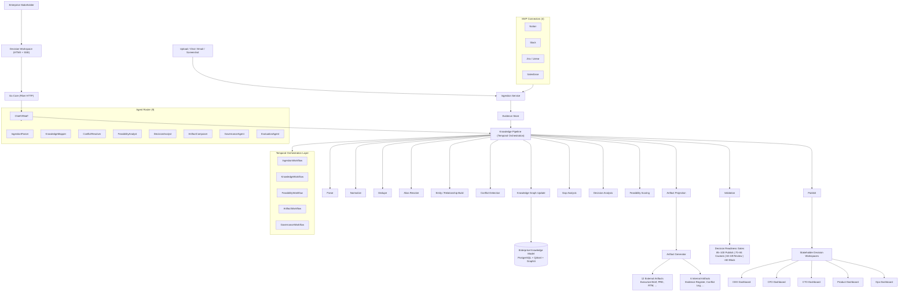

# OntologyAI V6 — Decision Intelligence Platform

<p align="center">

</p>

> **Convert fragmented enterprise evidence into a living Enterprise Knowledge Model and stakeholder-specific Decision Workspaces.** OntologyAI V6 ingests evidence from connected systems, builds a canonical knowledge graph, detects conflicts, scores feasibility, and projects decision-ready artifacts for every stakeholder — CEO to engineer — without autonomous side effects.

[](#getting-started)
[](#test-coverage)
[](https://go.dev)
[](https://www.python.org)
[](#v6-summary)

---

## Table of Contents

- [Vision](#vision)
- [Product Principle](#product-principle)
- [Who it is for](#who-it-is-for)
- [Scope](#scope)
- [Canonical Data Model](#canonical-data-model)
- [Knowledge Pipeline](#knowledge-pipeline)
- [Agent Roster](#agent-roster)
- [Artifact Catalog](#artifact-catalog)
- [Feasibility & Decision Readiness](#feasibility--decision-readiness)
- [Architecture](#architecture)
- [Project Structure](#project-structure)
- [Getting Started](#getting-started)
- [Key Metrics](#key-metrics)
- [Test Coverage](#test-coverage)

---

## Vision

Enterprise knowledge is scattered across meetings, docs, chat, spreadsheets, CRM, and ERP — creating duplicated effort, inconsistent decisions, and slow alignment. OntologyAI V6 converts that fragmented evidence into a **living Enterprise Knowledge Model** and **stakeholder-specific Decision Workspaces** that answer:

- What is happening?
- Why does it matter?
- What evidence supports it?
- What options exist?
- What is recommended?
- What are the trade-offs?
- What happens if nothing changes?
- Who owns the decision?
- What changes downstream?

**Outcome:** One canonical model, many synchronized stakeholder views, and validated decision-ready artifacts.

## Product Principle

**Evidence first, knowledge second, decision third, artifact last.**

No evidence → no artifact. No traceability → block. Low confidence → human review. Unresolved conflict → reject publish. Every layer depends on the layer before it.

## Who it is for

| Role | What they get |
|------|---------------|
| **CEO / COO** | Executive Decision Brief, Org / Ownership Map, Current-State Pack |
| **CFO** | Feasibility & Options Report, Measurement Pack, Feasibility Scorecard |
| **CTO / Enterprise Architect** | Solution Architecture Pack, Requirements Traceability Matrix |
| **Product Leaders** | PRD / Solution Brief, User Stories + Acceptance Criteria, Wireframes / Storyboards |
| **Business Analysts** | Stakeholder Register + Influence Matrix, Current-State Pack |
| **Ops Leads** | Delivery Plan (WBS + roadmap + RACI), Evidence Register |
| **Implementation Teams** | All 18 artifacts, full traceability and audit trail |

## Scope

**MVP supports 4 connectors only:**

| Connector | Purpose |
|-----------|---------|
| **Notion** | Docs, product specs, meeting notes, wikis |
| **Slack** | Conversations, decisions, async discussions |
| **Jira / Linear** | Issues, epics, tickets, sprint data |
| **Salesforce** | CRM data, opportunities, account hierarchies |

All other systems are future adapters behind the same connector interface.

### What V6 is not

- No freeform document generation
- No autonomous side effects
- No generic chatbot
- No broad connector sprawl
- No production deployment automation

## Canonical Data Model

V6 defines **22 canonical entity types** that form the Enterprise Knowledge Model:

| # | Entity | Description |
|---|--------|-------------|
| 1 | **Evidence** | Raw fact with source, timestamp, confidence, provenance |
| 2 | **Source** | Origin system or channel (connector, upload, chat, etc.) |
| 3 | **Stakeholder** | Person or role with influence and interests |
| 4 | **OrgUnit** | Organizational unit, team, or department |
| 5 | **Capability** | Business capability or function |
| 6 | **Process** | Business process or workflow |
| 7 | **System** | Software system, tool, or platform |
| 8 | **Requirement** | Functional or non-functional requirement |
| 9 | **BusinessRule** | Policy, invariant, or business logic |
| 10 | **Assumption** | Accepted premise without full evidence |
| 11 | **Constraint** | Limitation or boundary condition |
| 12 | **Risk** | Identified risk with impact and likelihood |
| 13 | **Decision** | Recorded decision with rationale and date |
| 14 | **Option** | Considered alternative or choice |
| 15 | **TradeOff** | Comparison of two or more options |
| 16 | **KPI** | Key performance indicator with baseline/target |
| 17 | **Project** | Initiative, program, or workstream |
| 18 | **Artifact** | Generated document or deliverable |
| 19 | **ArtifactVersion** | Versioned snapshot of an artifact |
| 20 | **Conflict** | Detected contradiction between evidence/entities |
| 21 | **ValidationResult** | Result of a validation check |
| 22 | **FeasibilityScore** | Multi-dimensional feasibility score |
| 23 | **AuditEvent** | Immutable audit log entry |

## Knowledge Pipeline

```
Ingest → Parse → Normalize → Dedupe → Alias Resolve →
Entity/Relationship Build → Conflict Detection →
Knowledge Graph Update → Gap Analysis → Decision Analysis →
Feasibility Scoring → Artifact Projection → Validation → Publish
```

Each stage is a deterministic activity (Temporal) that reads from and writes to the canonical model. No stage bypasses validation.

| Stage | Responsibility |
|-------|----------------|
| **Ingest** | Accept raw data from 4 MVP connectors + uploads + chat |
| **Parse** | Convert raw data into typed Evidence objects |
| **Normalize** | Standardize formats, dates, references |
| **Dedupe** | Merge duplicate evidence from overlapping sources |
| **Alias Resolve** | Map aliases (e.g. "Acme Inc" ↔ "Acme Corporation") |
| **Entity/Relationship Build** | Construct canonical entities and links |
| **Conflict Detection** | Identify contradictions across sources |
| **Knowledge Graph Update** | Persist to the Enterprise Knowledge Model |
| **Gap Analysis** | Identify missing evidence or relationships |
| **Decision Analysis** | Surface decisions, options, and trade-offs |
| **Feasibility Scoring** | Score across 8 dimensions |
| **Artifact Projection** | Generate external and internal artifacts |
| **Validation** | Run all validation gates before publishing |
| **Publish** | Release artifacts to Decision Workspaces |

## Agent Roster

| # | Agent | Responsibility |
|---|-------|----------------|
| 1 | **ChiefOfStaff** | Front-door orchestrator, context assembly, routing, state merge |
| 2 | **IngestionParser** | Parse raw input into typed Evidence; handle all 4 connectors |
| 3 | **KnowledgeMapper** | Build entities, relationships, and the knowledge graph |
| 4 | **ConflictResolver** | Detect and resolve contradictions across sources |
| 5 | **FeasibilityAnalyst** | Score recommendations across 8 dimensions |
| 6 | **DecisionAnalyst** | Surface decisions, options, trade-offs, and rationale |
| 7 | **ArtifactComposer** | Template-driven artifact generation from canonical model |
| 8 | **GovernanceAgent** | Enforce guardrails, validation gates, and approval flows |
| 9 | **EvaluationAgent** | Measure quality, coverage, freshness, and calibration |

### Agent Rules

- One responsibility per agent
- Typed I/O only — no unstructured data passing between agents
- No agent mutates canonical state directly (writes go through governance)
- No agent bypasses validation
- No agent executes side effects without governance

## Artifact Catalog

### External Decision Artifacts (12)

| # | Artifact | Consumer |
|---|----------|----------|
| 1 | **Executive Decision Brief** | CEO, COO, Board |
| 2 | **Stakeholder Register + Influence Matrix** | Business Analysts, PMs |
| 3 | **Org / Ownership Map** | COO, Enterprise Architects |
| 4 | **Current-State Pack** (capability map + SIPOC + context diagram + process map) | All stakeholders |
| 5 | **Feasibility & Options Report** | CFO, CTO, Product Leaders |
| 6 | **PRD / Solution Brief** | Product, Engineering |
| 7 | **User Stories + Acceptance Criteria** | Engineering, QA |
| 8 | **Wireframes / Storyboards** | Design, Product |
| 9 | **Solution Architecture Pack** | CTO, Architects, Engineering |
| 10 | **Requirements Traceability Matrix** | QA, Compliance, PMs |
| 11 | **Delivery Plan** (WBS + roadmap + RACI) | Ops Leads, Implementation Teams |
| 12 | **Measurement Pack** (KPIs + baseline + target + retrospective) | CFO, COO |

### Internal Control Artifacts (6)

| # | Artifact | Purpose |
|---|----------|---------|
| 13 | **Evidence Register** | All evidence with provenance, confidence, and source |
| 14 | **Data Quality / Mismatch Report** | Detected inconsistencies and gaps |
| 15 | **Conflict Register** | All unresolved and resolved conflicts |
| 16 | **Decision Log** | Immutable record of every decision and rationale |
| 17 | **Feasibility Scorecard** | Multi-dimensional scores for every recommendation |
| 18 | **Artifact Health Report** | Freshness, completeness, and validation status of all artifacts |

### Artifact Generation Rules

- Template-driven — every artifact uses a deterministic template
- Evidence-linked — every claim maps back to underlying Evidence
- Versioned — every regeneration creates a new ArtifactVersion
- Regenerated only from the canonical model — never from freeform LLM output
- LLM may fill fields but may not invent sections or authoritative facts

## Feasibility & Decision Readiness

### Feasibility Engine

Every recommendation is scored across **8 dimensions**:

| Dimension | Description |
|-----------|-------------|
| Business Value | Strategic impact and ROI |
| Technical Complexity | Implementation difficulty and unknowns |
| Operational Fit | Alignment with existing processes |
| Financial Impact | Cost, savings, and payback period |
| Compliance Risk | Regulatory and policy exposure |
| Data Readiness | Availability and quality of required data |
| Change Effort | Organizational change management load |
| Stakeholder Alignment | Buy-in and support from affected parties |

### Decision Readiness Gates

| Score | Action |
|-------|--------|
| **85–100** | Publish — ready for decision |
| **70–84** | Publish with caveats |
| **60–69** | Human review required |
| **Below 60** | Block and return to discovery |

### Validation Engine

The system **blocks** publication when any of the following is true:

- Any requirement lacks evidence
- Any claim lacks traceability
- Any artifact section conflicts with the canonical model
- Any KPI lacks baseline or owner
- Any numeric claim fails source reconciliation
- Any policy or governance rule is violated

## Architecture



### Key components

| Layer | Responsibility |
|-------|----------------|
| **Interface** (`apps/core/` HTMX) | Decision Workspaces, stakeholder-specific dashboards, SSE streaming |
| **Go Core** (`apps/core/`) | Fiber HTTP server, SSE, workspace routing, Temporal client |
| **Ingestion** | 4 MVP connectors (Notion, Slack, Jira/Linear, Salesforce) + upload/chat intake |
| **Knowledge Pipeline** | 14-stage Temporal-orchestrated pipeline from ingest to publish |
| **Enterprise Knowledge Model** | 22 canonical entity types in PostgreSQL, Qdrant, Graphiti |
| **Agent Roster** | 9 agents with typed I/O, governed writes, no direct state mutation |
| **Feasibility Engine** | 8-dimension scoring with Decision Readiness Gates |
| **Validation Engine** | Evidence-gated, traceability-checked, conflict-blocked publication |
| **Artifact Projection** | 18 artifact templates (12 external + 6 internal) |
| **Decision Workspaces** | Stakeholder-specific views of the same canonical model |
| **Observability** | Langfuse tracing, audit events, evaluation metrics |

---

## Project Structure

```
apps/
  core/                         # Go Modular Monolith (control / gateway)
    cmd/
      server/                   # HTTP server entrypoint
      worker/                   # Temporal worker entrypoint
    internal/
      web/                      # HTTP handlers (Fiber + HTMX + SSE)
        handler.go              # All endpoints, workspace routing
        sse.go                  # SSE handler
        templates/
          workspaces/           # Decision Workspace views
            ceo.html
            cfo.html
            cto.html
            product.html
            ops.html
          partials/             # HTMX partials
      agents/                   # Go agent stubs
      config/                   # LLM configuration
      db/                       # sqlc generated code
      database/                 # Connection utilities
      temporal/                 # Temporal client
      workflow/                 # Temporal workflow stubs
  ai/                           # Python AI Worker
    src/
      connectors/               # V6 — MVP connector implementations
        base.py                 # Connector ABC
        notion.py
        slack.py
        jira_linear.py
        salesforce.py
      evidence/                 # V6 — Evidence ingestion and parsing
        parser.py               # Input parser (chat, upload, transcript, etc.)
        evidence_store.py       # Evidence persistence
        normalizer.py           # Normalize and dedupe
      ontology/                 # V6 — Canonical data model
        entities.py             # 22 entity types
        relationships.py        # Entity relationship definitions
        knowledge_graph.py      # Graph operations
        adapter.py              # Read/write bridge
      pipeline/                 # V6 — Knowledge Pipeline stages
        ingest.py
        parse.py
        normalize.py
        dedupe.py
        alias_resolve.py
        entity_build.py
        conflict_detection.py
        graph_update.py
        gap_analysis.py
        decision_analysis.py
        feasibility_scoring.py
        artifact_projection.py
        validation.py
        publish.py
      artifacts/                # V6 — Artifact generation
        templates/              # 18 artifact templates
        composer.py             # Template-driven artifact generation
        external/               # 12 external artifacts
        internal/               # 6 internal artifacts
      feasibility/              # V6 — Feasibility engine
        scorer.py               # 8-dimension scoring
        gates.py                # Decision Readiness Gates
      decision/                 # V6 — Decision analysis
        workspace.py            # Decision Workspace contract
        stakeholder_view.py     # Stakeholder-specific projections
      validation/               # V6 — Validation engine
        rules.py                # Validation rules
        gates.py                # Publication gates
      agents/                   # V6 — Agent roster
        chief_of_staff.py
        ingestion_parser.py
        knowledge_mapper.py
        conflict_resolver.py
        feasibility_analyst.py
        decision_analyst.py
        artifact_composer.py
        governance_agent.py
        evaluation_agent.py
      governance/               # V6 — Governance agent
        guardrails.py           # Guardrail enforcement
        approval.py             # HITL approval flows
        audit.py                # Audit event logging
      workflows/                # Temporal workflow definitions
        ingestion_workflow.py
        knowledge_workflow.py
        feasibility_workflow.py
        artifact_workflow.py
        governance_workflow.py
      session/                  # Engagement and workspace state
      memory/                   # Graphiti, Qdrant, spine
      services/                 # Evidence layer, trust battery
      worker.py                 # Temporal worker registration
    tests/                      # Pytest test suite
```

---

## Getting Started

### Prerequisites

- **Docker** (Temporal, Qdrant, PostgreSQL, Neo4j/Graphiti)
- **Go 1.24**
- **Python 3.13** with [`uv`](https://github.com/astral-sh/uv)

### Quickstart

```bash
# 1. Start infrastructure
make up

# 2. Run the Go server
cd apps/core && go run cmd/server/main.go

# 3. Run the Go Temporal worker
cd apps/core && go run cmd/worker/main.go

# 4. Install Python deps and run the Python worker
cd apps/ai && uv sync
cd apps/ai && uv run python -m src.worker

# 5. Open a Decision Workspace
#    http://localhost:8080
```

### Run the tests

```bash
# Go — all packages
cd apps/core && go test ./...

# Python — full suite
cd apps/ai && uv run pytest tests/ -v

# Python — specific V6 suites
cd apps/ai && uv run pytest tests/test_pipeline/ -v
cd apps/ai && uv run pytest tests/test_connectors/ -v
cd apps/ai && uv run pytest tests/test_feasibility/ -v
cd apps/ai && uv run pytest tests/test_validation/ -v
```

### Environment variables

| Provider | Variables |
|----------|-----------|
| **Azure AI Foundry** | `AZURE_OPENAI_ENDPOINT`, `AZURE_OPENAI_API_KEY` |
| **Groq** | `GROQ_API_KEY` |
| **OpenAI** | `OPENAI_API_KEY` |
| **Ollama** (local) | `OLLAMA_BASE_URL`, `OLLAMA_API_KEY` |

| Control | Variable | Default |
|---------|----------|---------|
| Temporal task queue | `ONTOLOGYAI-MAIN-QUEUE` | `TRACKGUARD-MAIN-QUEUE` |

Secrets live in a local `.env` file (never committed).

---

## Key Metrics

V6 measures success across **12 evaluation dimensions**:

| Metric | Description |
|--------|-------------|
| **Parser Accuracy** | % of raw input correctly parsed into typed Evidence |
| **Entity Merge Accuracy** | % of entity merges that are correct (precision/recall) |
| **Conflict Detection Rate** | % of true conflicts detected |
| **Evidence Coverage** | % of entities with ≥1 evidence link |
| **Traceability Coverage** | % of claims with traceable evidence chain |
| **Artifact Completeness** | % of required sections populated in generated artifacts |
| **Decision Readiness** | % of workspaces meeting the Decision Workspace Contract |
| **Feasibility Calibration** | Correlation between feasibility scores and actual outcomes |
| **Human Override Rate** | % of gated decisions that humans override |
| **Stakeholder Usefulness** | NPS or satisfaction score from workspace consumers |
| **Regeneration Correctness** | % of regenerated artifacts that match prior versions |
| **Freshness** | Age of evidence underpinning published artifacts |

---

## V6 Summary

| Dimension | V6 |
|-----------|-----|
| **Vision** | Decision Intelligence Platform |
| **Connectors** | 4 MVP (Notion, Slack, Jira/Linear, Salesforce) |
| **Canonical Entities** | 22 (Evidence, Stakeholder, Decision, KPI, etc.) |
| **Pipeline Stages** | 14 (Ingest → Parse → ... → Publish) |
| **Agents** | 9 (ChiefOfStaff, IngestionParser, ..., EvaluationAgent) |
| **External Artifacts** | 12 (Executive Brief, PRD, RTM, Delivery Plan, etc.) |
| **Internal Artifacts** | 6 (Evidence Register, Conflict Log, etc.) |
| **Feasibility Dimensions** | 8 (Business Value, Technical Complexity, etc.) |
| **Decision Gates** | 4 tiers (85–100 publish, <60 block) |
| **Orchestration** | Temporal (replay-safe, deterministic, continue-as-new) |
| **Guardrails** | No evidence = no artifact; unresolved conflict = reject |

---

## Test Coverage

| Suite | Scope |
|-------|-------|
| **Unit Tests** | Parsers, merge logic, scoring, template rendering, validators |
| **Integration Tests** | Connectors, evidence flow, artifact projection, approval gates |
| **Temporal Tests** | Replay, pause/resume, retries, signals, updates, continue-as-new |
| **Adversarial Tests** | Conflicting sources, missing fields, duplicates, stale data, prompt injection, malformed files, inconsistent numbers |
| **End-to-End Tests** | Executive Brief → PRD → Architecture → RTM → Delivery Plan → Measurement Pack |
| **Go Build** | ✅ Clean |
| **Python Unit Tests** | ✅ Baseline + V6 suites |

---

## Architecture Decision Records

Key ADRs governing V6 design:

- **ADR-001**: Evidence-first pipeline — no artifact without evidence chain
- **ADR-002**: Temporal as single orchestration backbone — activities are deterministic and replayable
- **ADR-003**: Governance exclusivity — only GovernanceAgent finalizes side effects
- **ADR-004**: Template-driven artifacts — LLM fills fields, never invents sections
- **ADR-005**: Decision Readiness Gates — publication is gated by scored readiness
- **ADR-006**: Connector interface — abstract adapter pattern for all future connectors beyond the MVP 4
- **ADR-007**: Context engineering — layered context assembly never passes raw unbounded history
- **ADR-008**: 22-entity canonical model — single source of truth for all projections

---

## Contributing & Conventions

- **Feature branches:** `git checkout -b feature/description` — never commit directly to `main`.
- **Conventional Commits:** `feat:`, `fix:`, `refactor:`, `docs:`, `test:`, `chore:`.
- **Never commit to `main`.** Open a PR from your feature branch.
- **Secrets:** use a local `.env` file; never commit secrets.
- **Agent guidelines:** full coding standards and build/test commands in [`AGENTS.md`](./AGENTS.md).
- **Definition of Done:** A feature is done only when it updates the canonical model, survives validation, appears correctly in all affected workspaces, passes tests, carries traceability, and can be replayed from evidence.
