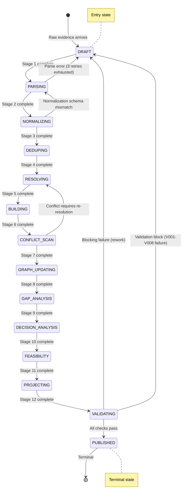

# OntologyAI V6 — Domain Model Specification

**Status:** DRAFT (awaiting sign-off before any implementation)
**Version:** 1.0
**Date:** 2026-07-27
**Author:** Solution Architecture
**Inputs:** PRD.md §1–§26, PLAN_V6.md §1–§5
**Constitution:** This document is the single source of truth for all V6 implementation. No code is written until this spec is signed off.

---

## Table of Contents

1. [Enterprise Ontology (Entity Taxonomy)](#1-enterprise-ontology-entity-taxonomy)
2. [Enterprise Semantic Layer](#2-enterprise-semantic-layer)
3. [Relationship Model](#3-relationship-model)
4. [Evidence Model](#4-evidence-model)
5. [Knowledge Model](#5-knowledge-model)
6. [Decision Model](#6-decision-model)
7. [Capability-Based Reasoning](#7-capability-based-reasoning)
8. [Artifact DSL](#8-artifact-dsl)
9. [Knowledge Catalog](#9-knowledge-catalog)
10. [Validation Rules](#10-validation-rules)
11. [Feasibility Model](#11-feasibility-model)
12. [Workflow State Machine](#12-workflow-state-machine)
13. [Context Model](#13-context-model)
14. [API Contracts](#14-api-contracts)
15. [Architecture Decision Records](#15-architecture-decision-records-adrs)
16. [Architecture Overview](#16-architecture-overview)
17. [V6.1 Runtime Architecture](#17-v61-runtime-architecture)

---

## 1. Enterprise Ontology (Entity Taxonomy)

24 entities defined. Every entity has a ULID `id`, a `tenant_id`, `created_at`, `updated_at`, and a `version` counter as implicit base attributes (not repeated per row). Identity rules determine "sameness" across merge operations.

### Entity Table

| # | Entity | Persistence | Identity Rule | Lifecycle | Key Attributes (Required + Optional) | Versioning |
|---|--------|------------|--------------|-----------|-------------------------------------|------------|
| 1 | **Evidence** | Neo4j (node) | SHA256 hash of `structured_data` — duplicate if hash matches | ingested → normalized → linked → conflicting → stale | **R:** id, tenant_id, source, source_type, timestamp, confidence, structured_data, hash **O:** raw_content, embeddings, entity_refs, source_refs, chunk_ref | Append-only; new hash = new node |
| 2 | **Source** | Postgres | External system ID + source_type (composite) | active → degraded → disconnected | **R:** id, name, source_type, external_id **O:** base_url, auth_method, last_sync_at, reliability_score | In-place update |
| 3 | **Stakeholder** | Neo4j (node) | Email or external_id (exact match) | identified → engaged → at_risk → blocked | **R:** name, email **O:** role, department, influence_score, sentiment_score | In-place update |
| 4 | **OrgUnit** | Postgres | External HR ID or org chart path | active → restructuring → dissolved | **R:** name, unit_type **O:** parent_id, head_count, budget_code, external_id | In-place update |
| 5 | **Capability** | Neo4j (node) | Name (normalized, case-insensitive) — fuzzy match on alias | assessed → developing → mature → deprecated | **R:** name, domain **O:** description, maturity_level, aliases[] | In-place update |
| 6 | **Process** | Neo4j (node) | External BPMN ID or name + org_unit composite | mapped → analyzed → improved → retired | **R:** name **O:** process_owner, bpmn_id, description, trigger_events[] | In-place update |
| 7 | **System** | Postgres | External system ID or canonical hostname | live → sunset → migrating | **R:** name, system_type **O:** vendor, version, hostname, api_endpoint, sla_tier | In-place update |
| 8 | **Requirement** | Neo4j (node) | External requirement ID or title hash | proposed → accepted → in_progress → verified → rejected | **R:** title, requirement_type (functional/nf) **O:** description, priority, external_id, acceptance_criteria[] | Snapshots on state change |
| 9 | **BusinessRule** | Neo4j (node) | Rule code (e.g., "BR-042") — exact match | active → superseded → deprecated | **R:** rule_code, description, rule_type **O:** severity, effective_date, expression, category | Append-only; superseded records point to successor |
| 10 | **Assumption** | Neo4j (node) | Statement hash (SHA256 of normalized text) | unvalidated → validated → invalidated | **R:** statement **O:** category, validated_by (Evidence ID), validated_at | In-place update |
| 11 | **Constraint** | Postgres | External constraint ID or name + entity composite | active → waived → removed | **R:** name, constraint_type **O:** description, source, waive_condition, expires_at | In-place update |
| 12 | **Risk** | Neo4j (node) | External risk ID or description hash | identified → analyzed → mitigated → accepted → realized | **R:** description, severity, probability **O:** risk_type, mitigation, owner_id, external_id | In-place update on re-assessment |
| 13 | **Decision** | Neo4j (node) | Title + workspace_id composite (unique per workspace) | draft → assessing → approved → superseded | **R:** title, workspace_id **O:** description, owner_id, status, approved_at, superseded_by | Append-only; superseded links to next |
| 14 | **Option** | Neo4j (node) | Title + decision_id composite | proposed → scored → selected → discarded | **R:** title, decision_id **O:** description, feasibility_score, pros[], cons[] | In-place update |
| 15 | **TradeOff** | Postgres | option_a_id + option_b_id + dimension composite | open → resolved | **R:** option_a_id, option_b_id, dimension **O:** a_score, b_score, delta, narrative | In-place update |
| 16 | **KPI** | Postgres | Name + workspace_id (composite) or external KPI ID | baseline_set → tracking → met → missed | **R:** name, target_value, unit **O:** baseline_value, current_value, owner_id, measurement_frequency | Append-only (time-series measurements) |
| 17 | **Project** | Postgres | External project ID or name composite | initiated → planning → executing → monitoring → closed | **R:** name **O:** description, start_date, end_date, budget, sponsor_id, status | In-place update |
| 18 | **Artifact** | Postgres | workspace_id + artifact_type + version composite | draft → valid → published → superseded | **R:** workspace_id, artifact_type **O:** title, status, published_at, checksum, superseded_by | Append-only; each publish = new row |
| 19 | **ArtifactVersion** | Postgres | artifact_id + version_number composite | current → archived | **R:** artifact_id, version_number **O:** checksum, content_path, size_bytes, rendered_by | Append-only |
| 20 | **Conflict** | Neo4j (node) | Hash of (evidence_a_id + evidence_b_id + conflict_type) | open → resolving → resolved → dismissed | **R:** conflict_type, evidence_a_id, evidence_b_id **O:** description, severity, resolved_by (Decision ID), resolved_at | Append-only |
| 21 | **ValidationResult** | Postgres | artifact_id + run_id composite | pending → passed → failed → blocked | **R:** artifact_id, run_id **O:** rule_results[], passed_count, failed_count, blocked_count, summary | Append-only |
| 22 | **FeasibilityScore** | Postgres | option_id + computed_at composite | computed → stale → superseded | **R:** option_id, dimensions (JSONB), weighted_total **O:** readiness_tier, computed_at | Append-only; new computation supersedes old |
| 23 | **AuditEvent** | Postgres | ULID (immutable order) | logged (terminal) | **R:** actor_id, action, entity_type, entity_id, payload (JSONB) **O:** workspace_id, correlation_id | Append-only (immutable log) |
| 24 | **Workspace** | Postgres | Name + tenant_id composite | active → archived → closed | **R:** name, tenant_id **O:** description, state, owner_id, configuration (JSONB) | Snapshots on state change |
| 25 | **CanonicalEntity** | Neo4j (node) | Canonical name (normalized, tenant-scoped) — system-of-record | active → superseded → archived | **R:** id, canonical_name, entity_type, tenant_id **O:** description, semantic_type, source_count, confidence, last_verified_at | Append-only; superseded records point to successor |
| 26 | **EntityAlias** | Postgres | Alias string + source_system composite | active → superseded → merged | **R:** alias, source_system, canonical_entity_id **O:** confidence, raw_value, created_at, resolved_at | In-place update; merged aliases point to surviving canonical |
| 27 | **Capability** | Neo4j (node) | Name (normalized, tenant-scoped) + domain composite | nascent → emerging → defined → managed → optimized | **R:** name, domain, capability_level (L0/L1/L2) **O:** description, maturity_level (1–5), health_score, owner_id, aliases[], last_assessed_at | In-place update on assessment |
| 28 | **CapabilityRelationship** | Neo4j (edge) | source_capability_id + target_capability_id + relationship_type composite | active → deprecated | **R:** source_capability_id, target_capability_id, relationship_type **O:** strength, evidence_refs[], created_at | In-place update |
| 29 | **KnowledgeCatalogEntry** | Postgres | catalog_category + entity_id composite | active → archived | **R:** catalog_category, entity_id, entity_type **O:** title, summary, tags[], last_indexed_at, relevance_score | In-place update on re-index |

### Entity Identity Resolution Priority

When resolving whether two evidence records refer to the same entity, apply in order:

1. **Exact external ID match** (e.g., same Jira ticket ID)
2. **Canonical name exact match** (case-insensitive normalized)
3. **Fuzzy name match** (Jaro-Winkler similarity ≥ 0.9)
4. **Qdrant cosine similarity** (≥ 0.85 on evidence embeddings)
5. **LLM-augmented classification** (confidence < 0.9 only after first 4 fail)

---

## 2. Enterprise Semantic Layer

> **ADR Reference:** ADR-013 (Enterprise Semantic Layer) — Accepted

### 2.1 Canonical Entity Resolution

The Enterprise Semantic Layer provides a **system-of-record** representation of every business entity across all source systems. Instead of storing source-specific duplicates, the system maintains a single **CanonicalEntity** per real-world concept and maps all source-specific representations to it via **EntityAlias** records.

**Resolution flow:**

```
Source System (Notion, Slack, Jira, Salesforce)
        │
        ▼
Evidence Record (structured_data with source-specific names/IDs)
        │
        ▼
Entity Resolution Pipeline
        │
        ├── Exact external ID match → CanonicalEntity
        ├── Canonical name match → CanonicalEntity
        ├── Fuzzy name match (Jaro-Winkler ≥ 0.9) → suggest merge
        ├── Embedding similarity (cosine ≥ 0.85) → suggest merge
        └── LLM classification → classify as same / different / uncertain
        │
        ▼
CanonicalEntity (system-of-record)
        │
        ▼
EntityAlias (source-specific pointer back to canonical)
```

### 2.2 Entity Alias Model

Every source system may refer to the same real-world entity using different names, identifiers, or formats. The Entity Alias model captures these variations:

| Source System | Alias Example | Canonical Entity | Confidence |
|--------------|---------------|-----------------|------------|
| Notion | "Q3 Revenue Forecast" | Q3 Revenue Forecast | 1.0 |
| Slack | "q3 rev forecast" | Q3 Revenue Forecast | 0.95 |
| Jira | "REV-2024-Q3" | Q3 Revenue Forecast | 0.90 |
| Salesforce | "Q3 Rev Forecast (Pipeline)" | Q3 Revenue Forecast | 0.85 |

**Alias resolution priority:** Exact match → case-insensitive match → Jaro-Winkler fuzzy match → embedding similarity → LLM classification.

### 2.3 Semantic Type Taxonomy

All canonical entities are classified into a semantic type hierarchy:

```
Semantic Type
├── Party                    # People, organizations, roles
│   ├── Person               # Individual stakeholders
│   ├── Organization         # Companies, departments, teams
│   └── Role                 # Job functions, titles
├── Thing                    # Physical or digital assets
│   ├── System               # Software, infrastructure
│   ├── Product              # Deliverables, artifacts
│   └── Resource             # Budget, capacity, time
├── Event                    # Time-bound occurrences
│   ├── Meeting               # Scheduled gatherings
│   ├── Milestone             # Project checkpoints
│   └── Incident              # Unplanned events
└── Concept                  # Abstract business ideas
    ├── Capability            # Business capabilities
    ├── Requirement           # Functional/non-functional needs
    ├── Risk                  # Identified threats
    └── Decision              # Choices and their outcomes
```

### 2.4 Resolution Rules

Resolution is applied in strict priority order. Lower-priority rules execute only if higher-priority rules produce no match or an uncertain result:

| Priority | Rule | Threshold | Action | Override? |
|----------|------|-----------|--------|-----------|
| 1 | **Exact external ID** | — | Auto-merge | No |
| 2 | **Canonical name exact** | case-insensitive | Auto-merge | No |
| 3 | **Fuzzy name match** | Jaro-Winkler ≥ 0.90 | Auto-merge if both confidence > 0.8; else suggest | HITL override |
| 4 | **Embedding similarity** | Cosine ≥ 0.85 | Suggest merge; auto-merge only if ≥ 0.92 | HITL override |
| 5 | **LLM classification** | Evidence confidences < 0.9 | Classify same/different/uncertain; uncertain = Conflict node | HITL required |

### 2.5 Conflict Resolution Strategy

When two evidence records contradict each other about the same canonical entity:

| Conflict Type | Auto-Resolve? | Strategy |
|---------------|---------------|----------|
| **Direct contradiction** (opposite values) | No | Create Conflict node; escalate to stakeholders |
| **Numeric mismatch** (values differ > 10%) | Conditional | Use higher-confidence value if gap > 0.2; else Conflict |
| **Temporal inconsistency** (overlapping state changes) | Conditional | Newer timestamp wins if confidence gap < 0.2; else Conflict |
| **Attribution conflict** (different owners) | No | Create Conflict; escalate to governance |
| **Naming conflict** (different canonical names) | Yes (alias resolution) | Alias resolution handles; flag if alias confidence < 0.8 |

---

## 3. Relationship Model

All relationships below are Neo4j typed edges unless marked "Postgres." Direction is always directed unless marked "bidirectional."

### Relationship Table

| # | Relationship | Source Type | Target Type | Cardinality | Direction | Edge Properties | Constraints | Cascade / Update | Store |
|---|-------------|-----------|------------|-------------|-----------|----------------|-------------|-----------------|-------|
| 1 | `PRODUCES_EVIDENCE` | Source | Evidence | 1:N | directed | confidence, extracted_at, connector_version | Source must exist before link | Source deleted → cascade delete evidence | Neo4j |
| 2 | `LINKS_TO` | Evidence | Entity (any) | N:M | directed | confidence, linked_at, method (auto/manual) | Entity must exist; evidence must be normalized | Evidence deleted → remove link only (entity lives on) | Neo4j |
| 3 | `CONFLICTS_WITH` | Evidence | Evidence | N:M | bidirectional | conflict_type, severity, detected_at | Must be different evidence records | Orphan detection: if one evidence deleted, demote to warn | Neo4j |
| 4 | `SUPPORTS` | Evidence | Entity (any) | N:M | directed | confidence, strength (0-1) | Must be non-conflicting evidence → entity | Evidence deleted → remove edge | Neo4j |
| 5 | `REFUTES` | Evidence | Entity (any) | N:M | directed | confidence, strength (0-1) | Must be contradictory evidence → entity | Evidence deleted → remove edge | Neo4j |
| 6 | `OWNED_BY` | Entity (any) | Stakeholder | N:1 | directed | role, since, confidence | Stakeholder must exist; one primary owner per entity (others are secondary) | Stakeholder deleted → reassign or orphan | Neo4j |
| 7 | `DEPENDS_ON` | Capability | Capability | M:N | directed | dependency_type (hard/soft), strength | No circular dependency allowed (validated at write time) | Cascade delete blocked if dependents exist | Neo4j |
| 8 | `ENABLED_BY` | Capability | System | M:N | directed | integration_level, criticality | System must be in "live" state | System decommissioned → warn capability owners | Neo4j |
| 9 | `GOVERNS` | BusinessRule | Decision | 1:N | directed | applicability (always/conditional), effective_at | BusinessRule must be "active" | Rule superseded → decisions re-validated | Neo4j |
| 10 | `EVALUATES` | Decision | Option | 1:N | directed | ranking, selected (bool), scored_at | Decision must be ≥ "assessing" | Decision superseded → options re-evaluated | Neo4j |
| 11 | `RESOLVES` | Decision | Conflict | N:M | directed | resolution_notes, resolved_at | Conflict must be "resolving" or "open" | Decision deleted → conflict returns to "open" | Neo4j |
| 12 | `CONTAINS` | Workspace | Entity (any) | 1:N | directed | added_at, added_by | Entity must exist; workspace must be "active" | Workspace closed → entities unlinked (not deleted) | Postgres (join table) |
| 13 | `PROJECTS` | Workspace | Artifact | 1:N | directed | projected_at, pipeline_run_id | Workspace must be "active" | Workspace archived → artifacts frozen | Postgres (foreign key) |
| 14 | `AFFECTS` | Risk | Decision | N:M | directed | impact_level, probability_adjustment | Risk must be ≥ "analyzed" | Risk mitigated → adjustment recalculated | Neo4j |
| 15 | `MEASURES` | KPI | Entity (any) | N:1 | directed | baseline, target, current, frequency | Entity must exist | Entity deprecated → KPI re-assigned | Postgres (foreign key) |
| 16 | `SATISFIES` | Requirement | Decision | N:M | directed | satisfaction_level (partial/full), evidence_refs[] | Requirement must be ≥ "accepted" | Decision superseded → satisfaction re-evaluated | Neo4j |
| 17 | `SCOPES` | Project | Workspace | N:M | directed | role, budget_allocation | Project must be ≥ "planning" | Project closes → workspace state reviewed | Postgres (foreign key) |
| 18 | `TRIGGERED_BY` | Event | Action | 1:N | directed | timestamp, payload | n/a | Immutable log | Postgres |
| 19 | `DERIVES_FROM` | Requirement | Requirement | M:N | directed | derivation_type (refines/decomposes/replaces) | No circular derivation allowed | Source requirement superseded → derived requirements flagged | Neo4j |
| 20 | `MENTIONS` | Evidence | Stakeholder | N:M | directed | mention_context, sentiment | n/a | Evidence deleted → remove edge | Neo4j |
| 21 | `CANONICAL_OF` | EntityAlias | CanonicalEntity | N:1 | directed | confidence, resolution_method (exact/fuzzy/embedding/llm), resolved_at | Alias must be active; CanonicalEntity must exist | CanonicalEntity superseded → alias migrated to successor | Neo4j |
| 22 | `MAPS_TO_CAPABILITY` | Evidence | Capability | N:M | directed | confidence, strength (0–1), assessment_method | Evidence must be normalized; Capability must exist | Evidence deleted → remove edge; Capability deprecated → demote edge | Neo4j |
| 23 | `CAPABILITY_DEPENDS` | Capability | Capability | M:N | directed | dependency_type (hard/soft), strength, evidence_refs[] | No circular dependency allowed (validated at write time) | Cascade delete blocked if dependents exist | Neo4j |
| 24 | `CATALOG_INDEXED` | Entity (any) | KnowledgeCatalogEntry | 1:N | directed | indexed_at, relevance_score, catalog_category | Entity must exist; CatalogEntry must be active | Entity archived → CatalogEntry archived | Postgres (foreign key) |

### Graph Constraints

- **No dangling edges**: every relationship must reference an existing source/target node (enforced via Neo4j `CREATE` constraint or application check on Postgres).
- **Evidence Linkage Rule**: an Evidence node may be linked to at most 15 distinct entities (prevent fan-out abuse).
- **Workspace scope**: all entity nodes added via `CONTAINS` must belong to the same tenant as the workspace.

---

## 3. Evidence Model

### 3.1 EvidenceRecord Schema

```yaml
EvidenceRecord:
  id: string (ULID, 26 chars, k-ordered)
  tenant_id: string (ULID)
  source: string                 # connector name or input channel e.g. "notion", "slack", "chat"
  source_type: enum              # see 3.2
  timestamp: datetime            # UTC, extracted from source or ingest time (if source lacks timestamp)
  confidence: float [0.0, 1.0]  # parser-assigned; 1.0 = deterministic extraction, 0.5 = LLM-inferred
  provenance:
    connector_version: string    # semver of connector code
    extraction_method: string    # "api", "webhook", "ocr", "nlp", "structured_import"
    raw_checksum: string         # SHA256 of raw_content (before parsing)
    retry_count: int             # how many ingestion attempts preceded success
  structured_data: dict          # canonical key-value payload; schema varies by source_type
  raw_content: string | null     # original text (null for blobs > 64KB — stored in object store)
  embeddings: float[] | null     # 768-dim Qdrant vector; set after stage 3 (Normalize)
  entity_refs: string[]          # resolved entity ULIDs; set after stage 5 (Alias Resolve)
  source_refs: string[]          # original external references: message URLs, doc IDs, ticket keys
  chunk_ref: string | null       # ULID of parent EvidenceRecord if this is a chunk
  hash: string                   # SHA256 of canonical JSON(tenant_id + structured_data)
```

### 3.2 Evidence Types (structured_data schema per source_type)

| source_type | structured_data shape | Example |
|-------------|----------------------|---------|
| `connector` | `{external_id, external_url, record_type, fields{...}}` | Notion page: `{database_id, title, properties{}}` |
| `chat` | `{channel_id, message_ts, thread_ts, sender, text, reactions[]}` | Slack message |
| `upload` | `{file_name, mime_type, size_bytes, extracted_text}` | PDF upload |
| `transcript` | `{meeting_id, duration_sec, speakers[], segments[{speaker, text, ts_start, ts_end}]}` | Meeting recording |
| `spreadsheet` | `{file_name, sheets[{name, headers[], row_count, rows[{col: val}]}]}` | CSV/Excel |
| `email` | `{message_id, from, to[], cc[], subject, body, attachments[]}` | Email export |
| `screenshot` | `{image_checksum, ocr_text, detected_regions[{bbox, text}]}` | OCR result |
| `api` | `{endpoint, method, response_status, payload}` | Webhook payload |

### 3.3 Provenance Chain

Every evidence record carries a provenance chain that is immutable after creation:

```
Original Source → Connector → Parser → Normalizer → Entity Resolver
                                                        ↓
                                              (provenance frozen)
```

The `provenance` block captures the connector→parser segment. Post-normalization steps append to an optional `provenance_chain[]` field:

```yaml
provenance_chain:
  - stage: "normalizer"
    version: "1.2.0"
    input_hash: "abc..."
    output_hash: "def..."
  - stage: "entity_resolver"
    version: "1.0.0"
    resolved_entities: ["01H...", "01J..."]
```

### 3.4 Confidence Propagation Rules

| Step | Rule |
|------|------|
| **Raw extraction** | Connector assigns base confidence: API sync = 0.95, webhook = 0.98, OCR = 0.70, LLM-extracted = 0.50 |
| **Parse** | Parser may adjust ±0.1 based on extraction clarity |
| **Normalize** | Normalizer does NOT change confidence (structural transformation only) |
| **Entity link** | Link confidence = min(evidence.confidence, entity_resolution.confidence) |
| **Aggregate entity** | `entity_confidence = weighted_avg_of_linked_evidence_confidences` where weight = `1 / (days_since_evidence_timestamp + 1)` |
| **Decision** | `decision_confidence = min(entity_confidences_of_all_inputs)` — weakest link principle |

### 3.5 Freshness Policy

| source_type | Max Age (fresh) | Stale At | Action When Stale |
|-------------|----------------|-----------|-------------------|
| `connector` | 7 days | 14 days | Deprecate links, reduce entity confidence by 50% |
| `chat` | 1 day | 3 days | Mark evidence as stale, exclude from active context |
| `upload` | 90 days | 180 days | No automatic action; warn on artifact generation |
| `transcript` | 30 days | 60 days | Flag as time-sensitive, deprecate after 60d |
| `spreadsheet` | 30 days | 90 days | Warn if baseline data may have changed |
| `email` | 14 days | 30 days | Mark as potentially obsolete |
| `screenshot` | 30 days | 90 days | Flag for re-verification |
| `api` | 1 day | 3 days | Treat as realtime; stale = exclude |

### 3.6 Source Reliability Scoring

Each Source entity carries a `reliability_score` (float 0.0–1.0) computed as:

```
reliability = 0.4 × (successful_fetches / total_fetches)
            + 0.3 × (1 - avg_connector_error_rate)
            + 0.2 × (1 / avg_evidence_confidence_from_source)
            + 0.1 × (1 if source has verified credentials else 0)
```

Recalculated after every 10 fetches.

### 3.7 Chunking Strategy

Evidence with `raw_content` > 16KB is chunked at ingestion:

- **Boundary detection**: split on paragraph breaks first, then sentence boundaries
- **Max chunk size**: 4096 tokens (for embedding model context window)
- **Overlap**: 128 tokens between chunks (for continuity)
- **Chunk linking**: each chunk's `chunk_ref` points to parent EvidenceRecord
- **Chunk metadata**: `chunk_index`, `chunk_total` carried in `structured_data`
- **Merge on entity resolution**: entity refs from all chunks combined into parent

### 3.8 Dedup Strategy

Dedup hash = `SHA256(canonical_json(tenant_id + structured_data))` where `canonical_json` is:

1. `json.dumps(structured_data, sort_keys=True)`
2. Exclude `timestamp`, `provenance.retry_count`, `source_refs`

Two evidence records with the same hash are considered **exact duplicates**. Resolution:

- First received wins → subsequent records are discarded (logged)
- If timestamps differ by > 24h → treat as separate (hash collision is almost impossible for intentional use cases)
- Hash is indexed in Postgres `evidence_hashes` table for O(1) lookup during ingest

---

## 4. Knowledge Model

### 4.1 Entity Merge Rules

Applied in sequence during stage 5 (Alias Resolve) and stage 6 (Entity/Relationship Build):

| Priority | Rule | Threshold | Action |
|----------|------|-----------|--------|
| 1 | External ID exact match | — | Merge: add `source_refs` to existing entity, skip node creation |
| 2 | Canonical name exact match | case-insensitive | Merge: add aliases[], update confidence |
| 3 | Jaro-Winkler name similarity | ≥ 0.90 | Suggest merge; auto-merge if confidence > 0.8 on both evidence |
| 4 | Qdrant cosine similarity on evidence embeddings | ≥ 0.85 | Suggest merge; auto-merge only if >0.92 |
| 5 | LLM-augmented classification | evidence confidences < 0.9 | Classify as "same", "different", or "uncertain"; "uncertain" = create Conflict node |
| 6 | Manual override | Stakeholder action | Merge or split via HITL signal |

### 4.2 Alias Resolution Strategy

Aliases live in a dedicated Postgres table `entity_aliases`:

```sql
CREATE TABLE entity_aliases (
    id          ULID PRIMARY KEY,
    entity_id   ULID NOT NULL REFERENCES neo4j_entity_refs(entity_id),
    alias       VARCHAR(512) NOT NULL,
    source      VARCHAR(64) NOT NULL,  -- "connector", "llm", "manual"
    confidence  FLOAT NOT NULL DEFAULT 1.0,
    created_at  TIMESTAMPTZ NOT NULL DEFAULT NOW()
);
CREATE INDEX idx_entity_aliases_alias ON entity_aliases(alias);
```

Resolution: alias → canonical name → entity ID lookup. Every query path that receives a name first checks aliases.

### 4.3 Conflict Types

| Type | Detection | Severity | Auto-resolve? |
|------|-----------|----------|--------------|
| **Direct contradiction** | Same entity, same attribute, opposite values in `structured_data` | High | No — create Conflict node, flag for review |
| **Numeric mismatch** | Same entity, same numeric attribute, values differ by >10% | Medium | If one evidence has confidence > 0.2 higher → use higher-confidence value; else create Conflict |
| **Temporal inconsistency** | Same entity, state changed (active→deprecated) with overlapping timestamps | Medium | Newer timestamp wins if confidence gap < 0.2; else Conflict |
| **Attribution conflict** | Two evidence records assign different owners to same entity | Medium | Create Conflict; escalate to stakeholders |
| **Naming conflict** | Same entity referenced by different canonical names | Low | Alias resolution handles; flag if alias confidence < 0.8 |

### 4.4 Graph Update Rules

| Event | Action |
|-------|--------|
| **New evidence links to existing entity** | Add `LINKS_TO` edge; update entity confidence via weighted average; refresh `updated_at` |
| **New evidence creates new entity** | Create entity node only if no match found after full resolution pipeline (all 5 stages). If match found → merge |
| **Conflicting evidence** | Create `Conflict` node; add `CONFLICTS_WITH` edges between conflicting evidence; link both to entity; set entity state to "conflicting" |
| **Stale evidence** (older than freshness window) | Deprecate `SUPPORTS`/`REFUTES` edges (set `active=false` property); recalculate entity confidence excluding stale links |
| **Evidence deleted** | Remove all edges from that evidence; recalculate entity confidence; cascade delete evidence node |
| **Entity merge** | Merge all edges from source entity to target; update aliases; keep higher confidence entity; delete source node |

### 4.5 Temporal History

Entity states are time-series, not snapshots. Every entity node carries:

```yaml
entity_state:
  current: {...}       # latest state
  history: [           # ordered by timestamp DESC
    {state, timestamp, evidence_id, confidence},
    ...
  ]
```

History is capped at 50 entries per entity (oldest evicted when exceeded). Full history lives in Postgres `entity_state_history` for replay and audit.

---

## 5. Decision Model

### 5.1 Decision Schema

```yaml
Decision:
  id: string (ULID)
  workspace_id: string (ULID)
  title: string (max 200 chars)
  description: string (max 5000 chars)
  status: enum(draft, assessing, approved, superseded)
  owner_id: string (Stakeholder ULID)
  created_at: datetime
  approved_at: datetime | null
  superseded_by: string (ULID) | null  # points to superseding Decision
  superseded_at: datetime | null
  tags: string[]
  urgency: enum(low, medium, high, critical)
```

### 5.2 Option Schema

```yaml
Option:
  id: string (ULID)
  decision_id: string (ULID)
  title: string (max 200 chars)
  description: string (max 5000 chars)
  status: enum(proposed, scored, selected, discarded)
  feasibility_score: float | null  # set after stage 11
  pros: string[]
  cons: string[]
  created_at: datetime
  evidence_links: string[]  # ULIDs of supporting evidence
  cost_estimate: float | null
  timeline_estimate: string | null  # e.g. "3-6 months"
```

### 5.3 TradeOff Schema

```yaml
TradeOff:
  id: string (ULID)
  option_a_id: string (ULID)
  option_b_id: string (ULID)
  dimension: string  # e.g. "cost", "time", "risk", "value"
  a_score: float 0-100
  b_score: float 0-100
  delta: float    # a_score - b_score
  narrative: string | null  # LLM-augmented explanation
  created_at: datetime
```

### 5.4 Recommendation Schema

```yaml
Recommendation:
  option_id: string (ULID)
  decision_id: string (ULID)
  justification: string          # LLM-augmented narrative
  confidence: float [0, 1]       # = min(decision_confidence, feasibility_weighted_total / 100)
  evidence_links: string[]       # ULIDs of evidence backing this recommendation
  created_at: datetime
  rank: int                      # 1 = primary recommendation
```

### 5.5 Impact Schema

```yaml
Impact:
  id: string (ULID)
  decision_id: string (ULID)
  entity_id: string (ULID)       # affected entity
  entity_type: string
  impact_type: enum(positive, negative, neutral)
  magnitude: int [0, 100]
  probability: float [0.0, 1.0]
  narrative: string | null       # LLM-augmented
  created_at: datetime
```

### 5.6 Assumption Schema

```yaml
Assumption:
  id: string (ULID)
  decision_id: string (ULID)
  statement: string
  category: enum(technical, business, regulatory, market, organizational)
  status: enum(unvalidated, validated, invalidated)
  validated_by: string (ULID) | null  # Evidence ID that validated/invalidated
  validated_at: datetime | null
  created_at: datetime
```

### 5.7 Risk Schema

```yaml
Risk:
  id: string (ULID)
  decision_id: string (ULID)
  description: string
  risk_type: enum(technical, financial, operational, compliance, market, strategic)
  severity: int [0, 100]
  probability: float [0.0, 1.0]
  status: enum(identified, analyzed, mitigated, accepted, realized)
  mitigation: string | null
  owner_id: string (Stakeholder ULID) | null
  created_at: datetime
```

### 5.8 Feasibility Schema

```yaml
Feasibility:
  id: string (ULID)
  option_id: string (ULID)
  dimensions:
    business_value: int [0, 100]
    technical_complexity: int [0, 100]     # inverted: 100 = simplest
    operational_fit: int [0, 100]
    financial_impact: int [-100, 100]
    compliance_risk: int [0, 100]           # inverted: 100 = lowest risk
    data_readiness: int [0, 100]
    change_effort: int [0, 100]             # inverted: 100 = least effort
    stakeholder_alignment: int [0, 100]
  weighted_total: float [0, 100]           # sum(dim * weight)
  readiness_tier: enum(publish, caveats, review, block)
  computed_at: datetime
  weights_snapshot: dict                    # copy of weights used at computation time
```

### 5.9 Decision Readiness Schema

```yaml
DecisionReadiness:
  workspace_id: string (ULID)
  tier: enum(publish, caveats, review, block)
  scores:
    evidence_coverage: float [0, 100]
    conflict_resolution: float [0, 100]
    stakeholder_alignment: float [0, 100]
    feasibility_completeness: float [0, 100]
    risk_coverage: float [0, 100]
    traceability: float [0, 100]
  blocking_issues: string[]    # human-readable list of blockers
  computed_at: datetime
```

---

## 7. Capability-Based Reasoning

> **ADR Reference:** ADR-014 (Capability-Based Reasoning) — Accepted

### 7.1 Capabilities as Primary Reasoning Unit

V6 shifts from entity-centric reasoning to **capability-centric reasoning**. A business capability represents *what the organization does* — not *what systems it uses* or *what processes it follows*. Capabilities are the bridge between evidence and decisions: evidence informs capability health, and capability health informs decision feasibility.

**Why capabilities?**
- Entities (systems, processes, stakeholders) change frequently; capabilities are more stable.
- Capabilities provide a natural grouping for evidence, decisions, and investments.
- Capability maturity directly maps to feasibility dimensions (operational fit, change effort).

### 7.2 Capability Hierarchy (L0/L1/L2)

Capabilities are organized in a three-level hierarchy:

```
L0: Enterprise Capability (e.g., "Revenue Operations")
  ├── L1: Domain Capability (e.g., "Forecasting", "Pipeline Management")
  │     ├── L2:leaf Capability (e.g., "Quarterly Revenue Forecast", "Deal Stage Tracking")
  │     └── L2:leaf Capability (e.g., "Win Rate Analysis", "Lead Scoring")
  └── L1: Domain Capability (e.g., "Contract Management")
        ├── L2:leaf Capability (e.g., "Contract Negotiation", "Approval Workflow")
        └── L2:leaf Capability (e.g., "Renewal Tracking", "Compliance Check")
```

| Level | Scope | Ownership | Assessment Frequency |
|-------|-------|-----------|---------------------|
| **L0** | Enterprise-wide | Executive sponsor | Quarterly |
| **L1** | Domain / business unit | Domain owner | Monthly |
| **L2** | Leaf / team-level | Team lead | Weekly or on-demand |

### 7.3 Capability-Decision Bridge

The bridge between evidence and decisions flows through capabilities:

```
Evidence (structured_data)
    │
    ├── MAPS_TO_CAPABILITY ──▶ Capability (maturity, health, owner)
    │                                │
    │                                ▼
    │                        Capability Assessment
    │                        (maturity_level, health_score, gaps)
    │                                │
    │                                ▼
    │                        Decision Intelligence
    │                        (feasibility, trade-offs, recommendations)
    │                                │
    │                                ▼
    │                        Artifacts (reports, briefs, matrices)
    │
    └── LINKS_TO ──▶ Entity (existing V6 path)
```

Evidence maps to capabilities via the `MAPS_TO_CAPABILITY` edge. A single evidence record may map to multiple capabilities (e.g., a revenue forecast document maps to both "Forecasting" and "Revenue Operations").

### 7.4 Capability Maturity Model (5 Levels)

| Level | Name | Description | Health Score Range |
|-------|------|-------------|-------------------|
| 1 | **Nascent** | Ad-hoc, inconsistent, no defined process | 0–20 |
| 2 | **Emerging** | Partially defined, some repeatable practices | 21–40 |
| 3 | **Defined** | Documented, standardized, consistently applied | 41–60 |
| 4 | **Managed** | Measured, controlled, continuously improved | 61–80 |
| 5 | **Optimized** | Predictable, innovative, industry-leading | 81–100 |

**Health score computation:**

```
health_score = (
    0.30 × maturity_level_score +
    0.25 × evidence_coverage_ratio +
    0.20 × stakeholder_satisfaction +
    0.15 × (1 - dependency_risk_ratio) +
    0.10 × system_reliability_score
)
```

### 7.5 Evidence-to-Capability Mapping

Evidence maps to capabilities through a combination of automatic and manual methods:

| Method | Confidence | When Used |
|--------|-----------|-----------|
| **Keyword match** | 0.7–0.85 | Evidence structured_data contains capability name or aliases |
| **Embedding similarity** | 0.8–0.95 | Evidence embedding cosine similarity to capability embedding ≥ 0.8 |
| **LLM classification** | 0.6–0.9 | Ambiguous evidence that requires context to classify |
| **Manual assignment** | 1.0 | Stakeholder explicitly links evidence to capability |

**Mapping rules:**
- Evidence with confidence < 0.6 is not mapped to any capability (insufficient signal).
- Evidence mapped to ≥ 3 capabilities is flagged for review (over-linking).
- Capability health is recalculated after every 5 new evidence mappings.

---

## 8. Artifact DSL

### 6.1 DSL Schema

```yaml
# DSL schema definition (validated via JSON Schema as artifact-schema.json)
artifact:
  id: string                    # unique key, e.g. "executive-decision-brief"
  name: string                  # display name
  type: enum(external, internal)
  audience: string[]            # stakeholder roles this targets
  model_dependencies: string[]  # canonical model paths required

sections:
  - name: string                # section title
    type: enum(
      title, summary, evidence_list, decision_table,
      recommendation_list, risk_matrix, impact_analysis,
      kpi_table, stakeholder_table, timeline, gantt,
      diagram_placeholder, narrative, table, list
    )
    source: string              # dot-path into canonical model
    llm_augment: boolean        # LLM fills narrative from source data
    config:                     # type-specific key-value pairs
      max_items: int
      sort_by: string
      min_confidence: float
      include_tradeoffs: boolean
      severity_filter: string
      # ... extensible per section type

validation:
  required_sections: string[]   # section names that must render non-empty
  optional_sections: string[]
  rules: string[]               # validation rule IDs (see §7)

traceability:
  field_sources: dict           # "artifact.path" → "canonical.model.path"
```

### 6.2 Artifact Configs — External (12)

#### 1. Executive Decision Brief

```yaml
artifact:
  id: "executive-decision-brief"
  name: "Executive Decision Brief"
  type: external
  audience: ["CEO", "board", "executives"]
  model_dependencies: ["workspace.summary", "evidence.top_findings", "decisions.active", "decisions.recommendations", "decisions.risks", "decisions.tradeoffs"]
sections:
  - {name: "Header", type: title, source: "workspace.title"}
  - {name: "Executive Summary", type: summary, source: "workspace.summary", llm_augment: true}
  - {name: "Key Evidence", type: evidence_list, source: "evidence.top_findings", config: {max_items: 10, sort_by: confidence, min_confidence: 0.7}}
  - {name: "Active Decisions", type: decision_table, source: "decisions.active", config: {include_tradeoffs: true}}
  - {name: "Recommendations", type: recommendation_list, source: "decisions.recommendations", llm_augment: true}
  - {name: "Risk Assessment", type: risk_matrix, source: "decisions.risks", config: {severity_filter: ">=medium"}}
  - {name: "Downstream Impact", type: impact_analysis, source: "decisions.blast_radius"}
validation: {required_sections: ["Executive Summary", "Active Decisions", "Recommendations"], optional_sections: ["Risk Assessment"], rules: ["V001", "V002", "V003"]}
```

#### 2. Stakeholder Register + Influence Matrix

```yaml
artifact:
  id: "stakeholder-register"
  name: "Stakeholder Register + Influence Matrix"
  type: external
  audience: ["project-lead", "product-manager", "change-manager"]
  model_dependencies: ["stakeholders.all", "evidence.stakeholder_mentions"]
sections:
  - {name: "Header", type: title, source: "workspace.title"}
  - {name: "Stakeholder Table", type: stakeholder_table, source: "stakeholders.all", config: {include_influence_scores: true, sort_by: influence_score}}
  - {name: "Engagement Status", type: table, source: "stakeholders.engagement", config: {columns: [name, role, influence, sentiment, status]}}
  - {name: "Influence Matrix", type: diagram_placeholder, source: "stakeholders.influence_matrix", config: {diagram_type: "matrix"}}
validation: {required_sections: ["Stakeholder Table", "Influence Matrix"], optional_sections: [], rules: ["V002"]}
```

#### 3. Org / Ownership Map

```yaml
artifact:
  id: "org-ownership-map"
  name: "Org / Ownership Map"
  type: external
  audience: ["executives", "org-design", "hr"]
  model_dependencies: ["org_units.all", "stakeholders.all", "capabilities.all", "entities.ownership"]
sections:
  - {name: "Header", type: title, source: "workspace.title"}
  - {name: "Org Hierarchy", type: diagram_placeholder, source: "org_units.hierarchy", config: {diagram_type: "org_chart"}}
  - {name: "Ownership Matrix", type: table, source: "entities.ownership", config: {columns: [entity, entity_type, owner, role, since], max_items: 50}}
  - {name: "Coverage Gaps", type: narrative, source: "entities.unowned", llm_augment: true}
validation: {required_sections: ["Org Hierarchy", "Ownership Matrix"], optional_sections: ["Coverage Gaps"], rules: ["V004"]}
```

#### 4. Current-State Pack

```yaml
artifact:
  id: "current-state-pack"
  name: "Current-State Pack"
  type: external
  audience: ["architect", "analyst", "product-team"]
  model_dependencies: ["capabilities.all", "processes.all", "systems.all", "evidence.entity_links"]
sections:
  - {name: "Header", type: title, source: "workspace.title"}
  - {name: "Capability Map", type: diagram_placeholder, source: "capabilities.map", config: {diagram_type: "capability_map"}, llm_augment: true}
  - {name: "SIPOC", type: table, source: "processes.sipoc", config: {columns: [supplier, input, process, output, customer]}}
  - {name: "Context Diagram", type: diagram_placeholder, source: "systems.context", config: {diagram_type: "context_diagram"}}
  - {name: "Process Map", type: diagram_placeholder, source: "processes.flow", config: {diagram_type: "flowchart"}}
validation: {required_sections: ["Capability Map", "Context Diagram"], optional_sections: ["SIPOC", "Process Map"], rules: ["V002", "V003"]}
```

#### 5. Feasibility & Options Report

```yaml
artifact:
  id: "feasibility-options-report"
  name: "Feasibility & Options Report"
  type: external
  audience: ["decision-maker", "sponsor", "steering-committee"]
  model_dependencies: ["decisions.options", "feasibility.scores", "decisions.tradeoffs", "evidence.decision_backing"]
sections:
  - {name: "Header", type: title, source: "workspace.title"}
  - {name: "Options Summary", type: table, source: "decisions.options", config: {columns: [title, feasibility_score, readiness_tier, pros, cons], sort_by: feasibility_score}}
  - {name: "Feasibility Comparison", type: table, source: "feasibility.scores", config: {columns: [option, business_value, technical_complexity, operational_fit, financial_impact, weighted_total], max_items: 5}}
  - {name: "Trade-Off Analysis", type: narrative, source: "decisions.tradeoffs", llm_augment: true}
  - {name: "Recommendation", type: recommendation_list, source: "decisions.recommendations", llm_augment: true}
validation: {required_sections: ["Options Summary", "Feasibility Comparison"], optional_sections: ["Trade-Off Analysis", "Recommendation"], rules: ["V001", "V002", "V008"]}
```

#### 6. PRD / Solution Brief

```yaml
artifact:
  id: "prd-solution-brief"
  name: "PRD / Solution Brief"
  type: external
  audience: ["product-manager", "engineering-lead", "designer"]
  model_dependencies: ["requirements.all", "decisions.selected", "evidence.requirement_links", "constraints.all", "assumptions.all"]
sections:
  - {name: "Header", type: title, source: "workspace.title"}
  - {name: "Problem Statement", type: summary, source: "workspace.problem_statement", llm_augment: true}
  - {name: "Requirements", type: table, source: "requirements.all", config: {columns: [title, type, priority, status], sort_by: priority}}
  - {name: "Selected Solution", type: narrative, source: "decisions.selected", llm_augment: true}
  - {name: "Constraints", type: list, source: "constraints.all", config: {max_items: 20}}
  - {name: "Assumptions", type: list, source: "assumptions.all", config: {filter_status: unvalidated}}
validation: {required_sections: ["Problem Statement", "Requirements", "Selected Solution"], optional_sections: ["Constraints", "Assumptions"], rules: ["V001", "V002", "V003", "V006"]}
```

#### 7. User Stories + Acceptance Criteria

```yaml
artifact:
  id: "user-stories-acceptance-criteria"
  name: "User Stories + Acceptance Criteria"
  type: external
  audience: ["product-manager", "developer", "qa"]
  model_dependencies: ["requirements.all", "evidence.requirement_links", "stakeholders.all"]
sections:
  - {name: "Header", type: title, source: "workspace.title"}
  - {name: "User Stories", type: table, source: "requirements.stories", config: {columns: [id, story, priority, stakeholder, status]}, llm_augment: true}
  - {name: "Acceptance Criteria", type: table, source: "requirements.acceptance_criteria", config: {columns: [story_id, criterion, type, verification_method]}}
  - {name: "Stakeholder Mapping", type: table, source: "requirements.stakeholder_map", config: {columns: [requirement, stakeholder, role, priority]}}
validation: {required_sections: ["User Stories", "Acceptance Criteria"], optional_sections: ["Stakeholder Mapping"], rules: ["V001", "V003", "V008"]}
```

#### 8. Wireframes / Storyboards

```yaml
artifact:
  id: "wireframes-storyboards"
  name: "Wireframes / Storyboards"
  type: external
  audience: ["designer", "product-manager", "developer"]
  model_dependencies: ["requirements.all", "evidence.wireframe_links", "decisions.selected"]
sections:
  - {name: "Header", type: title, source: "workspace.title"}
  - {name: "Design Requirements", type: table, source: "requirements.design", config: {columns: [id, description, priority]}}
  - {name: "Wireframe Placeholder", type: diagram_placeholder, source: "artifacts.wireframes", config: {diagram_type: "wireframe"}}
  - {name: "User Flow", type: diagram_placeholder, source: "processes.user_flow", config: {diagram_type: "flowchart"}}
  - {name: "Design Decisions", type: narrative, source: "decisions.design", llm_augment: true}
validation: {required_sections: ["Wireframe Placeholder", "User Flow"], optional_sections: ["Design Decisions"], rules: ["V002"]}
```

#### 9. Solution Architecture Pack

```yaml
artifact:
  id: "solution-architecture-pack"
  name: "Solution Architecture Pack"
  type: external
  audience: ["architect", "engineering-lead", "infra-team"]
  model_dependencies: ["capabilities.all", "systems.all", "processes.all", "requirements.technical", "constraints.technical"]
sections:
  - {name: "Header", type: title, source: "workspace.title"}
  - {name: "Architecture Overview", type: narrative, source: "workspace.architecture_overview", llm_augment: true}
  - {name: "System Context", type: diagram_placeholder, source: "systems.context", config: {diagram_type: "system_context"}}
  - {name: "Capability Mapping", type: diagram_placeholder, source: "capabilities.architecture_map", config: {diagram_type: "capability_map"}}
  - {name: "Technical Requirements", type: table, source: "requirements.technical", config: {columns: [id, title, priority, status]}}
  - {name: "Integration Points", type: table, source: "systems.integrations", config: {columns: [system_a, system_b, protocol, data_flow]}}
validation: {required_sections: ["Architecture Overview", "System Context", "Technical Requirements"], optional_sections: ["Integration Points"], rules: ["V002", "V003", "V006"]}
```

#### 10. Requirements Traceability Matrix

```yaml
artifact:
  id: "requirements-traceability-matrix"
  name: "Requirements Traceability Matrix"
  type: external
  audience: ["analyst", "qa", "compliance", "auditor"]
  model_dependencies: ["requirements.all", "evidence.requirement_links", "decisions.satisfaction", "artifacts.requirement_coverage"]
sections:
  - {name: "Header", type: title, source: "workspace.title"}
  - {name: "Traceability Matrix", type: table, source: "requirements.traceability", config: {columns: [req_id, title, evidence_refs[], decision_refs[], artifact_coverage, gap_status], max_items: 200}}
  - {name: "Coverage Summary", type: narrative, source: "requirements.coverage_summary", llm_augment: true}
  - {name: "Untraced Requirements", type: list, source: "requirements.untraced", config: {max_items: 50}}
validation: {required_sections: ["Traceability Matrix", "Coverage Summary"], optional_sections: ["Untraced Requirements"], rules: ["V001", "V002", "V003", "V008"]}
```

#### 11. Delivery Plan

```yaml
artifact:
  id: "delivery-plan"
  name: "Delivery Plan (WBS + Roadmap + RACI)"
  type: external
  audience: ["project-manager", "delivery-lead", "team"]
  model_dependencies: ["projects.all", "requirements.all", "stakeholders.all", "work_breakdown.all", "decisions.timeline"]
sections:
  - {name: "Header", type: title, source: "workspace.title"}
  - {name: "Work Breakdown Structure", type: table, source: "projects.wbs", config: {columns: [wbs_id, task, owner, effort_hours, dependencies], max_items: 100}}
  - {name: "Roadmap Timeline", type: timeline, source: "projects.roadmap", config: {gantt_style: true}}
  - {name: "RACI Matrix", type: table, source: "stakeholders.raci", config: {columns: [task, responsible, accountable, consulted, informed]}}
  - {name: "Dependency Map", type: diagram_placeholder, source: "projects.dependencies", config: {diagram_type: "dependency_graph"}}
validation: {required_sections: ["Work Breakdown Structure", "Roadmap Timeline", "RACI Matrix"], optional_sections: ["Dependency Map"], rules: ["V002", "V003"]}
```

#### 12. Measurement Pack

```yaml
artifact:
  id: "measurement-pack"
  name: "Measurement Pack"
  type: external
  audience: ["analyst", "executive", "finance"]
  model_dependencies: ["kpis.all", "evidence.kpi_measurements", "decisions.impact_projections"]
sections:
  - {name: "Header", type: title, source: "workspace.title"}
  - {name: "KPI Dashboard", type: kpi_table, source: "kpis.all", config: {columns: [name, baseline, target, current, trend, owner], sort_by: target_delta}}
  - {name: "Measurement Timeline", type: timeline, source: "kpis.measurements_history", config: {max_items: 50}}
  - {name: "Baseline Analysis", type: narrative, source: "kpis.baseline_analysis", llm_augment: true}
  - {name: "Retrospective", type: narrative, source: "decisions.retrospective", llm_augment: true}
validation: {required_sections: ["KPI Dashboard", "Baseline Analysis"], optional_sections: ["Retrospective"], rules: ["V001", "V004", "V005"]}
```

### 6.3 Artifact Configs — Internal (6)

#### 13. Evidence Register

```yaml
artifact:
  id: "evidence-register"
  name: "Evidence Register"
  type: internal
  audience: ["analyst", "architect"]
  model_dependencies: ["evidence.all", "sources.all", "entities.all"]
sections:
  - {name: "Header", type: title, source: "workspace.title"}
  - {name: "Evidence Inventory", type: table, source: "evidence.all", config: {columns: [id, source, source_type, confidence, linked_entities, timestamp], max_items: 200, sort_by: timestamp}}
  - {name: "Source Reliability", type: table, source: "sources.all", config: {columns: [name, type, reliability_score, last_sync, evidence_count]}}
  - {name: "Entity Coverage", type: table, source: "entities.coverage", config: {columns: [entity, type, evidence_count, avg_confidence, last_evidence]}}
validation: {required_sections: ["Evidence Inventory"], optional_sections: ["Source Reliability", "Entity Coverage"], rules: ["V002"]}
```

#### 14. Data Quality / Mismatch Report

```yaml
artifact:
  id: "data-quality-report"
  name: "Data Quality / Mismatch Report"
  type: internal
  audience: ["analyst", "data-steward"]
  model_dependencies: ["evidence.all", "conflicts.all", "feasibility.scores"]
sections:
  - {name: "Header", type: title, source: "workspace.title"}
  - {name: "Quality Metrics", type: table, source: "workspace.data_quality", config: {columns: [metric, value, threshold, status]}}
  - {name: "Numeric Mismatches", type: table, source: "conflicts.numeric", config: {columns: [entity, attribute, value_a, value_b, source_a, source_b, delta], max_items: 50}}
  - {name: "Confidence Distribution", type: table, source: "evidence.confidence_distribution", config: {columns: [bucket, count, percentage]}}
  - {name: "Data Gaps", type: list, source: "evidence.gaps", llm_augment: true}
validation: {required_sections: ["Quality Metrics", "Numeric Mismatches"], optional_sections: ["Data Gaps"], rules: ["V003", "V005"]}
```

#### 15. Conflict Register

```yaml
artifact:
  id: "conflict-register"
  name: "Conflict Register"
  type: internal
  audience: ["analyst", "decision-maker", "governance"]
  model_dependencies: ["conflicts.all", "evidence.all", "decisions.resolution"]
sections:
  - {name: "Header", type: title, source: "workspace.title"}
  - {name: "Open Conflicts", type: table, source: "conflicts.open", config: {columns: [id, type, entity, evidence_a, evidence_b, severity, detected_at], sort_by: severity}}
  - {name: "Resolved Conflicts", type: table, source: "conflicts.resolved", config: {columns: [id, type, resolved_by, resolution, resolved_at]}}
  - {name: "Conflict Trends", type: narrative, source: "conflicts.trends", llm_augment: true}
validation: {required_sections: ["Open Conflicts"], optional_sections: ["Resolved Conflicts", "Conflict Trends"], rules: ["V002", "V003"]}
```

#### 16. Decision Log

```yaml
artifact:
  id: "decision-log"
  name: "Decision Log"
  type: internal
  audience: ["auditor", "governance", "any"]
  model_dependencies: ["decisions.all", "decisions.options", "evidence.decision_links"]
sections:
  - {name: "Header", type: title, source: "workspace.title"}
  - {name: "Decision History", type: table, source: "decisions.all", config: {columns: [id, title, status, owner, approved_at, superseded_by], sort_by: created_at, max_items: 100}}
  - {name: "Decision Details", type: decision_table, source: "decisions.with_options", config: {include_tradeoffs: true}}
  - {name: "Evidence Backing", type: table, source: "evidence.decision_linked", config: {columns: [decision, evidence, source, confidence, linked_at]}}
validation: {required_sections: ["Decision History"], optional_sections: ["Decision Details", "Evidence Backing"], rules: ["V002"]}
```

#### 17. Feasibility Scorecard

```yaml
artifact:
  id: "feasibility-scorecard"
  name: "Feasibility Scorecard"
  type: internal
  audience: ["analyst", "decision-maker"]
  model_dependencies: ["feasibility.scores", "options.all", "evidence.option_links"]
sections:
  - {name: "Header", type: title, source: "workspace.title"}
  - {name: "Score Overview", type: table, source: "feasibility.scores", config: {columns: [option, business_value, technical_complexity, operational_fit, financial_impact, compliance_risk, data_readiness, change_effort, alignment, weighted_total], max_items: 10}}
  - {name: "Dimension Breakdown", type: table, source: "feasibility.dimensions_detail", config: {columns: [dimension, weight, score, source, narrative]}}
  - {name: "Readiness Assessment", type: table, source: "feasibility.readiness", config: {columns: [option, tier, blocking_issues]}, llm_augment: true}
validation: {required_sections: ["Score Overview", "Dimension Breakdown", "Readiness Assessment"], optional_sections: [], rules: ["V002", "V003", "V008"]}
```

#### 18. Artifact Health Report

```yaml
artifact:
  id: "artifact-health-report"
  name: "Artifact Health Report"
  type: internal
  audience: ["analyst", "admin"]
  model_dependencies: ["artifacts.all", "validation.results", "evidence.freshness", "workspace.state"]
sections:
  - {name: "Header", type: title, source: "workspace.title"}
  - {name: "Artifact Status", type: table, source: "artifacts.all", config: {columns: [name, type, version, status, last_generated, published_at]}}
  - {name: "Validation Results", type: table, source: "validation.results", config: {columns: [artifact, passed, failed, blocked, summary]}}
  - {name: "Freshness Overview", type: table, source: "evidence.freshness_by_type", config: {columns: [source_type, total_evidence, fresh_count, stale_count, oldest_age_days]}}
  - {name: "Pipeline Health", type: table, source: "pipeline.stage_status", config: {columns: [stage, status, last_run, duration_ms, error_rate]}}
validation: {required_sections: ["Artifact Status", "Validation Results", "Freshness Overview"], optional_sections: ["Pipeline Health"], rules: ["V003"]}
```

---

## 9. Knowledge Catalog

> **ADR Reference:** ADR-015 (Knowledge Catalog) — Accepted

The Knowledge Catalog is a searchable index of all entities in the workspace, organized by **category**. It enables stakeholders to discover, filter, and navigate the knowledge graph without writing Cypher queries or understanding the underlying data model.

### 9.1 Catalog Categories

| # | Category | Entity Types Indexed | Key Query Patterns |
|---|----------|---------------------|-------------------|
| 1 | **Capabilities** | Capability, CapabilityRelationship | "What capabilities are assessed as mature?", "Which capabilities depend on System X?" |
| 2 | **Decisions** | Decision, Option, TradeOff, Recommendation | "What decisions are pending approval?", "Show all options for Decision Y" |
| 3 | **Processes** | Process | "Which processes are mapped to Capability Z?", "Show process owners" |
| 4 | **Policies** | BusinessRule, Constraint | "What policies apply to this workspace?", "Show active constraints" |
| 5 | **Risks** | Risk | "What risks are mitigated?", "Show risks with severity > 70" |
| 6 | **Artifacts** | Artifact, ArtifactVersion, ValidationResult | "Which artifacts are published?", "Show validation failures" |
| 7 | **Stakeholders** | Stakeholder, OrgUnit | "Who owns Entity X?", "Show stakeholder influence scores" |
| 8 | **Evidence** | Evidence, Source | "Show evidence by source type", "What is the freshest evidence for Entity X?" |
| 9 | **Systems** | System | "Which systems are live?", "Show system integrations" |
| 10 | **Projects** | Project | "What projects are executing?", "Show project budgets" |

### 9.2 Entity Schemas

Each catalog entry follows a common schema:

```yaml
KnowledgeCatalogEntry:
  id: string (ULID)
  catalog_category: enum(capabilities, decisions, processes, policies, risks, artifacts, stakeholders, evidence, systems, projects)
  entity_id: string (ULID)              # references the source entity
  entity_type: string                    # canonical entity type name
  title: string                          # human-readable display name
  summary: string (max 500 chars)        # LLM-generated or source-provided summary
  tags: string[]                         # searchable tags
  status: string                         # entity-specific lifecycle state
  owner_id: string (ULID) | null         # Stakeholder ULID if applicable
  confidence: float [0, 1]              # entity confidence score
  last_indexed_at: datetime             # when this entry was last re-indexed
  relevance_score: float [0, 1]         # computed relevance for workspace
  source_refs: string[]                 # original external references
```

### 9.3 Query Patterns

| Pattern | Description | Example |
|---------|-------------|---------|
| **Category browse** | List all entries in a category | `GET /catalog/capabilities?workspace_id=X` |
| **Full-text search** | Search across title + summary + tags | `GET /catalog/search?q=forecast&category=capabilities` |
| **Filter by status** | Filter entries by lifecycle state | `GET /catalog/decisions?status=assessing` |
| **Filter by owner** | Filter entries by owner | `GET /catalog/risks?owner_id=Y` |
| **Related entries** | Show entries related to a given entity | `GET /catalog/entity/{id}/related` |
| **Health summary** | Aggregate health scores by category | `GET /catalog/capabilities/health?domain=finance` |
| **Timeline** | Show entries indexed/updated in time range | `GET /catalog/evidence?since=2026-07-01&until=2026-07-31` |

### 9.4 Lifecycle States

Catalog entries follow entity-specific lifecycle states:

| Category | Active States | Inactive States |
|----------|--------------|-----------------|
| Capabilities | nascent, emerging, defined, managed, optimized | deprecated |
| Decisions | draft, assessing, approved | superseded |
| Processes | mapped, analyzed, improved | retired |
| Policies | active | superseded, deprecated |
| Risks | identified, analyzed, mitigated, accepted | realized |
| Artifacts | draft, valid, published | superseded |
| Stakeholders | identified, engaged | at_risk, blocked |
| Evidence | ingested, normalized, linked | stale, conflicting |
| Systems | live | sunset, migrating |
| Projects | initiated, planning, executing, monitoring | closed |

### 9.5 Indexing Rules

- **Re-index trigger:** Entity state change, new evidence linked, or manual re-index request.
- **Re-index frequency:** On-demand (event-driven), not periodic. Minimum interval: 5 minutes per entity.
- **Staleness:** Entries not re-indexed within 30 days are flagged as `potentially_stale`.
- **Tenant isolation:** All catalog queries are scoped to `tenant_id`. No cross-tenant visibility.

---

## 10. Validation Rules

### Rule Definitions

| ID | Name | Condition | Severity | Applies To | Error Message | Resolution Hint |
|----|------|-----------|----------|------------|---------------|-----------------|
| V001 | **Missing evidence** | Every Requirement must link to ≥1 Evidence via `LINKS_TO` | **block** | All artifacts | "Requirement '{req_title}' has no linked evidence. Every requirement must trace to at least one piece of evidence." | Use connector or upload to capture evidence for this requirement before publishing. |
| V002 | **Unsupported claim** | Every claim in artifact must trace to Evidence or computed FeasibilityScore | **block** | All artifacts | "Section '{section_name}' contains claim '{claim_text}' with no traceable source." | Add evidence links or ensure the claim derives from a computed score (Feasibility, KPI). |
| V003 | **Stale evidence** | Evidence older than freshness window (see §3.5) → warn; if ALL evidence for any entity is stale → block | **warn / block** | All artifacts | "Entity '{entity_name}': all supporting evidence is stale (oldest: {age_days}d). Artifact cannot be published." | Re-sync connectors or upload fresh evidence for this entity. |
| V004 | **Conflicting ownership** | Two Stakeholders claim ownership of same entity with contradictory evidence (active `CONFLICTS_WITH` edges) | **block** | Artifacts with ownership sections (3, 6, 11) | "Entity '{entity_name}' has conflicting ownership claims between {stakeholder_a} and {stakeholder_b}. Conflict #{conflict_id} is unresolved." | Review and resolve the ownership conflict via the Conflict Register before publishing. |
| V005 | **Inconsistent KPI** | KPI value in artifact differs from canonical KPI entity by >10% | **block** | Artifacts with KPI sections (12, 14) | "KPI '{kpi_name}': artifact shows {artifact_value}, canonical value is {canonical_value} ({delta}% difference, threshold 10%)." | Re-run artifact projection to sync with canonical model. |
| V006 | **Orphan requirement** | Requirement not linked to any Decision or Option via `SATISFIES` or `EVALUATES` | **warn** | All artifacts | "Requirement '{req_title}' has no linking Decision. It may be orphaned." | Assign this requirement to a decision or mark it as out of scope. |
| V007 | **Invalid relationship** | Relationship edge references non-existent source or target entity | **block** | All artifacts | "Relationship '{rel_type}' references entity '{entity_id}' which does not exist in the graph." | Run graph integrity check (stage 8) or purge orphaned relationship edges. |
| V008 | **Broken traceability** | Artifact section `source` dot-path has no corresponding data in canonical model | **block** | All artifacts | "Artifact '{artifact_id}' section '{section_name}' source '{dot_path}' resolves to empty or missing canonical data." | Ensure the canonical model has the required data for this artifact dependency. |

### Execution Order

Validation runs in numeric order. First failure short-circuits with an error report. Warnings do not block but are accumulated and displayed.

```
V001 → V002 → V003 → V004 → V005 → V006 → V007 → V008
 |       |       |       |       |       |       |       |
 └─block  └─block └─warn  └─block └─block └─warn  └─block └─block
         |       |               |               |
         V006 runs even after    V004 skipped if  V005 skipped if
         V003 warn (no short-    no ownership     no KPI sections
         circuit on warn)        sections         present
```

---

## 8. Feasibility Model

### 8.1 Dimension Weights

```yaml
# config/feasibility_weights.yaml — NOT hardcoded
feasibility_weights:
  business_value: 0.25
  technical_complexity: 0.15
  operational_fit: 0.15
  financial_impact: 0.20
  compliance_risk: 0.10
  data_readiness: 0.05
  change_effort: 0.05
  stakeholder_alignment: 0.05
```

### 8.2 Dimension Formulas

| Dimension | Weight | Source | Scale | Computation |
|-----------|--------|--------|-------|------------|
| Business Value | 25% | Stakeholder scoring, KPI targets | 0–100 | `avg(stakeholder_value_scores) × 100` normalized to 0–100 |
| Technical Complexity | 15% | System dependency analysis | 0–100 (inverted) | `100 - weighted_avg(dependency_depth, integration_count) / max_possible × 100` |
| Operational Fit | 15% | Capability maturity | 0–100 | `avg(capability_maturity_scores_linked_to_option)` |
| Financial Impact | 20% | Cost/benefit from evidence | -100–100 | `(benefit - cost) / max(abs(benefit), abs(cost)) × 100` |
| Compliance Risk | 10% | BusinessRule check | 0–100 (inverted) | `100 - max(violation_severity_for_option)` |
| Data Readiness | 5% | Evidence coverage score | 0–100 | `% of required entity evidence types present for this option` |
| Change Effort | 5% | Org impact analysis | 0–100 (inverted) | `100 - (affected_org_units / total_org_units × 100)` |
| Stakeholder Alignment | 5% | Stakeholder sentiment from evidence | 0–100 | `avg(sentiment_scores_for_option)` where sentiment = NER + VADER on evidence mentioning stakeholders |

### Weight Configuration

Weights are NOT hardcoded. They are loaded from `config/feasibility/weights.yaml` at startup:

```yaml
# config/feasibility/weights.yaml
dimensions:
  business_value:
    weight: 0.25
    source: stakeholder_scoring
    scale: 0-100
  technical_complexity:
    weight: 0.15
    source: dependency_analysis
    scale: 0-100
    inverted: true
  operational_fit:
    weight: 0.15
    source: capability_maturity
    scale: 0-100
  financial_impact:
    weight: 0.20
    source: cost_benefit_evidence
    scale: -100-100
  compliance_risk:
    weight: 0.10
    source: business_rule_check
    scale: 0-100
    inverted: true
  data_readiness:
    weight: 0.05
    source: evidence_coverage
    scale: 0-100
  change_effort:
    weight: 0.05
    source: org_impact
    scale: 0-100
    inverted: true
  stakeholder_alignment:
    weight: 0.05
    source: sentiment_analysis
    scale: 0-100
```

This file can be updated without code changes. The FeasibilityEngine reads it at startup and caches it.

### 8.3 Weighted Total

```
weighted_total = Σ(dimension_score × weight_for_dimension)
```

### 8.4 Readiness Tiers

| Tier | Range | Action |
|------|-------|--------|
| **Publish** | 85–100 | Artifact can be published without human review |
| **Caveats** | 70–84 | Publish with annotated caveats (auto-generated caveat sections) |
| **Review** | 60–69 | Requires human review before publish; HITL signal sent |
| **Block** | <60 | Blocked — return to discovery; evidence gap report generated |

### 8.5 Blocking Rules (Override Scoring)

These conditions override the weighted total and force a `Block` tier regardless of score:

1. **Any single dimension < 20** → Block (individual dimension floor)
2. **Compliance Risk < 30** → Block (regulatory threshold)
3. **Stakeholder Alignment < 20** → Block (consensus floor)
4. **Data Readiness = 0%** → Block (no evidence at all)
5. **Any open (unresolved) Conflict linked to the decision** → Block (graph check)

Blocking rules are checked AFTER weighted total computation. If multiple block conditions trigger, all are reported.

---

## 9. Workflow State Machine

### 9.1 Pipeline State Diagram



### 9.2 Stage Definitions

| # | Stage | Queue | Entry Cond. | Actions | Success → | Failure → | Retry | Rollback | Terminal? |
|---|-------|-------|------------|---------|-----------|-----------|-------|----------|-----------|
| 1 | **Ingest** | pipeline | Raw evidence available | Accept raw input; compute hash; store in evidence store; emit `EvidenceIngested` | Stage 2 | Dead-letter after 3 retries | 3x immediate | Delete evidence record | No |
| 2 | **Parse** | pipeline | EvidenceRecord (raw) exists | Classify source_type; extract `structured_data` via parser; assign confidence; emit `EvidenceParsed` | Stage 3 | DRAFT after 2 retries + HITL | 2x exponential backoff (1s, 5s) | Return to DRAFT | No |
| 3 | **Normalize** | pipeline | EvidenceRecord (parsed) | Convert to canonical `EvidenceRecord` shape; compute embeddings via embedding model; set `normalized_at` | Stage 4 | Stage 2 (schema mismatch) | 2x with backoff | Clear embeddings | No |
| 4 | **Dedupe** | pipeline | EvidenceRecord (normalized) | Check hash against `evidence_hashes` index; if match → discard (log); if no match → proceed | Stage 5 | Stage 3 (retry hash compute) | 1x | N/A (discard is not an error) | No |
| 5 | **Alias Resolve** | pipeline | Unique evidence confirmed | Resolve `structured_data` names → canonical entity IDs via alias table; fuzzy match if no exact hit | Stage 6 | Stage 3 (LLM re-classify) | 1x | Clear entity_refs | No |
| 6 | **Entity/Relationship Build** | pipeline | entity_refs resolved | Pattern-match entities from structured_data; create Neo4j nodes + edges; batch writes (100 txns); emit `EntityResolved` | Stage 7 | Stage 5 (re-resolve) | 2x with backoff | Rollback Neo4j batch | No |
| 7 | **Conflict Scan** | pipeline | Graph updated | Compare new evidence against existing on same entity; detect contradictions; create Conflict nodes; emit `ConflictDetected` | Stage 8 | Stage 6 (re-scan) | 1x | Remove Conflict nodes | No |
| 8 | **Graph Update** | pipeline | Conflict scan complete | Write entity/relationship/evidence links to Neo4j; update entity confidence; refresh timestamps; emit `KnowledgeGraphUpdated` | Stage 9 | Stage 7 (re-scan) | 3x with backoff | Rollback Neo4j transaction | No |
| 9 | **Gap Analysis** | pipeline | Graph committed | Compare required entity types per workspace vs existing nodes; identify missing coverage; generate gap report | Stage 10 | Stage 8 (re-query graph) | 1x | N/A (read-only) | No |
| 10 | **Decision Analysis** | agent | Gap report available | Generate options from evidence gaps; score options; compute trade-offs; produce recommendations; emit `DecisionScored` | Stage 11 | Stage 9 (re-gap) | 2x with backoff | Clear option/trade-off data | No |
| 11 | **Feasibility Scoring** | pipeline | Options scored | Compute 8-dimension feasibility scores; compute weighted total; determine readiness tier; apply blocking rules; emit `FeasibilityComputed` | Stage 12 | Stage 10 (re-score) | 2x with backoff | Clear FeasibilityScore row | No |
| 12 | **Artifact Projection** | agent | Feasibility computed | Load DSL YAML configs; query canonical model; render Jinja2 templates; fill LLM-augmented fields; generate artifact content; emit `ArtifactProjected` | Stage 13 | Stage 11 (re-project) | 2x with backoff | Delete unvalidated artifact | No |
| 13 | **Validation** | validation | Artifact content ready | Run V001–V008 rules; collect results; emit `ValidationComplete` (with pass/fail status) | Stage 14 if all pass; Stage 1 if any block | N/A (deterministic) | 1x | N/A (read-only validation) | No |
| 14 | **Publish** | validation | Validation passed | Set artifact status to `published`; create ArtifactVersion; emit artifact via SSE; emit `PipelineComplete` | Terminal | Stage 13 (re-validate) | 1x | Remove ArtifactVersion, set status to draft | **Yes** |

### 9.3 Retry Policy

| Queue | Max Retries | Backoff | Dead-letter |
|-------|------------|---------|-------------|
| Pipeline | 3 | Exponential (1s, 5s, 15s) | `pipeline-dead-letter` queue with alert |
| Agent | 2 | Exponential (5s, 30s) | `agent-dead-letter` queue with HITL notification |
| Validation | 1 | Linear (10s) | `validation-dead-letter` queue with admin alert |

---

## 10. Context Model

### 10.1 Layer Assembly Order

Context is assembled in strict order. Each layer is appended to the context window. LLM-augmented stages (2, 6, 10, 12) receive the full assembled context. Deterministic stages (1, 3, 4, 5, 7, 8, 9, 11, 13, 14) receive NO LLM context — only typed inputs + config.

```
Layer 1:  Tenant Context        (tenant_id, tenant_config, active_policies)
Layer 2:  Workspace Context     (workspace_id, workspace_state, workspace_entities[])
Layer 3:  Stakeholder Context   (requesting_stakeholder, role, permissions)
Layer 4:  Evidence Slice        (top N evidence records, sorted by confidence, limited to context window)
Layer 5:  Knowledge Slice       (entity nodes + relationship edges from Neo4j, max 3 hops)
Layer 6:  Decision Slice        (active decisions, last 10 decisions)
Layer 7:  Artifact Slice        (current artifacts: titles + statuses only)
Layer 8:  Policy Slice          (applicable BusinessRules for this workspace + role)
```

### 10.2 Context Budget

```
Total budget:          32,000 tokens (LLM context window)
Evidence slice limit:  20 records or 8,000 tokens (whichever is smaller)
Graph traversal depth: max 3 hops from workspace entities
Decision slice limit:  10 decisions (titles + statuses only = ~500 tokens)
Artifact slice limit:  titles + statuses only = ~200 tokens
Policy slice limit:    10 business rules = ~1000 tokens
Reserve:               2,000 tokens for system prompt + instructions
```

### 10.3 AgentContext Schema

```yaml
AgentContext:
  tenant:
    tenant_id: string (ULID)
    config: dict                  # tenant-specific settings
    active_policies: string[]     # policy IDs in effect

  workspace:
    workspace_id: string (ULID)
    state: enum(active, archived, closed)
    entity_ids: string[]          # ULIDs of entities in this workspace
    summary: string | null

  stakeholder:
    stakeholder_id: string (ULID)
    role: string
    permissions: string[]         # e.g. ["read_evidence", "approve_decision", "publish_artifact"]

  evidence_slice:                 # max 20 records or 8K tokens
    - id: string (ULID)
      source: string
      source_type: string
      timestamp: datetime
      confidence: float
      structured_data: dict
      entity_refs: string[]

  knowledge_slice:                # Neo4j graph traversal result; max 3 hops
    entities:
      - id: string
        type: string
        name: string
        state: string
        confidence: float
    relationships:
      - source_id: string
        target_id: string
        type: string
        properties: dict

  decision_slice:                 # last 10 decisions
    - decision_id: string (ULID)
      title: string
      status: string
      options_summary: string[]

  artifact_slice:                 # titles + statuses only
    - artifact_id: string (ULID)
      name: string
      status: string
      version: int

  policy_slice:                   # max 10 rules
    - rule_code: string
      description: string
      severity: string
      expression: string          # human-readable
```

### 10.4 Context Assembly Rules

1. **Never pass raw conversation history** — only assembled context layers.
2. **Rolling window**: evidence slice is refreshed every pipeline run, limited to 20 records or 8000 tokens.
3. **Graph traversal**: start from workspace entities, follow relationships up to 3 hops. No recursive expansion.
4. **Context budget**: hard cap at 32,000 tokens. If exceeded, priority order: evidence_slice → knowledge_slice → decision_slice (truncate from bottom).
5. **Deterministic stages** receive context = `null`. They operate only on typed input objects + config.

---

## 11. API Contracts

### 11.1 Connector Contract

```go
// Connector is the interface every data source must implement.
type Connector interface {
    // Connect establishes the connection to the source.
    // Config carries source-specific parameters (auth, endpoint, etc.).
    Connect(ctx context.Context, config ConnectorConfig) error

    // Fetch retrieves all evidence records created since the given timestamp.
    // Returns only EvidenceRecord — no side effects, no state mutations.
    Fetch(ctx context.Context, since time.Time) ([]EvidenceRecord, error)

    // Health returns the current status of the connector.
    Health(ctx context.Context) HealthStatus
}

type ConnectorConfig struct {
    SourceID     string            // ULID of the Source entity
    Auth         map[string]string // credentials (never logged)
    Endpoint     string
    PollInterval time.Duration
    Options      map[string]any
}

type HealthStatus struct {
    Status   enum(healthy, degraded, disconnected)
    Latency  time.Duration
    LastSync time.Time
    Error    string // empty if healthy
}
```

### 11.2 Evidence DTO

```python
@dataclass
class EvidenceRecord:
    id: str                    # ULID
    tenant_id: str             # ULID
    source: str                # connector name or input channel
    source_type: str           # enum value
    timestamp: datetime        # UTC
    confidence: float          # [0.0, 1.0]
    provenance: Provenance
    structured_data: dict
    raw_content: str | None
    embeddings: list[float] | None
    entity_refs: list[str]     # populated post-resolution
    source_refs: list[str]
    chunk_ref: str | None
    hash: str                  # SHA256

@dataclass
class Provenance:
    connector_version: str
    extraction_method: str
    raw_checksum: str
    retry_count: int
```

### 11.3 Pipeline Events

```python
# Events emitted by pipeline stages (via Temporal signals or Redis Streams)
@dataclass
class EvidenceIngested:
    evidence_id: str
    tenant_id: str
    source: str
    hash: str

@dataclass
class EvidenceParsed:
    evidence_id: str
    source_type: str
    confidence: float
    structured_data_shape: str  # schema fingerprint

@dataclass
class EntityResolved:
    evidence_id: str
    entity_ids: list[str]
    resolution_method: str      # "exact", "fuzzy", "embedding", "llm"

@dataclass
class ConflictDetected:
    conflict_id: str
    conflict_type: str
    evidence_a_id: str
    evidence_b_id: str
    entity_id: str
    severity: str

@dataclass
class KnowledgeGraphUpdated:
    nodes_created: int
    edges_created: int
    entities_updated: int
    batch_duration_ms: int

@dataclass
class DecisionScored:
    decision_id: str
    option_count: int
    top_option_id: str | None
    weighted_total: float
    readiness_tier: str

@dataclass
class ArtifactProjected:
    artifact_id: str
    artifact_type: str
    version: int
    section_count: int
    llm_augmented_fields: int

@dataclass
class ValidationComplete:
    artifact_id: str
    passed: bool
    rule_results: list[RuleResult]
    blocking_issues: list[str]

@dataclass
class PipelineComplete:
    pipeline_run_id: str
    stages_completed: int
    total_duration_ms: int
    artifact_ids: list[str]
```

### 11.4 Pipeline Commands

```python
# Commands accepted by the pipeline orchestrator (via Temporal Signal)
@dataclass
class IngestEvidence:
    tenant_id: str
    source: str
    source_type: str
    raw_content: str | None
    structured_data: dict
    source_refs: list[str]

@dataclass
class RerunStage:
    pipeline_run_id: str
    stage_number: int           # 1-14
    reason: str

@dataclass
class RollbackToStage:
    pipeline_run_id: str
    target_stage: int           # roll back to this stage number
    reason: str

@dataclass
class PublishArtifact:
    artifact_id: str
    workspace_id: str
    force: bool = False         # bypass validation if True (requires governance override)

@dataclass
class SignalHumanReview:
    artifact_id: str
    review_type: str            # "approval", "rejection", "clarification"
    payload: dict
```

### 11.5 Activity Contracts (Temporal)

```go
// Pipeline activities (one per stage, deterministic where marked)
type PipelineActivities interface {
    // Stage 1: Ingest (deterministic)
    IngestEvidence(ctx, IngestEvidenceInput) (IngestEvidenceOutput, error)

    // Stage 2: Parse (LLM-augmented)
    ParseEvidence(ctx, ParseEvidenceInput) (ParseEvidenceOutput, error)

    // Stage 3: Normalize (deterministic)
    NormalizeEvidence(ctx, NormalizeEvidenceInput) (NormalizeEvidenceOutput, error)

    // Stage 4: Dedupe (deterministic)
    DedupEvidence(ctx, DedupEvidenceInput) (DedupEvidenceOutput, error)

    // Stage 5: Alias Resolve (deterministic)
    ResolveAliases(ctx, ResolveAliasesInput) (ResolveAliasesOutput, error)

    // Stage 6: Entity/Relationship Build (LLM-augmented)
    BuildEntityRelationships(ctx, BuildERInput) (BuildEROutput, error)

    // Stage 7: Conflict Scan (deterministic)
    ScanConflicts(ctx, ScanConflictsInput) (ScanConflictsOutput, error)

    // Stage 8: Graph Update (deterministic)
    UpdateKnowledgeGraph(ctx, UpdateKGInput) (UpdateKGOutput, error)

    // Stage 9: Gap Analysis (deterministic)
    AnalyzeGaps(ctx, AnalyzeGapsInput) (AnalyzeGapsOutput, error)

    // Stage 10: Decision Analysis (LLM-augmented)
    AnalyzeDecisions(ctx, AnalyzeDecisionsInput) (AnalyzeDecisionsOutput, error)

    // Stage 11: Feasibility Scoring (deterministic)
    ScoreFeasibility(ctx, ScoreFeasibilityInput) (ScoreFeasibilityOutput, error)

    // Stage 12: Artifact Projection (LLM-augmented)
    ProjectArtifact(ctx, ProjectArtifactInput) (ProjectArtifactOutput, error)

    // Stage 13: Validation (deterministic)
    ValidateArtifact(ctx, ValidateArtifactInput) (ValidateArtifactOutput, error)

    // Stage 14: Publish (deterministic)
    PublishArtifact(ctx, PublishArtifactInput) (PublishArtifactOutput, error)
}
```

### 11.6 Query Contracts

```python
@dataclass
class WorkspaceQuery:
    workspace_id: str
    include_entities: bool = False
    include_artifacts: bool = True
    include_decisions: bool = True
    include_scores: bool = False

@dataclass
class EvidenceQuery:
    workspace_id: str
    source_types: list[str] | None = None
    min_confidence: float = 0.0
    max_age_days: int | None = None
    entity_ids: list[str] | None = None
    sort_by: str = "timestamp"        # "timestamp", "confidence", "source"
    limit: int = 50
    offset: int = 0

@dataclass
class DecisionQuery:
    workspace_id: str
    status: str | None = None         # "draft", "assessing", "approved", "superseded"
    include_options: bool = True
    include_risks: bool = False
    include_impacts: bool = False
    limit: int = 20

@dataclass
class ArtifactQuery:
    workspace_id: str
    artifact_type: str | None = None  # artifact ID from DSL registry
    status: str | None = None          # "draft", "valid", "published", "superseded"
    include_versions: bool = False
    limit: int = 20

@dataclass
class ValidationQuery:
    workspace_id: str
    artifact_id: str | None = None
    limit: int = 20
    status: str | None = None          # "pending", "passed", "failed", "blocked"
```

### 11.7 Signal Contracts

```python
# Temporal Signals for HITL and pipeline control
@dataclass
class HITLApproval:
    signal_name: str = "hitl-approval"
    workflow_id: str
    decision_id: str
    approved_by: str              # stakeholder ULID
    approved_at: datetime
    notes: str | None

@dataclass
class HITLRejection:
    signal_name: str = "hitl-rejection"
    workflow_id: str
    decision_id: str
    rejected_by: str
    reason: str
    suggested_action: str | None

@dataclass
class StageOverride:
    signal_name: str = "stage-override"
    pipeline_run_id: str
    target_stage: int
    override_type: str            # "skip", "force", "rerun"
    authorized_by: str

@dataclass
class RollbackCommand:
    signal_name: str = "rollback-command"
    pipeline_run_id: str
    target_stage: int
    reason: str
    authorized_by: str
```

### 11.8 Webhook / SSE DTOs

```go
// SSE payloads sent to HTMX frontend (scoped per workspace)
type SSEEvent struct {
    Event string      `json:"event"`      // event type
    Data  interface{} `json:"data"`        // typed payload below
}

// WorkspaceUpdated: sent on any workspace state change
type WorkspaceUpdated struct {
    WorkspaceID string `json:"workspace_id"`
    State       string `json:"state"`
    UpdatedAt   string `json:"updated_at"`
}

// EvidenceAvailable: sent when new evidence is ingested and linked
type EvidenceAvailable struct {
    WorkspaceID string `json:"workspace_id"`
    EvidenceID  string `json:"evidence_id"`
    Source      string `json:"source"`
    Confidence  float64 `json:"confidence"`
    EntityRefs  []string `json:"entity_refs"`
}

// DecisionReady: sent when decision analysis completes
type DecisionReady struct {
    WorkspaceID    string `json:"workspace_id"`
    DecisionID     string `json:"decision_id"`
    Title          string `json:"title"`
    ReadinessTier  string `json:"readiness_tier"`
    OptionCount    int    `json:"option_count"`
}

// ArtifactPublished: sent when an artifact passes validation and is published
type ArtifactPublished struct {
    WorkspaceID  string `json:"workspace_id"`
    ArtifactID   string `json:"artifact_id"`
    ArtifactType string `json:"artifact_type"`
    Version      int    `json:"version"`
    PublishedAt  string `json:"published_at"`
}

// ValidationFailed: sent when an artifact fails validation
type ValidationFailed struct {
    WorkspaceID    string   `json:"workspace_id"`
    ArtifactID     string   `json:"artifact_id"`
    FailedRules    []string `json:"failed_rules"`
    BlockingIssues []string `json:"blocking_issues"`
    PassedCount    int      `json:"passed_count"`
    FailedCount    int      `json:"failed_count"`
}
```

---

## 12. Architecture Decision Records (ADRs)

### ADR-001: Evidence-Only Connectors

**Status:** Accepted

**Context:** In V5.2, connectors produced raw data dicts that bypassed the canonical model. Some connectors wrote directly to state stores, creating consistency problems and making the pipeline's normalization stage optional. This led to different artifact shapes depending on which connector produced the data.

**Decision:** Every connector exposes exactly three methods: `Connect()`, `Fetch(ctx, since) -> list[EvidenceRecord]`, and `Health() -> HealthStatus`. The `Fetch()` call returns typed `EvidenceRecord` objects and nothing else. No connector may mutate state, write to Neo4j, generate artifacts, or invoke the ontology adapter. The pipeline owns all normalization, entity resolution, and state propagation.

**Consequences:**
- Positive: Connectors become pure adapters with zero business logic. Adding a new connector requires no pipeline changes.
- Positive: Normalization is mandatory before any state change — no bypass paths.
- Positive: Connector SDK shrinks to a 3-method interface, easy to implement.
- Negative: Connectors cannot enrich data with graph context (e.g., cannot look up existing entities). All enrichment happens in stage 3.
- Negative: Slightly more data transfer (raw + normalized) compared to V5.2's direct writes.

### ADR-002: Artifacts as Read Models (Projections)

**Status:** Accepted

**Context:** V5.2 artifact generators mixed reading canonical state with LLM generation and occasional direct state writes, creating inconsistency. Artifacts sometimes diverged from the canonical model because they were generated independently.

**Decision:** Artifacts are **never** source of truth. They are read-model projections computed from the canonical model (Neo4j entities + Postgres transactional data) at generation time. Every field in an artifact must trace to either an Evidence record or a computed Decision score. LLM output may only fill fields explicitly marked `llm_augment: true` in the DSL config.

**Consequences:**
- Positive: Artifact regeneration is idempotent and deterministic — same canonical state → same artifact output.
- Positive: LLM is confined to narrative fields within template bounds; no LLM freedom.
- Positive: Validation is straightforward — every field has a traceable source.
- Negative: Artifacts are always slightly behind real-time state (read-from-replica lag).
- Negative: Complex artifacts (e.g., full PRD) require many model queries.

### ADR-003: Artifact DSL Over Bespoke Generators

**Status:** Accepted

**Context:** V5.2 had 12+ hardcoded artifact generators. Every new artifact type required writing a new Python generator class with its own rendering logic, field extraction, and formatting. Adding a new artifact took 2-3 days.

**Decision:** All 18 artifacts (12 external + 6 internal) are defined via declarative YAML config files loaded at runtime. A JSON Schema validates each config. A generic Jinja2 template engine renders artifacts from DSL config + canonical model data. Section types are mapper functions that extract data from the canonical model by dot-path.

**Consequences:**
- Positive: New artifact = new YAML file + (optionally) a new section type mapper. No code changes for 90% of new artifacts.
- Positive: Configs are auditable, versionable, and editable by non-developers.
- Positive: LLM operates only on `llm_augment: true` fields with clear prompt instructions.
- Negative: DSL must be expressive enough to cover all 18 artifact shapes. Edge cases may require custom Jinja2 templates as fallback.
- Negative: Template rendering performance is bounded by Jinja2 (acceptable for document-scale output).

### ADR-004: Shared Platform Agent with Skills

**Status:** Accepted

**Context:** V5.2 had 9 independently-prompted LLM agent personalities (ChiefOfStaff, IngestionParser, KnowledgeMapper, ConflictResolver, FeasibilityAnalyst, DecisionAnalyst, ArtifactComposer, GovernanceAgent, EvaluationAgent). This created prompt drift, inconsistent behavior across agents, duplicated context assembly, and high maintenance overhead.

**Decision:** Replace the 9-agent model with one **Shared Platform Agent** whose `ChiefOfStaff` orchestrates 5 defined skills (Parser, Knowledge, Decision, Evaluation, Artifact). Skills share one layered context assembly. ChiefOfStaff performs intent classification to route incoming messages to the correct skill. Skills produce typed outputs validated against Pydantic schemas.

**Consequences:**
- Positive: One LLM persona with typed skill outputs — no prompt duplication, no behavior drift.
- Positive: Skills share context window budget — layered context (§10) assembled once.
- Positive: New capability = new skill module registered with ChiefOfStaff (no new agent persona).
- Negative: Intent classification accuracy is critical — misrouted messages produce wrong results.
- Negative: Single agent cannot parallelize independent skill executions (mitigated by Temporal queues).

### ADR-005: Enterprise Knowledge Layer

**Status:** Accepted

**Context:** V5.2 had ontology schema and governance decorators but no structured layer between the Knowledge Graph and Decision Intelligence. Decision logic directly queried Neo4j, mixing raw entity data with business logic.

**Decision:** Insert a formal **Enterprise Knowledge Layer** between the Knowledge Graph and Decision Intelligence containing: Ontology Registry (entity/relationship type definitions + lifecycle states), Context Store (layered context assembly), Memory Store (Qdrant-based semantic memory for recurring patterns), Business Rules Engine (deterministic rule evaluation), Decision History (append-only log of decisions + outcomes), Policy Store (versioned policy documents), and Versioning (artifact/state versioning for replay).

**Consequences:**
- Positive: Decision Intelligence reads from a curated, context-enriched layer — not raw graph data.
- Positive: Policies and business rules are auditable and versioned independently of code.
- Positive: The layer provides a clear seam for testing — mock the layer, not the graph.
- Negative: Increased storage/compute cost for the layer (estimated +15-20% over raw graph).
- Negative: Additional latency for decision queries (one extra hop through the layer).

### ADR-006: Narrow Neo4j Scope

**Status:** Accepted

**Context:** V5.2 under-defined Neo4j usage. There was a risk of overloading the graph database with non-graph data (sessions, settings, logs), which would degrade traversal performance and complicate operations.

**Decision:** Neo4j stores **only**: entity nodes (all 24 types), relationship edges (typed with cardinality + provenance), evidence links (evidence → entity edges), and the decision graph (decision → option → trade-off → outcome paths). Everything else — sessions, users, tokens, artifacts, settings, workspace state, validation results, audit logs — stays in PostgreSQL.

**Consequences:**
- Positive: Graph queries are fast and targeted — no non-graph data pollutes the graph.
- Positive: PostgreSQL remains the transactional source of truth with ACID guarantees.
- Positive: Qdrant handles vector similarity for dedup and memory — clear separation of concerns.
- Negative: Some queries require crossing the Neo4j/Postgres boundary (mitigated by the EKL in ADR-005).
- Negative: Operations teams must maintain three data stores (Neo4j + Postgres + Qdrant).

### ADR-007: Three Temporal Queues

**Status:** Accepted

**Context:** V5.2 used a single Temporal task queue. All workflow types (pipeline, agent, validation) competed for the same worker pool. Pipeline backpressure from artifact generation blocked evidence ingestion, causing head-of-line blocking.

**Decision:** Three isolated Temporal task queues with dedicated worker pools:

| Queue | Purpose | Workers | Scaling |
|-------|---------|---------|---------|
| `ONTOLOGYAI-PIPELINE-QUEUE` | 14-stage knowledge pipeline | Dedicated pipeline workers (2-4) | Scale with evidence volume |
| `ONTOLOGYAI-AGENT-QUEUE` | Agent skill execution (LLM-backed) | AI workers (2-4) | Scale with LLM latency |
| `ONTOLOGYAI-VALIDATION-QUEUE` | Validation engine, governance checks | Lightweight workers (1-2) | Scale with artifact frequency |

**Consequences:**
- Positive: Pipeline stages do not block agent responses or validation checks.
- Positive: Each queue can scale independently based on load patterns.
- Positive: Validation (lightweight) doesn't compete with agent work (LLM-heavy).
- Negative: More complex Temporal deployment (3 worker configs instead of 1).
- Negative: Cross-queue coordination requires Temporal Signal/Update patterns.

### ADR-008: Evidence-First Architecture

**Status:** Accepted

**Context:** The V6 product principle states: "Evidence first, knowledge second, decision third, artifact last." This inverts V5.2's approach where agents could produce artifacts from their internal knowledge without explicit evidence linking.

**Decision:** Everything in V6 traces to evidence. No entity is created without at least one supporting `LINKS_TO` edge from an EvidenceRecord. No decision is scored without evidence backing each option. No artifact section renders without evidence (or a computed FeasibilityScore, which itself derives from evidence). The validation engine enforces this with V001 (missing evidence → block) and V002 (unsupported claim → block).

**Consequences:**
- Positive: Full traceability from published artifact back to raw evidence.
- Positive: Audit trail is complete — every claim can be inspected at source.
- Positive: Validation is simple but powerful — "no evidence = no artifact."
- Negative: High-quality, well-linked evidence is a prerequisite for any output. Poor connector data = empty artifacts.
- Negative: Initial evidence collection phase required before any artifact can be generated.

### ADR-009: Graph + Vector + Relational Tri-Store

**Status:** Accepted

**Context:** V6's domain model (§1) spans 24 entity types with complex relationships, unstructured text that requires semantic search, and transactional data requiring ACID compliance. No single database optimally handles all three.

**Decision:** Adopt a tri-store architecture:
- **Neo4j 5** (with APOC plugin): entity nodes, relationship edges, evidence links, decision graph. Purpose: graph traversal for blast-radius, dependency analysis, decision lineage.
- **Qdrant**: evidence embeddings (768-dim), semantic memory vectors. Purpose: cosine similarity for dedup, entity resolution, memory retrieval.
- **PostgreSQL** (existing): all transactional data — sources, org units, systems, constraints, KPIs, projects, artifacts, versions, validation results, feasibility scores, audit events, workspaces. Purpose: ACID transactional consistency, CRUD operations, pagination.

**Consequences:**
- Positive: Each database optimized for its workload — no compromise.
- Positive: Qdrant handles vector search at orders of magnitude faster than Postgres pgvector.
- Positive: Neo4j is isolated to graph patterns only — no schema overload.
- Negative: Three data stores to operate, back up, and monitor.
- Negative: Cross-store queries must be composed in application code (mitigated by EKL).

### ADR-010: 4 Connector MVP

**Status:** Accepted

**Context:** The V5.2 codebase had partial connectors for Notion, Slack, and Jira, but each followed a different pattern and produced different output shapes. Full connector sprawl is out of scope for V6.

**Decision:** MVP supports exactly 4 connectors: **Notion** (documentation, wikis, project pages), **Slack** (chat evidence, decisions-in-thread), **Jira/Linear** (ticket-based requirements, acceptance criteria), and **Salesforce** (CRM data, opportunity evidence). All other systems (ERPNext, HubSpot, QuickBooks, etc.) are future adapters behind the same `Connector` interface. Adding a new connector post-MVP requires only implementing the 3-method interface.

**Consequences:**
- Positive: Clear scope — 4 connectors, 4 normalizers, 1 integration test per connector.
- Positive: Connector interface is proven by 4 different implementations.
- Negative: Teams using tools outside the 4 must wait for post-MVP connector development.
- Negative: Notion and Slack require OAuth setup — operational overhead for each tenant.

### ADR-011: 12 External + 6 Internal Artifacts

**Status:** Accepted

**Context:** The PRD (§11-12) defines 18 artifact types covering the full decision lifecycle: from evidence collection through executive briefing. V5.2 had approximately 8 artifact-like outputs with inconsistent formats.

**Decision:** All 18 artifacts (12 external for stakeholders, 6 internal for analysts/governance) are part of the V6 MVP. Each is defined via DSL YAML config (§6.2). External artifacts are end-user deliverables (reports, briefs, matrices). Internal artifacts are operational tools (registers, scorecards, health reports) used by analysts to monitor and improve data quality.

**Consequences:**
- Positive: Complete coverage of the decision lifecycle — from Evidence Register (internal) to Executive Brief (external).
- Positive: Internal artifacts enforce data quality discipline before external artifacts are generated.
- Positive: DSL model means 18 configs = 18 artifacts with zero code duplication.
- Negative: 18 is a large MVP scope — each artifact requires model queries, template rendering, and validation.
- Negative: Internal artifacts may be underutilized if teams skip operational discipline.

### ADR-012: Template-Driven Generation

**Status:** Accepted

**Context:** V5.2 artifact generation used ad-hoc string formatting mixed with LLM calls. This produced inconsistent output quality and made it impossible to guarantee structure across regeneration.

**Decision:** All artifact generation is **template-driven**. Every artifact section is rendered by a Jinja2 template that receives structured data from the canonical model plus optional LLM narrative. Templates are sandboxed (no arbitrary Python execution). Section type mappers extract data from the canonical model by dot-path. LLM output fills only `llm_augment: true` fields, and those are inserted into pre-defined template slots — never into section structure or field selection.

**Consequences:**
- Positive: Same input → same output (deterministic for non-LLM fields).
- Positive: Templates are version-controlled alongside DSL configs — auditable generation history.
- Positive: Sandboxed Jinja2 eliminates injection risk from LLM output.
- Negative: Template debugging requires understanding both Jinja2 and the canonical model shape.
- Negative: Complex conditional formatting (e.g., show/hide sections based on data) requires template logic rather than DSL config.

### ADR-008: Connector Manifest Specification

**Status:** Accepted

**Context:** V6 defines exactly 4 MVP connectors (Notion, Slack, Jira/Linear, Salesforce), but the connector abstraction must support future adapters without code changes. Each connector has different capabilities, auth mechanisms, sync strategies, and data semantics.

**Decision:** Every connector MUST implement a `ConnectorManifest` that declares its capabilities at registration time. The manifest is stored in the `connector_manifests` table and is used by the pipeline to route data correctly. The manifest covers:

| Field | Type | Description |
|-------|------|-------------|
| `name` | string | Connector identifier (e.g., "slack", "notion") |
| `version` | string | Connector implementation version |
| `capabilities` | string[] | List of `ConnectorCapability` values |
| `supported_objects` | string[] | Object types this connector handles (e.g., ["messages", "channels", "users"]) |
| `sync_strategy` | enum(polling, webhook, both) | How the connector receives updates |
| `supports_webhook` | bool | Can register webhook subscriptions |
| `supports_polling` | bool | Can be polled on a schedule |
| `rate_limit_per_minute` | int | Maximum API calls per minute |
| `auth_type` | string | "oauth2", "api_key", or "basic" |
| `supports_incremental_sync` | bool | Supports `fetch(since)` pattern |
| `supports_backfill` | bool | Can fetch historical data |
| `supports_delta_sync` | bool | Can fetch only changed records |
| `deletion_strategy` | string | "soft_delete", "hard_delete", or "ignore" |
| `checkpoint_key` | string | Field name used for sync checkpointing (e.g., "updated_at", "timestamp") |
| `max_batch_size` | int | Maximum records per fetch call |
| `retry_policy` | dict | Backoff intervals and max retries per error code |
| `pagination_type` | string | "cursor", "offset", "page", or "none" |

**Consequences:**
- Positive: All future connectors declare capabilities upfront — no hidden assumptions
- Positive: Pipeline can route evidence differently based on connector capabilities (e.g., webhook events go to real-time queue, polling goes to batch queue)
- Positive: Rate limiting and auth requirements are visible at registration time
- Negative: Connector implementation requires more upfront config
- Negative: Manifest must be kept in sync with actual connector behavior (versioning discipline required)

---

## 13. Canonical Events

All pipeline components communicate through versioned, typed events. Events are the bounded contract between stages — no stage directly calls another stage's internal functions.

### Event Envelope

```yaml
Event:
  id: string (ULID)
  type: EventType
  version: int (currently 1)
  tenant_id: string
  workspace_id: string (optional)
  timestamp: datetime (UTC)
  payload: dict (type-specific)
  trace_id: string (for distributed tracing)
```

### Event Catalog

| Event Type | Version | Producer | Consumers | Payload Description |
|-----------|---------|----------|-----------|-------------------|
| `evidence.ingested` | 1 | Ingest stage | Parse stage | evidence_id, source, source_type, confidence, content_hash, size |
| `evidence.parsed` | 1 | Parse stage | Normalize stage | evidence_id, parsed_fields[], confidence, parser_version |
| `evidence.normalized` | 1 | Normalize stage | Dedupe stage | evidence_id, normalized_hash, entity_refs[] |
| `entity.resolved` | 1 | Entity Resolution | Graph stage | entity_id, entity_type, evidence_ids[], merge_method, confidence |
| `conflict.detected` | 1 | Conflict Detection | Review queue | conflict_id, conflict_type, evidence_ids[], entity_ids[], severity |
| `knowledge_graph.updated` | 1 | Graph stage | Gap Analysis | entity_ids[], relationship_count, evidence_links_count |
| `gap.detected` | 1 | Gap Analysis | Decision stage | gap_type, missing_entities[], missing_evidence[], severity |
| `decision.created` | 1 | Decision stage | Feasibility stage | decision_id, workspace_id, option_count, evidence_backed |
| `feasibility.computed` | 1 | Feasibility stage | Artifact stage | option_id, dimensions{}, weighted_total, readiness_tier |
| `artifact.projected` | 1 | Artifact stage | Validation stage | artifact_id, artifact_type, workspace_id, status, version |
| `validation.passed` | 1 | Validation stage | Publish stage | artifact_id, rules_checked[], duration_ms |
| `validation.failed` | 1 | Validation stage | Review queue | artifact_id, rule_id, reason, severity, blocking |
| `workspace.published` | 1 | Publish stage | SSE/Webhook | workspace_id, artifact_ids[], published_at |
| `pipeline.error` | 1 | Any stage | Dead letter queue | stage, error_type, evidence_id, retry_count, error_detail |

### Event Versioning

- Events are append-only (new version = new event type constant, e.g., `evidence.ingested.v2`)
- Consumers must handle the current version + N-1 for one migration cycle
- Schema evolution follows additive-only changes within a version (new fields are optional)

---

## 17. V6.1 Runtime Architecture

> **Status:** FROZEN. Supersedes the "Shared Platform Agent + 5 Skills" framing (PLAN_V6.md ADR-004) and the V5.2 agent roster (apps/ai/src/agents/authority_manifest.py). The entity taxonomy (§1), relationship model (§2), evidence model (§3), and decision model (§5) in this document are **unchanged and remain authoritative**. This section adds the 9-runtime model on top of the existing taxonomy.
>
> **Reference:** `docs/v6-runtime-architecture.md` (v2.0, frozen), `docs/decision-context-runtime.md`, `docs/autonomy-model.md` (all frozen).

### 17.1 Product Reframe

OntologyAI V6.1 is an **Enterprise Decision Runtime**, not an "AI Employee". The runtime owns decisions; the action layer owns execution. Five layers:

```
Observe → Understand → Decide → Act → Learn
```

| Layer | Automation | Runtime | Internal Agents | Delivers |
|-------|-----------|---------|-----------------|----------|
| **Observe** | 100% automated | Evidence Runtime | Discovery | Trusted, deduplicated, scored Evidence |
| **Understand** | 100% automated | Knowledge Runtime | Entity Resolver, Ontology Mapper, Conflict Detector, Capability Mapper | Enterprise Knowledge Model (EKM) — entities, ontology mapping, conflicts, gaps |
| **Decide** | AI leads, **human governs** | Decision Context Runtime | Decision agent; Feasibility engine; Autonomy classifier | Options, trade-offs, risks, recommendation, readiness, decision brief |
| **Act (gate)** | Policy-driven **by risk** | Policy Runtime | Policy evaluator; Approval matrix resolver; Tier recomputer | Deterministic gate: allowed? approval required? confidence threshold? autonomy level? escalation? compliance? |
| **Act (projection)** | Policy-driven **by risk** | Workspace Runtime | Artifact DSL projector; Validation orchestrator; Publisher | Validated, published artifacts + SSE fan-out |
| **Act (execution)** | Policy-driven **by risk** | Action Runtime | Execution agent (NEVER reasons); Deterministic Action Scheduler | Approved, scheduled, executed actions only |
| **Simulate** | Placeholder (future) | Simulation Runtime | What-if engine (placeholder) | Executive what-if scenario simulation (future) |
| **Learn** | 100% automated | Learning Runtime | Evaluator; Continuous Decision Monitor | Outcome tracking, drift detection, regeneration |

### 17.2 Agents Are Implementation Detail

Agents are internal to runtimes and are not architectural boundaries. The 9 Runtimes are the ownership boundaries. Each runtime may contain one or more agents/services internally — those are implementation details, not architectural concerns. For reference, the canonical internal agents per runtime are:

| Runtime | Internal Agents / Services |
|---------|---------------------------|
| Evidence Runtime | Discovery agent; Parse stage (LLM-augmented); Entity/Relationship Build stage (LLM-augmented) |
| Knowledge Runtime | Entity Resolver; Ontology Mapper; Conflict Detector; Capability Mapper; Knowledge Catalog indexer |
| Decision Context Runtime | Decision agent; Feasibility engine; Readiness engine; Autonomy classifier |
| Policy Runtime | Policy evaluator; Approval matrix resolver; Tier recomputer; Audit logger |
| Workspace Runtime | Artifact DSL projector; Validation orchestrator (V001–V008); Publisher; SSEHub fan-out |
| Action Runtime | Execution agent (deterministic); Deterministic Action Scheduler; Audit trail writer |
| Simulation Runtime | What-if engine (placeholder — future extension) |
| Learning Runtime | Evaluator; Continuous Decision Monitor; Outcome tracker; Drift detector |

**Governance is not an agent.** Governance — approval matrix, policy evaluation, escalation, audit — is a deterministic policy gate owned by the Policy Runtime (see §17.5). **ChiefOfStaff is retired as an agent.** Orchestration is Temporal workflows; intent classification is replaced by deterministic routing (@mention map + typed signals).

### 17.3 The 9 Runtimes

Nine runtimes partition the codebase and the Temporal queues. Runtimes are **ownership boundaries** (which agent owns which behavior), not necessarily separate processes — they map onto the existing three Temporal queues plus deterministic workers.

| # | Runtime | Owns | Temporal Queue | Determinism | MVP Status |
|---|---------|------|----------------|-------------|------------|
| R1 | **Evidence Runtime** | Pipeline stages Ingest→Gap; freshness/drift scoring | `ONTOLOGYAI-PIPELINE-QUEUE` | Deterministic except Parse (S2) + Entity/Relationship Build (S6), both LLM-augmented with typed I/O | **Implement** |
| R2 | **Knowledge Runtime** | EKM write path, semantic layer (CanonicalEntity/EntityAlias), ontology adapter, capability graph, Knowledge Catalog indexing, conflict resolution, missing-context detection | `ONTOLOGYAI-PIPELINE-QUEUE` + deterministic workers | Deterministic; LLM only as stage-5 fallback classifier | **Implement** |
| R3 | **Decision Context Runtime** | **Decision Context Runtime** + Decision agent + feasibility/readiness/recommendation engines + Autonomy classifier | `ONTOLOGYAI-AGENT-QUEUE` | LLM-led, deterministic gates (feasibility math, blocking rules, risk classification) | **Implement** |
| R4 | **Policy Runtime** | Deterministic policy gate: Validation → Policy → Governance → Execution; tier recomputation; AuditEvent logging | `ONTOLOGYAI-VALIDATION-QUEUE` | **Fully deterministic.** No LLM in the policy path. Tier recomputed in gate, never trusted from LLM | **Placeholder** (basic approval rules) |
| R5 | **Workspace Runtime** | Artifact DSL projection, validation (V001–V008), publish, workspace store, SSEHub fan-out | `ONTOLOGYAI-AGENT-QUEUE` + `ONTOLOGYAI-VALIDATION-QUEUE` | Projection/validation deterministic; LLM only in `llm_augment: true` narrative fields | **Implement** |
| R6 | **Action Runtime** | Risk classification, Deterministic Action Scheduler, Execution agent, audit trail | `ONTOLOGYAI-VALIDATION-QUEUE` + deterministic workers | **Fully deterministic.** No LLM in the execution path | **Placeholder** (draft actions, no real side effects) |
| R7 | **Simulation Runtime** | Executive what-if scenario simulation ("what happens if...") | `ONTOLOGYAI-AGENT-QUEUE` (future) | Deterministic simulation; LLM may assist with scenario narration (future) | **Placeholder** (future extension) |
| R8 | **Learning Runtime** | Outcome tracking, KPI measurement, expected-vs-actual, confidence/prompt/ontology update queues, process-drift detection, Continuous Decision Monitoring | `ONTOLOGYAI-PIPELINE-QUEUE` + deterministic workers | Deterministic measurement; LLM only for narrative retrospective | **Placeholder** (metrics + outcome logging) |
| R9 | *(reserved)* | — | — | — | — |

### 17.4 The Decision Context Runtime

The Decision Context Runtime sits **between the Enterprise Knowledge Model (EKM) and the Decision agent**. Its job is to assemble the **minimal high-signal context** for a single decision — not the entire knowledge graph — and hand it to the Decision agent as a deterministic, validated, budget-bounded `DecisionContext`.

It is the foundation for:

- **Long-context handling** — the runtime never ships the whole graph to the LLM.
- **Token efficiency** — a fixed per-section budget with priority truncation.
- **Explainability** — every field carries provenance (evidence / score / policy / graph).
- **Deterministic reasoning** — policies, KPIs, priorities, and risk tier are computed deterministically and injected as ground truth the model may reason *about* but never *author*.

The runtime is **read-only** with respect to the EKM. It never mutates the graph, evidence, or policy stores. It is invoked by the Decision Context Runtime on the `ONTOLOGYAI-AGENT-QUEUE`.

**Frozen contract** (`docs/decision-context-runtime.md`):

- **Input**: `DecisionContextRequest` (decision_id or intake + workspace_id + tenant_id + mode).
- **Output**: `DecisionContext` with sections: `decision_intake`, `relevant_evidence[]`, `related_entities[]`, `kpis[]`, `active_policies[]`, `risks[]`, `open_decisions[]`, `stakeholders[]`, `capability_graph`, `priorities` (urgency/severity/blast_radius/readiness_tier/**risk_tier**/recommended_action), `freshness` (including `decision_monitoring` signals), `budget`.
- **Assembly**: 9 steps — scope resolution (Postgres) → seed expansion (Neo4j) → parallel retrieval (Neo4j graph traversal to depth 2 + Qdrant vector top-K + Postgres relational) → deterministic fusion (combined relevance = semantic + graph affinity + recency) → deterministic enrichment (policies, KPIs, priorities, risk tier, freshness) → ordering → budget enforcement (32K token budget, per-section caps, priority truncation; ground-truth sections never truncated) → Pydantic validation (`extra="forbid", strict=True`) → deterministic handoff to the Decision agent.
- **Determinism**: same request + same store state → byte-identical context. `active_policies`, `priorities`, and `freshness` are computed by code, never by a model.
- **Relationship to §10 Context Model**: the existing 8-layer `AgentContext` (32K budget) is retained for pipeline LLM stages (Parse, Entity/Relationship Build, Artifact Projection). The Decision Context Runtime is a decision-centric context used only by the Decision Context Runtime.

The Decision Context Runtime owns the following lifecycle responsibilities:

1. **Retrieve** — fetch relevant evidence, entities, KPIs, policies, risks, open decisions, stakeholders, capability graph from the tri-store.
2. **Compress** — apply per-section token budgets and priority truncation to fit within the context window.
3. **Rerank** — reorder evidence and entities by combined relevance (semantic + graph affinity + recency).
4. **Temporal memory** — incorporate time-aware signals (freshness, staleness, drift) into the context.
5. **Graph traversal** — traverse the Neo4j graph to depth 2 from seed entities, following typed edges.
6. **Policy retrieval** — pull active BusinessRule/Constraint/CatalogPolicy scoped to workspace + tenant.
7. **Capability retrieval** — pull capability graph (L0/L1/L2 + CapabilityRelationship) relevant to the decision.
8. **Evidence selection** — select the highest-signal evidence records, classify by role (supporting/contradicting/contextual/prerequisite).
9. **Token budgeting** — enforce per-section caps with priority truncation; tokenizer-accurate accounting (`tiktoken`).
10. **Provenance packing** — attach evidence/score/policy provenance to every field.
11. **Prompt assembly** — serialize the validated `DecisionContext` as the sole input to the Decision agent.

Later, long-term memory becomes one module inside the Decision Context Runtime.

### 17.5 Policy Runtime — The Deterministic Gate

The **Policy Runtime** (R4) is inserted between the Decision Context Runtime and the Workspace/Action runtimes. **EVERYTHING** passes through the Policy Runtime before action. It is the deterministic gate that answers:

> **Policy Runtime decides: allowed? approval required? confidence threshold? autonomy level? escalation? compliance?**

#### Gate Flow

```
Decision Context Runtime output
        │
        ▼
  ┌─────────────┐
  │  VALIDATION  │  ← Workspace Runtime validates payload schema + evidence links (V001/V002 subset)
  └──────┬──────┘
         │
         ▼
  ┌─────────────┐
  │   POLICY     │  ← Action Runtime evaluates active BusinessRule/Constraint/CatalogPolicy; applies blocking rules
  └──────┬──────┘
         │
         ▼
  ┌─────────────┐
  │ GOVERNANCE   │  ← Approval matrix lookup → resolve risk tier → route: Low=auto; Medium=manager approval; High=blocked
  └──────┬──────┘
         │
         ▼
  ┌─────────────┐
  │ EXECUTION    │  ← Deterministic Action Scheduler enqueues approved actions; Execution agent executes
  └─────────────┘
```

#### Autonomy-by-Risk

| Tier | Definition | Autonomy | Examples |
|------|-----------|----------|----------|
| **Low** | Informational / read-only / no financial authority / no production change / no permission grant / no customer-data exposure | **Auto-execute** | Generate Jira ticket, Slack summary, PRD draft, architecture doc, SOP, meeting notes; read-only analysis |
| **Medium** | Creates or modifies business records, external-facing communications, or applies approved config — but reversible and non-destructive | **Draft → manager approval → execute** | Create a PR, apply an approved config change, schedule a meeting, send an external-facing communication |
| **High** | Destructive, irreversible, financially authoritative, production-modifying, permission-granting, or compliance-sensitive | **NEVER autonomous** | Delete a customer, change pricing, approve spend, modify production, grant permissions, compliance-sensitive actions |

#### Policy Runtime Checklist (every action passes through)

1. **allowed?** — Is this action type permitted by active policy? (BusinessRule/Constraint/CatalogPolicy evaluation)
2. **approval required?** — Does the risk tier require human governance? (Medium → manager approval via `SignalWorkflow("hitl-approval")`)
3. **confidence threshold?** — Is the decision confidence above the minimum for this action type? (Deterministic threshold check)
4. **autonomy level?** — What is the autonomy tier for this action? (Low/Medium/High, recomputed in gate)
5. **escalation?** — Does this action require escalation to a governance owner? (High-risk → blocked + escalation)
6. **compliance?** — Does this action touch regulated data, legal, or audit-sensitive domains? (Compliance check)

**Critical:** The risk tier is **recomputed inside the gate** at execution time — it is never trusted from the Decision agent's output (defense in depth). The tier is derived from action category + policy + approval matrix, all deterministic.

**Tier is never trusted from the LLM.** The Decision Context Runtime may *recommend* a tier, but the Policy Runtime **recomputes** it deterministically.

### 17.6 Simulation Runtime — Placeholder / Future Extension

The **Simulation Runtime** (R7) is a placeholder for executive what-if capabilities ("what happens if..."). It is not implemented in MVP. The runtime will support:

- Scenario modeling: simulate the effect of a decision on KPIs, capabilities, and risks before committing.
- Counterfactual analysis: "what if we had chosen Option B?"
- Sensitivity analysis: which variables most affect the decision outcome?

In MVP, the Simulation Runtime is represented as an interface/placeholder only. The Decision Context Runtime may surface simulation-readiness signals (e.g., "this decision has high uncertainty — consider simulation") but does not invoke the Simulation Runtime.

### 17.7 Autonomy-by-Risk (Act layer)

Act is **policy-driven by RISK**, not a HITL/autonomous binary. Frozen contract: `docs/autonomy-model.md`.

**Risk tiers:**

| Tier | Autonomy | Examples |
|------|----------|----------|
| Low | Auto-execute | Jira ticket, Slack summary, PRD draft, architecture doc, SOP, meeting notes; read-only analysis |
| Medium | Draft → manager approval → execute | Create PR, apply approved config change, schedule meeting, external-facing communication |
| High | **Never autonomous** | Delete customer, change pricing, approve spend, modify production, grant permissions, compliance-sensitive actions |

**Policy gate (deterministic):**

```
Validation → Policy → Governance → Execution
```

1. **Validation** — action payload schema-valid, evidence links present (V001/V002 subset).
2. **Policy** — evaluate active BusinessRule/Constraint/CatalogPolicy; apply blocking rules.
3. **Governance** — approval matrix lookup → Low = auto; Medium = manager approval (reuses `SignalWorkflow("hitl-approval")`); High = blocked.
4. **Execution** — Deterministic Action Scheduler enqueues approved actions; Execution agent executes (no reasoning, no LLM).

**Deterministic Action Scheduler**: an `Action` table (Postgres) state machine (`pending_validation → valid → policy_passed → awaiting_approval → approved → queued → executing → executed | failed | rejected | superseded`). Approved-actions only; idempotent; `AuditEvent` on every transition; queued actions are superseded if Continuous Decision Monitoring invalidates the parent decision.

**Never AI-owned**: business rules, ontology definition, policy, approval matrix, security, financial authority, production permissions, compliance logic — all deterministic only.

### 17.8 Continuous Decision Monitoring (killer feature)

When evidence changes (Slack/Jira/Salesforce/Notion) and the model updates, a previously-valid decision may become stale:

1. Evidence Runtime emits graph-update events.
2. Learning Runtime matches changed entity/capability IDs against decisions in `assessing`/`approved`.
3. If supporting evidence is stale/conflicting, or a linked entity/KPI/policy changed → decision marked `superseded` (append-only; `superseded_by` → regenerated decision).
4. Decision Context Runtime re-assembles → Decision agent re-reasons → Workspace Runtime re-projects artifacts → Policy Runtime re-gates → validation → publish.
5. Stakeholders notified: "Your previous decision is no longer valid."

Queued-but-unexecuted actions for a superseded decision are marked `superseded` and never execute.

### 17.9 Reuse > Rewrite (frozen)

| Preserve (production runtime) | Replace (business-intelligence layer only) | Add (Decision Intelligence layer) |
|---|---|---|
| FastAPI, Temporal (3 queues + retry/DLQ/idempotency + continueAsNew) | V5.2 agent roster (authority_manifest.py) | **Decision Context Runtime** (between EKM and Decision agent) |
| Redpanda event bus | "Shared Platform Agent + 5 skills" plan (PLAN_V6.md ADR-004) | **Risk-tiered autonomy model** + **Policy Runtime** gate |
| Connector SDK (connect/fetch/health → list[EvidenceRecord]) | EngagementState/MissionState bridge | **Deterministic Action Scheduler** |
| Evidence pipeline (14 stages) + EvidenceRecord | Specialist @mention workflows (command_center_chat.go) | **Simulation Runtime** interface (placeholder) |
| Governance decorators (`@governed_write`) | — | **Learning Runtime** metrics + outcome logging |
| Workspace store, Validation framework (V001–V008), SSEHub, SignalWorkflow("hitl-approval"), observability/circuit breakers/retry/DLQ/idempotency | — | — |

**Core Platform (NEVER rewrite):** FastAPI, Temporal, Redpanda, Retry, DLQ, Circuit Breaker, Governance, Observability, Connector SDK, Workspace Store, Evidence SDK, Validation Framework. Only the Business Layer [Evidence→Knowledge→Decision→Workspace] is rewritten.

---

## Sign-Off Checklist

Verify every item before signing off this specification:

- [ ] **§1 — Enterprise Ontology**: All 24 entities defined with identity rules (ULID/external ID/composite key), lifecycle states (min 3 per entity), and persistence target (Neo4j vs Postgres).
- [ ] **§2 — Relationship Model**: All 20 relationships defined with cardinality, direction, edge properties, constraints, cascade behavior, and persistence target.
- [ ] **§3 — Evidence Model**: EvidenceRecord schema complete with hashing (SHA256), chunking strategy (16KB / 4K tokens / 128 overlap), confidence propagation chain (raw → parse → link → entity → decision), and freshness policy per source_type.
- [ ] **§4 — Knowledge Model**: 5-stage entity merge rules (exact → fuzzy → embedding → LLM → manual), alias resolution strategy (Postgres alias table), 4 conflict types with detection + severity, graph update rules for all 6 events.
- [ ] **§5 — Decision Model**: All 8 YAML schemas (Decision, Option, TradeOff, Recommendation, Impact, Assumption, Risk, Feasibility, DecisionReadiness) with required+optional fields and enums.
- [ ] **§6 — Artifact DSL**: DSL JSON Schema defined; exactly **18 artifact configs** (12 external + 6 internal) present as YAML blocks; all configs specify model_dependencies, sections, validation, and traceability.
- [ ] **§7 — Validation Rules**: **8 rules** defined (V001–V008) with ID, name, condition, severity (block/warn), applies-to, error message, and resolution hint. Execution order specified.
- [ ] **§8 — Feasibility Model**: 8 dimensions with weights, source, scale, and formula; weights defined in external YAML file (not hardcoded); 4 readiness tiers with ranges; 5 blocking override rules.
- [ ] **§9 — Workflow State Machine**: **14 pipeline stages** defined with entry condition, actions, success/failure transitions, retry policy, rollback path, and terminal flag. Mermaid state diagram present.
- [ ] **§10 — Context Model**: 8-layer assembly order defined; AgentContext YAML schema present; context budget specified (32K tokens, 20-record evidence slice, 3-hop graph traversal).
- [ ] **§11 — API Contracts**: Connector interface (Go), EvidenceRecord DTO (Python), 9 pipeline events, 5 pipeline commands, 14 activity signatures, 5 query contracts, 4 signal contracts, 5 webhook/SSE DTOs.
- [ ] **§12 — ADRs**: All **12 ADRs** present (1–12) with Status, Context, Decision, and Consequences sections; each 4–8 paragraphs.
- [ ] **§17 — V6 Runtime Architecture**: 9-runtime model (Evidence, Knowledge, Decision Context, Policy, Workspace, Action, Simulation, Learning, reserved); agents are implementation detail inside runtimes; Decision Context Runtime contract; Policy Runtime gate (Validation → Policy → Governance → Execution); Simulation Runtime placeholder; autonomy-by-risk (Low/Medium/High) with the deterministic gate; Continuous Decision Monitoring; reuse > rewrite table. Existing §1–§3 taxonomy unchanged.

---

**Approval block:**

| Role | Name | Signature | Date |
|------|------|-----------|------|
| Solution Architect | | | |
| Tech Lead (Go) | | | |
| Tech Lead (Python) | | | |
| Product Manager | | | |
| Domain Expert | | | |

*No implementation work shall begin until all approvers have signed.*
