# OntologyAI V6 — Enterprise Decision Runtime Architecture

**Status:** FROZEN (architecture decision — implementation must conform)
**Version:** 2.0
**Date:** 2026-08-05
**Author:** Solution Architecture
**Supersedes:** Version 1.0 (`docs/v6-runtime-architecture.md` v1.0, 2026-08-05). The v1 "6-runtime / 6-agent" framing is replaced by the frozen 9-runtime model below. The entity/edge taxonomy in `V6_DOMAIN_SPEC.md` §1–§3 remains authoritative and unchanged.
**Constitution:** This document is the single source of truth for the V6 runtime model. It does not modify production code.

---

## 1. Product Reframe (Authoritative)

We are **NOT** building an "AI Employee". We are building an **Enterprise Decision Runtime**.

The runtime **owns decisions**. The action layer **owns execution**. The runtime is a closed loop of five layers:

```
Observe → Understand → Decide → Act → Learn
```

| Layer | Automation | Runtime | Primary Agent | Delivers |
|-------|-----------|---------|---------------|----------|
| **Observe** | 100% automated | Evidence Runtime | Discovery | Trusted, deduplicated, scored Evidence |
| **Understand** | 100% automated | Knowledge Runtime | Knowledge | Enterprise Knowledge Model (EKM) — entities, ontology mapping, conflicts, gaps |
| **Decide** | AI leads, **human governs** | Decision Context Runtime | Decision | Options, trade-offs, risks, recommendation, readiness, decision brief |
| **Act** | Policy-driven **by risk** | Action Runtime | Execution (NEVER reasons) | Approved, scheduled, executed actions only |
| **Learn** | 100% automated | Learning Runtime | Evaluation | Outcome tracking, confidence/prompt/ontology updates, drift detection |

### 1.1 Layer Contracts (frozen)

- **Observe (Evidence Pipeline)** — connector sync, parsing, OCR, normalization, dedup, entity/relationship extraction, embeddings, graph updates, data-quality/freshness/drift scores, evidence confidence. Deterministic except the two LLM-augmented stages (Parse, Entity/Relationship Build) which are confined to typed input → typed output. Every connector returns `list[EvidenceRecord]` only (ADR-001/ADR-008 preserved).
- **Understand (Enterprise Knowledge Model)** — entity resolution (`CanonicalEntity`/`EntityAlias`, `ResolutionTier`), ontology & capability/process/organization mapping (`MAPS_TO_CAPABILITY`, `CapabilityRelationship`), alias detection, dependency discovery (`DEPENDS_ON`, `ENABLED_BY`), KPI/requirement mapping (`MEASURES`, `SATISFIES`), business-rule/policy extraction (`BusinessRule`), risk identification (`Risk`), missing-context detection, conflict detection (`Conflict`), timeline reconstruction.
- **Decide (the product)** — root-cause & impact analysis, option generation, trade-off/cost/risk/feasibility analysis, stakeholder & technical impact, dependency analysis, missing-info detection, recommendation, confidence & readiness scoring (`FeasibilityScore`, `DecisionReadiness`), required approvals, decision brief. Powered by the **Decision Context Runtime** (see `docs/decision-context-runtime.md`).
- **Act (policy-driven by RISK)** — Low-risk auto (generate Jira/Slack/PRD/architecture/SOP/meeting notes); Medium-risk needs draft → manager approval → execute; High-risk **NEVER autonomous** (delete customer, change pricing, approve spend, modify production, grant permissions). The Execution agent is a deterministic executor — it never reasons (see `docs/autonomy-model.md`).
- **Learn** — track outcome, measure KPIs, expected-vs-actual, feedback, update confidence/prompts/ontology, detect process drift.

### 1.2 Never AI-Owned (deterministic only)

The following are **never** owned, generated, or overridden by an LLM:

business rules, ontology definition, policy, approval matrix, security, financial authority, production permissions, compliance logic.

These are code + versioned config (`BusinessRule.rule_expression`, policy store, `CatalogPolicy.enforcement`), evaluated by deterministic engines. The Decision Context Runtime may *surface* them to the Decision agent for reasoning, but they are **not** authored by the model and **cannot** be altered by a model write.

---

## 2. The 9 Runtimes (frozen)

The architecture revolves around **9 Runtimes**, not "agents". Each runtime is an ownership boundary mapping to Temporal queues and deterministic workers. Runtimes may contain one or more agents/services internally — those internal agents are an implementation detail, not an architectural concern.

### 2.1 Runtime Map

| # | Runtime | Layer | Internal Agents / Services | Temporal Queue | Determinism | MVP Status |
|---|---------|-------|---------------------------|----------------|-------------|------------|
| R1 | **Evidence Runtime** | Observe | Discovery agent; Parse stage (LLM-augmented); Entity/Relationship Build stage (LLM-augmented) | `ONTOLOGYAI-PIPELINE-QUEUE` | Deterministic except Parse (S2) + Entity/Relationship Build (S6), both LLM-augmented with typed I/O | **Implement** |
| R2 | **Knowledge Runtime** | Understand | Entity Resolver; Ontology Mapper; Conflict Detector; Capability Mapper; Knowledge Catalog indexer | `ONTOLOGYAI-PIPELINE-QUEUE` + deterministic workers | Deterministic (rule + similarity resolution); LLM only as stage-5 fallback classifier | **Implement** |
| R3 | **Decision Context Runtime** | Decide | Context assembler; token budgeter; provenance packer; prompt assembler; temporal-memory manager | `ONTOLOGYAI-AGENT-QUEUE` | Deterministic assembly; LLM only for context enrichment (retrieval, not reasoning) | **Implement** |
| R4 | **Decision Runtime** | Decide | Decision agent; Feasibility engine; Readiness engine; Autonomy classifier | `ONTOLOGYAI-AGENT-QUEUE` | LLM-led, deterministic gates (feasibility math, blocking rules, risk classification) | **Implement** |
| R5 | **Simulation Runtime** | Decide (future) | What-if engine (placeholder) | `ONTOLOGYAI-AGENT-QUEUE` (future) | Deterministic simulation; LLM may assist with scenario narration (future) | **Placeholder** (future extension — executive what-if "what happens if...") |
| R6 | **Policy Runtime** | Act (gate) | Policy evaluator; Approval matrix resolver; Tier recomputer; Audit logger | `ONTOLOGYAI-VALIDATION-QUEUE` | **Fully deterministic.** No LLM in the policy path. Tier recomputed in gate, never trusted from LLM | **Placeholder** (basic approval rules) |
| R7 | **Workspace Runtime** | Act (projection) | Artifact DSL projector; Validation orchestrator (V001–V008); Publisher; SSEHub fan-out; Workspace store | `ONTOLOGYAI-AGENT-QUEUE` + `ONTOLOGYAI-VALIDATION-QUEUE` | Projection/validation deterministic; LLM only in `llm_augment: true` narrative fields | **Implement** |
| R8 | **Action Runtime** | Act (execution) | Execution agent (deterministic); Deterministic Action Scheduler; Audit trail writer | `ONTOLOGYAI-VALIDATION-QUEUE` + deterministic workers | **Fully deterministic.** No LLM in the execution path | **Placeholder** (draft actions, no real side effects) |
| R9 | **Learning Runtime** | Learn | Evaluation agent; Continuous Decision Monitor; Outcome tracker; Drift detector | `ONTOLOGYAI-PIPELINE-QUEUE` + deterministic workers | Deterministic measurement; LLM only for narrative retrospective | **Placeholder** (metrics + outcome logging) |

### 2.2 Agents Are Implementation Detail

Agents are internal to runtimes and are not architectural boundaries. The following table maps canonical internal agents to their owning runtime for reference only:

| Internal Agent | Owning Runtime | Responsibilities |
|---------------|----------------|------------------|
| Discovery | Evidence Runtime | Evidence gathering, ingestion, parsing, normalization, dedup, linking, freshness scoring |
| Entity Resolver | Knowledge Runtime | `CanonicalEntity`/`EntityAlias` resolution, `ResolutionTier` assignment |
| Ontology Mapper | Knowledge Runtime | Ontology & capability/process/org mapping, `MAPS_TO_CAPABILITY`, `CapabilityRelationship` |
| Conflict Detector | Knowledge Runtime | Conflict detection (`Conflict`), alias detection, dependency discovery |
| Capability Mapper | Knowledge Runtime | KPI/requirement mapping (`MEASURES`, `SATISFIES`), business-rule extraction, gap detection |
| Context Assembler | Decision Context Runtime | Retrieve, compress, rerank, temporal-memory, graph-traversal, policy-retrieval, capability-retrieval, evidence-selection, token-budget, provenance, prompt-assembly |
| Decision Agent | Decision Runtime | Root-cause & impact analysis, option generation, trade-off/cost/risk/feasibility analysis, recommendation, confidence & readiness scoring, decision brief |
| Policy Evaluator | Policy Runtime | Deterministic policy gate: allowed? approval required? confidence threshold? autonomy level? escalation? compliance? |
| Artifact Projector | Workspace Runtime | Decision Workspace projection: artifact DSL rendering, validation orchestration, publish, SSE fan-out |
| Execution Agent | Action Runtime | Execute approved actions via Deterministic Action Scheduler. **NEVER reasons**: no LLM call in the execution path |
| Evaluator | Learning Runtime | Outcome tracking, KPI measurement, expected-vs-actual, confidence/prompt/ontology feedback, process-drift detection |
| What-If Engine | Simulation Runtime | Executive what-if scenario simulation (placeholder — future extension) |

### 2.3 Simulation Runtime — Placeholder / Future Extension

The **Simulation Runtime** (R5) is a placeholder for executive what-if capabilities ("what happens if..."). It sits between the Decision Runtime and the Policy Runtime. It is not implemented in MVP. The runtime will support:

- Scenario modeling: simulate the effect of a decision on KPIs, capabilities, and risks before committing.
- Counterfactual analysis: "what if we had chosen Option B?"
- Sensitivity analysis: which variables most affect the decision outcome?

In MVP, the Simulation Runtime is represented as an interface/placeholder only. The Decision Runtime may surface simulation-readiness signals (e.g., "this decision has high uncertainty — consider simulation") but does not invoke the Simulation Runtime.

### 2.4 Policy Runtime — The Deterministic Gate

The **Policy Runtime** (R6) is inserted between the Simulation Runtime and the Workspace/Action runtimes. **EVERYTHING** passes through the Policy Runtime before action. It is the deterministic gate that answers:

> **Policy Runtime decides: allowed? approval required? confidence threshold? autonomy level? escalation? compliance?**

#### Gate Flow

```
Decision Context Runtime output
        │
        ▼
  ┌─────────────┐
  │  VALIDATION  │  ← Workspace Runtime validates payload schema + evidence links (V001/V002 subset)
  └──────┬──────┘
         │
         ▼
  ┌─────────────┐
  │   POLICY     │  ← Action Runtime evaluates active BusinessRule/Constraint/CatalogPolicy; applies blocking rules
  └──────┬──────┘
         │
         ▼
  ┌─────────────┐
  │ GOVERNANCE   │  ← Approval matrix lookup → resolve risk tier → route: Low=auto; Medium=manager approval; High=blocked
  └──────┬──────┘
         │
         ▼
  ┌─────────────┐
  │ EXECUTION    │  ← Deterministic Action Scheduler enqueues approved actions; Execution agent executes
  └─────────────┘
```

#### Autonomy-by-Risk

| Tier | Definition | Autonomy | Examples |
|------|-----------|----------|----------|
| **Low** | Informational / read-only / no financial authority / no production change / no permission grant / no customer-data exposure | **Auto-execute** | Generate Jira ticket, Slack summary, PRD draft, architecture doc, SOP, meeting notes; read-only analysis |
| **Medium** | Creates or modifies business records, external-facing communications, or applies approved config — but reversible and non-destructive | **Draft → manager approval → execute** | Create a PR, apply an approved config change, schedule a meeting, send an external-facing communication |
| **High** | Destructive, irreversible, financially authoritative, production-modifying, permission-granting, or compliance-sensitive | **NEVER autonomous** | Delete a customer, change pricing, approve spend, modify production, grant permissions, compliance-sensitive actions |

#### Policy Runtime Checklist (every action passes through)

1. **allowed?** — Is this action type permitted by active policy? (BusinessRule/Constraint/CatalogPolicy evaluation)
2. **approval required?** — Does the risk tier require human governance? (Medium → manager approval via `SignalWorkflow("hitl-approval")`)
3. **confidence threshold?** — Is the decision confidence above the minimum for this action type? (Deterministic threshold check)
4. **autonomy level?** — What is the autonomy tier for this action? (Low/Medium/High, recomputed in gate)
5. **escalation?** — Does this action require escalation to a governance owner? (High-risk → blocked + escalation)
6. **compliance?** — Does this action touch regulated data, legal, or audit-sensitive domains? (Compliance check)

**Critical:** The risk tier is **recomputed inside the gate** at execution time — it is never trusted from the Decision agent's output (defense in depth). The tier is derived from action category + policy + approval matrix, all deterministic.

**Tier is never trusted from the LLM.** The Decision Context Runtime may *recommend* a tier, but the Policy Runtime **recomputes** it deterministically.

### 2.4 Simulation Runtime — Placeholder / Future Extension

The **Simulation Runtime** (R7) is a placeholder for executive what-if capabilities ("what happens if..."). It is not implemented in MVP. The runtime will support:

- Scenario modeling: simulate the effect of a decision on KPIs, capabilities, and risks before committing.
- Counterfactual analysis: "what if we had chosen Option B?"
- Sensitivity analysis: which variables most affect the decision outcome?

In MVP, the Simulation Runtime is represented as an interface/placeholder only. The Decision Context Runtime may surface simulation-readiness signals (e.g., "this decision has high uncertainty — consider simulation") but does not invoke the Simulation Runtime.

---

## 3. LLM Boundary (frozen)

**LLM exists ONLY inside Evidence, Knowledge, and Decision runtimes.** Everything else is deterministic.

| Runtime | LLM Allowed? | LLM Use |
|---------|-------------|---------|
| Evidence Runtime | ✅ Allowed | Parse (S2), Entity/Relationship Build (S6) — typed input → typed output only |
| Knowledge Runtime | ✅ Allowed | Stage-5 fallback classifier only (entity resolution when deterministic methods fail) |
| Decision Context Runtime | ✅ Allowed | Decision agent reasoning over assembled context |
| Policy Runtime | ❌ Forbidden | Fully deterministic policy evaluation |
| Workspace Runtime | ❌ Forbidden | Projection/validation deterministic; LLM only in `llm_augment: true` narrative fields (not in policy/state/execution) |
| Action Runtime | ❌ Forbidden | Fully deterministic execution path |
| Simulation Runtime | ❌ Forbidden (MVP) | Future: LLM may assist with scenario narration |
| Learning Runtime | ❌ Forbidden | Deterministic measurement; LLM only for narrative retrospective (future) |

### LLM Allowed/Forbidden Contract

**ALLOWED:** extraction, classification, summarization, reasoning, recommendation, narrative.
**FORBIDDEN:** business rules, ontology, policy, state, execution, validation, permissions.

Every runtime respects this contract. The Policy Runtime and Action Runtime are fully deterministic — no LLM call in their execution path under any circumstance.

---

## 4. Reuse > Rewrite (frozen)

| Preserve (production runtime) | Replace (business-intelligence layer only) | Add (Decision Intelligence layer) |
|---|---|---|
| FastAPI services | V5.2 agent roster (`authority_manifest.py`) | **Decision Context Runtime** (between EKM and Decision agent) |
| Temporal (3 queues + retry/DLQ/idempotency + `continueAsNew`) | "Shared Platform Agent + 5 skills" plan (`PLAN_V6.md` ADR-004) | **Risk-tiered autonomy model** + **Policy Runtime** gate |
| Redpanda event bus (`apps/ai/src/events/`) | Specialist @mention workflows in `command_center_chat.go` (migrate to workspace-scoped SSE + typed signals) | **Deterministic Action Scheduler** |
| Connector SDK (`connect/fetch/health` → `list[EvidenceRecord]`) | — | **Simulation Runtime** interface (placeholder) |
| Evidence pipeline (14 stages) + `EvidenceRecord` | — | **Policy Runtime** gate (Validation → Policy → Governance → Execution) |
| Governance decorators (`@governed_write`) | — | **Learning Runtime** metrics + outcome logging |
| Workspace store (`session/workspace_store.py`) | — | — |
| Validation framework (V001–V008) | — | — |
| Observability, circuit breakers, retry, DLQ, idempotency | — | — |
| SSEHub event-type filtering + `SignalWorkflow("hitl-approval")` | — | — |
| Core Platform (FastAPI, Temporal, Redpanda, Retry, DLQ, Circuit Breaker, Governance, Observability, Connector SDK, Workspace Store, Evidence SDK, Validation Framework) | — | — |

**Core Platform (NEVER rewrite):** FastAPI, Temporal, Redpanda, Retry, DLQ, Circuit Breaker, Governance, Observability, Connector SDK, Workspace Store, Evidence SDK, Validation Framework. Only the Business Layer [Evidence→Knowledge→Decision→Workspace] is rewritten.

---

## 5. Full Architecture Diagram (frozen)

Nine horizontal bands. Presentation is the only human-facing band; everything below it is the runtime.

```mermaid
flowchart TB
    subgraph Presentation["Presentation (human surface)"]
        UI["Command Center / Decision Workspace<br/>(HTMX + SSE, workspace-scoped)"]
        NOTIF["Notifications<br/>(Slack / Jira / Email / SSE)"]
        APPROVALS["Approval Queue<br/>(manager HITL)"]
    end

    subgraph EvidenceRuntime["EVIDENCE RUNTIME (Observe)"]
        CONN["Connectors<br/>(Notion · Slack · Jira · Salesforce)"]
        EVID["Evidence Store<br/>(EvidenceRecord · Source · dedup hash)"]
        PARSE["Parse / Normalize / Dedupe"]
        RESOLVE["Entity Resolution + Graph Build"]
        SCORE["Confidence · Freshness · Drift Scoring"]
        CONN --> EVID --> PARSE --> RESOLVE --> SCORE
    end

    subgraph KnowledgeRuntime["KNOWLEDGE RUNTIME (Understand)"]
        SEM["Semantic Layer<br/>(CanonicalEntity · EntityAlias · ResolutionTier)"]
        ONTO["Ontology + Capability Graph<br/>(Capability · CapabilityRelationship · Process · OrgUnit)"]
        RULES["Deterministic Rules & Policy<br/>(BusinessRule · Constraint · CatalogPolicy)"]
        RISK["Risk & Conflict Register<br/>(Risk · Conflict)"]
        CATALOG["Knowledge Catalog<br/>(10 categories, KnowledgeCatalogEntry)"]
        HIST["Decision History<br/>(Decision · Option · TradeOff · AuditEvent)"]
        SEM --- ONTO --- RULES --- RISK --- CATALOG --- HIST
    end

    subgraph DecisionContextRuntime["DECISION CONTEXT RUNTIME (Decide — context assembly)"]
        DCE["Decision Context Runtime<br/>(retrieve · compress · rerank · temporal-memory<br/>graph-traversal · policy-retrieval · capability-retrieval<br/>evidence-selection · token-budget · provenance · prompt-assembly)"]
        DCE --> DA
    end

    subgraph DecisionRuntime["DECISION RUNTIME (Decide — reasoning)"]
        DA["Decision Agent<br/>(options · trade-offs · risks · recommendation · brief)"]
        FEAS["Feasibility & Readiness<br/>(8-dim math, 4 tiers, blocking rules)"]
        AUTO["Autonomy Classifier<br/>(risk-tier: low/medium/high)"]
        DA --> FEAS
        FEAS --> AUTO
    end

    subgraph SimulationRuntime["SIMULATION RUNTIME (Placeholder — future)"]
        WHATIF["What-If Engine<br/>(executive scenario simulation)"]
    end

    subgraph PolicyRuntime["POLICY RUNTIME (Gate — deterministic)"]
        VALIDATE["Validation<br/>schema + evidence links"]
        POLICY_EVAL["Policy<br/>BusinessRule/Constraint/CatalogPolicy"]
        GOV["Governance<br/>approval matrix → tier → route"]
        AUDIT["AuditEvent<br/>per action"]
        VALIDATE --> POLICY_EVAL --> GOV --> AUDIT
    end

    subgraph WorkspaceRuntime["WORKSPACE RUNTIME (Projection)"]
        PROJ["Artifact DSL Projection"]
        VAL["Validation (V001–V008)"]
        PUB["Publish + SSEHub fan-out"]
        PROJ --> VAL --> PUB
    end

    subgraph ActionRuntime["ACTION RUNTIME (Act — deterministic only)"]
        SCHED["Deterministic Action Scheduler<br/>(approved actions only)"]
        EXEC["Execution Agent<br/>(never reasons)"]
        SCHED --> EXEC
    end

    subgraph LearningRuntime["LEARNING RUNTIME (Learn)"]
        EVAL["Evaluation Agent"]
        MONITOR["Continuous Decision Monitoring<br/>(staleness detection + regeneration)"]
        EVAL --> MONITOR
    end

    subgraph Infra["INFRASTRUCTURE"]
        TEMP["Temporal<br/>(pipeline · agent · validation queues)"]
        RP["Redpanda"]
        PG["PostgreSQL<br/>(transactional system of record)"]
        NEO["Neo4j 5 + APOC<br/>(entity · relationship · evidence · decision graph)"]
        QD["Qdrant<br/>(evidence + capability embeddings)"]
        OBS["Observability<br/>(Prometheus · Grafana · tracing)"]
        TEMP --- RP --- PG --- NEO --- QD --- OBS
    end

    EvidenceRuntime --> KnowledgeRuntime
    KnowledgeRuntime --> DecisionContextRuntime
    DecisionContextRuntime --> DecisionRuntime
    DecisionRuntime --> SimulationRuntime
    SimulationRuntime --> PolicyRuntime
    PolicyRuntime --> WorkspaceRuntime
    PolicyRuntime --> ActionRuntime
    PolicyRuntime --> LearningRuntime
    WorkspaceRuntime --> ActionRuntime
    ActionRuntime --> Infra
    KnowledgeRuntime --> LearningRuntime
    MONITOR --> KnowledgeRuntime
    MONITOR --> DecisionContextRuntime
    MONITOR --> DecisionRuntime
    MONITOR --> UI
    DA --> UI
    EXEC --> NOTIF
    GOV --> APPROVALS
    APPROVALS --> GOV
    UI --> EvidenceRuntime
```



---

## 6. Data Flow (Observe → Learn, end to end)

1. **Observe**: A connector `fetch()` returns `list[EvidenceRecord]`. The Evidence Runtime runs the 14-stage pipeline: parse → normalize → dedupe (SHA256 hash) → alias resolve → entity/relationship build → conflict scan → graph update → gap analysis. Every record gets `confidence`, freshness state, and drift signals.
2. **Understand**: The Knowledge Runtime writes to the EKM: `CanonicalEntity` + `EntityAlias` resolution, Neo4j nodes/edges (`LINKS_TO`, `MAPS_TO_CAPABILITY`, `DEPENDS_ON`, `CAPABILITY_DEPENDS`, `MEASURES`, `SATISFIES`, `GOVERNS`, `AFFECTS`), Knowledge Catalog entries, conflict register.
3. **Decide (context assembly)**: A decision/work item enters the Decision Context Runtime. The **Decision Context Runtime** assembles the minimal `DecisionContext` (evidence, entities, KPIs, policies, risks, open decisions, stakeholders, capability graph, priorities, freshness signals) and hands it to the Decision Runtime.
4. **Decide (reasoning)**: The Decision Runtime receives the `DecisionContext` and produces options, trade-offs, risks, recommendation, readiness, and a decision brief. Feasibility scoring and blocking rules are deterministic math.
5. **Simulate** (future): The Simulation Runtime may intercept the decision output for executive what-if scenario modeling ("what happens if..."). In MVP, this step is a pass-through.
6. **Policy Gate**: The Decision Runtime output (and optionally simulation results) passes through the Policy Runtime (R6). The Policy Runtime validates the payload, evaluates active policies, recomputes the risk tier deterministically, and routes: Low → auto; Medium → draft → manager approval; High → blocked. Every action is logged as an `AuditEvent`.
7. **Act**: The Deterministic Action Scheduler queues approved actions; the Execution agent executes them (no reasoning, no LLM). The Workspace Runtime projects artifacts and publishes via SSE.
8. **Learn**: The Evaluation agent tracks outcomes against KPIs, computes expected-vs-actual, and feeds confidence/prompt/ontology updates. **Continuous Decision Monitoring** watches for evidence changes that invalidate a previous decision.

---

## 7. Continuous Decision Monitoring (killer feature, frozen)

Trigger: any `evidence.ingested`/`knowledge_graph.updated` event that touches an entity or capability linked to a previously approved decision.

Flow:

1. Evidence Runtime emits graph-update events on the Redpanda bus.
2. Learning Runtime's monitoring worker matches changed entity/capability IDs against open **and** approved decisions (`Decision.status in (assessing, approved)`), via `AFFECTS`/`LINKS_TO`/`MAPS_TO_CAPABILITY` edges and the Knowledge Catalog.
3. For each affected decision, recompute decision validity:
   - any supporting evidence now stale/conflicting → **stale**;
   - any linked entity state changed (e.g., `Capability.maturity_level`, `Risk.status`, `KPI.current_value`) → **stale**;
   - any policy change (`BusinessRule.status`) → **stale**.
4. If stale: mark `Decision.status = superseded` (append-only, `superseded_by` points at the regenerated decision), and trigger regeneration: Decision Context Runtime re-assembles context → Decision Runtime re-reasons → Simulation Runtime (future) → Policy Runtime re-gates → Workspace Runtime re-projects artifacts → validation → publish.
5. Notify stakeholders (owner + reviewers from the decision's `stakeholders`) via the Workspace Runtime SSE/notification channels: **"Your previous decision is no longer valid."**

The regeneration is a new decision node (append-only), never an in-place mutation of the prior record.

---

## 8. Non-Functional Requirements (frozen)

| Concern | Requirement |
|---|---|
| Security | Tenant isolation enforced at every store boundary (`tenant_id` on all queries); secrets only in `.env`/secret manager; no connector stores credentials; prompt-injection-resistant: LLM output never executes and never writes to deterministic stores ungoverned |
| Scalability | Evidence Runtime scales horizontally on the pipeline queue; Decision Context Runtime scales with LLM latency; Policy Runtime and Action Runtime are lightweight and scale independently (ADR-007 preserved) |
| Maintainability | 9 runtimes, not 20; each runtime is a bounded module; adding a capability = one graph edge + one Knowledge Runtime mapping, not a new agent |
| Reliability | Temporal retries + DLQ + idempotency preserved; circuit breakers on all external calls (LLM, connectors, stores) |
| Explainability | Every Decision Context field carries provenance (evidence/score/policy); every artifact claim traces to evidence or computed score (V002); every Policy Runtime decision is logged as an `AuditEvent` |
| Cost | Decision Context Runtime enforces a token budget per decision (see `docs/decision-context-runtime.md`) — the runtime never ships the whole knowledge graph to an LLM |

---

## 9. Risks Flagged (frozen)

| # | Risk | Likelihood | Impact | Mitigation |
|---|------|-----------|--------|------------|
| R1 | **V5.2 migration regression** — `authority_manifest.py`, @mention routes, and EngagementState bridge are deeply wired; ripping out ChiefOfStaff/Governance could regress the 74 Go handler tests | High | High | Keep the V5.2 manifest as a **compatibility shim** behind a feature flag (`ENABLE_V6_RUNTIME=on`); migrate route-by-route; preserve `SignalWorkflow("hitl-approval")` |
| R2 | **Decision Context Runtime token mis-budget** — too much context degrades decision quality; too little loses signal | High | High | Per-section token budget with priority truncation order; tokenizer-accurate accounting (`tiktoken`), not char/4 heuristic; per-decision observability of budget utilization |
| R3 | **Policy misclassification** — a Medium-risk action classified Low could auto-execute with financial/production impact | High | High | Tier recomputed in gate, never trusted from LLM; High-risk denylist; `AuditEvent` per action; defense in depth |
| R4 | **Decision-monitoring churn** — noisy evidence (e.g., chat) triggers constant regeneration and notification fatigue | Medium | Medium | Monitoring ignores chat/screenshot evidence below confidence thresholds for regeneration; debounce window per decision; notifications aggregate per day |
| R5 | **Execution scope-creep** — "never reasons" can be violated by tool output interpretation | Medium | High | Zero-LLM action path; typed payloads; template-driven output; `AuditEvent` on every executed action |
| R6 | **Migration from V5.2 agents** — `authority_manifest.py`, @mention routes, and EngagementState bridge are deeply wired; ripping out ChiefOfStaff/Governance could regress the 74 Go handler tests | High | High | Keep the V5.2 manifest as a **compatibility shim** behind a feature flag (`ENABLE_V6_RUNTIME=on`); migrate route-by-route; preserve `SignalWorkflow("hitl-approval")` |
| R7 | **Decision Context Runtime token mis-budget** — too much context degrades decision quality; too little loses signal | Medium | High | Fixed per-section budget with priority truncation order; tokenizer-accurate accounting (`tiktoken`), not char/4 heuristic; per-decision observability of budget utilization |
| R8 | **Autonomy misclassification** — a Medium-risk action classified Low could auto-execute with financial/production impact | Low | High | Risk tier is deterministic and derived from action category + policy + approval matrix; High-risk categories are an explicit denylist; tier is re-checked inside the policy gate, not trusted from the LLM |
| R9 | **Continuous Decision Monitoring churn** — noisy evidence (e.g., chat) triggers constant regeneration and notification fatigue | High | Medium | Monitoring ignores chat/screenshot evidence below confidence thresholds for regeneration; debounce window per decision; notifications aggregate per day |
| R10 | **Execution agent scope creep** — "never reasons" can be violated by tool output interpretation | Medium | High | Execution agent has no LLM dependency; approved-action payload is fully typed; any output formatting is template-driven; audit trail (`AuditEvent`) on every executed action |
| R11 | **The 32K context budget of V6 `AgentContext`** is workspace-centric, not decision-centric | Medium | Medium | `AgentContext` (8-layer) is retained for pipeline LLM stages; the Decision Context Runtime introduces a **decision-centric** budget layered on top — it does not replace the existing assembler |
| R12 | **Governance-as-code removes human discretion** at the policy edge | Medium | Medium | Medium-risk path always includes a manager approval; policy overrides require a governed write with `AuditEvent`; humans can hold, not just approve/reject |

---

*This document is frozen. Follow-on contracts: `docs/decision-context-runtime.md`, `docs/autonomy-model.md`, `V6_DOMAIN_SPEC.md` §17.*
