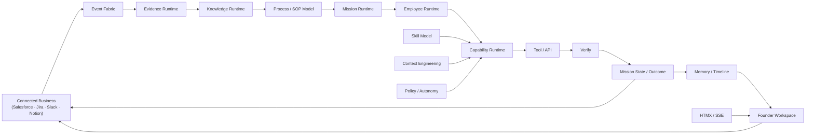

# OntologyAI PRD — V6 "Virtual COO Office for B2B SaaS Founders"

> **Canonical Product Requirements Document.** This file is the single source of truth for the OntologyAI product.
> Version: **V6 — Virtual COO Office** (supersedes all prior "Decision Intelligence Platform" framing).
> Last updated: **August 2026**.

## 1. Product

- **Name:** OntologyAI
- **Category:** Virtual COO / Organizational Operations Intelligence
- **Target:** Founder-led B2B SaaS companies
- **Scope:** Portfolio project, not production SaaS

## 2. Vision

Demonstrate how a B2B SaaS founder can use a continuously operating digital workforce to reduce the four recurring dependencies: information, standards, decision, and execution.

## 3. Problem

Operational knowledge is fragmented across CRM, project management, communication, and documentation systems. The founder repeatedly becomes the integration layer between them. OntologyAI creates persistent organizational context and gives scoped AI employees the ability to observe, investigate, coordinate, and execute digital operational work.

## 4. MVP Boundaries

- **Integrations:** exactly Salesforce, Jira, Slack, Notion. No additional connectors in MVP.
- **Business pillars:** exactly Marketing, Sales, Operations, Finance.
- **AI employees:** exactly RevOps Intern, ProductOps Intern, Organizational Intelligence Intern.
- **Core missions:** nine canonical missions rather than automating an entire company.
  - RevOps: stalled-opportunity investigation, CRM hygiene review, follow-up coordination.
  - ProductOps: blocked-work investigation, roadmap/process health review, documentation synchronization.
  - Org Intelligence: decision capture, SOP freshness review, ownership/bottleneck investigation.

**Pillar ↔ employee coverage (intentional, not symmetric).** Business pillars are the domain model; employees are role configurations. Coverage is deliberately uneven — the project proves the digital-workforce architecture, not per-pillar automation:

| Business area | Primary AI employee | MVP coverage |
|---------------|---------------------|--------------|
| Marketing | RevOps Intern | Limited |
| Sales | RevOps Intern | Strong |
| Operations | ProductOps Intern | Strong |
| Finance | Org Intelligence / existing finance capabilities | Monitoring / context only |
| Cross-functional | Org Intelligence Intern | Strong |

**Do not create a Finance Intern to make the pillar coverage symmetric.** The four pillars (Marketing, Sales, Operations, Finance) are covered by the three interns because none of the nine canonical missions is a finance mission; a finance intern is not a priority unless a finance mission is authored.

## 5. Domain Model

Core entities: Organization, BusinessPillar, Process, ProcessStep, SOP, SOPVersion, Owner, Role, KPI, MetricObservation, Mission, MissionEvent, MissionSnapshot, Evidence, Source, CanonicalEntity, EntityAlias, Relationship, Decision, Recommendation, Capability, Skill, EmployeeDefinition, EmployeeRun, Action, ActionResult, Policy, Approval, Memory, Workspace, Outcome.

Rule: do not add entities merely to look comprehensive; each entity must support an actual MVP behavior.

**Three things that must never merge — strict separation across three tables/models:**

- **`EmployeeDefinition`** — what the employee IS: role config, skills, capabilities, permissions, policies, authority, risk threshold, KPIs, memory namespace.
- **`EmployeeRun`** — what it is CURRENTLY DOING: runtime state, current mission, memory/learned context, allowed capabilities.
- **`Mission`** — the persistent objective it is working toward.

**Rule: "You can't put what an employee is doing INTO what an employee is."** Role config, runtime state, and mission objective are three separate tables/models. Runtime state and learned context stay out of the role configuration.

**Implementation status:** a canonical entity model exists at `apps/ai/src/entities/models.py` (strict Pydantic entities, `extra="forbid"`, including Evidence, Source, KPI, Decision, Policy, Workspace, and others). BusinessPillar, SOP, Mission, Action, Review, and AIEmployee entities are **PLANNED** — not yet present in the model.

## 6. Process Contract

Every operational process: Input → Trigger → Preconditions → Steps → Decision Points → Output → KPI → Feedback. Every process defines: owner, objective, scope, allowed actors, SOP, expected output, Definition of Done, escalation conditions, review cadence.

**Implementation status:** BusinessPillar/Process entities are **PLANNED** (not yet in `apps/ai/src/entities/models.py`).

## 7. SOP Contract

An SOP contains: objective, scope, owner, prerequisites, steps, decision rules, Definition of Done, FAQ/troubleshooting, linked systems, revision history, last-reviewed timestamp. SOPs are living knowledge objects. AI execution may propose an SOP update but must never silently rewrite authoritative SOPs.

**Implementation status:** the SOP module/contract is **PLANNED** — currently missing.

## 8. Mission Runtime

A mission is a persistent operational objective. Example: Mission "Investigate stalled Enterprise opportunities", Owner RevOps Intern, Goal "Reduce stale Enterprise pipeline", Inputs Salesforce + Slack + Jira, SOP stalled-opportunity-v2, KPI opportunity_age, Authority medium, Review every 6 hours.

Mission states: CREATED, ACTIVE, WAITING, INVESTIGATING, AWAITING_APPROVAL, EXECUTING, MONITORING, COMPLETED, ARCHIVED, FAILED, PAUSED.

Mission supports: pause, resume, redirect, reprioritize, interrupt, approve, reject, escalate, retry, replan, continue-as-new.

**Implementation status:** mission machinery exists in `apps/ai/src/mission/` (`timeline.py`, `decision.py`, `storage.py`, `runtime.py`, `orchestrator.py`, `coordinator.py`) and `apps/ai/src/session/` (`mission_state.py`, `relevance_gate.py`). The mission-state write path `POST /api/mission-state` → PostgreSQL is working. The frozen V6 set of nine canonical mission configs is **PLANNED** (5+ Temporal workflows exist today).

## 9. Employee Runtime

An employee is: Role + Goals + Permissions + KPIs + Memory + SOPs + Skills + Capabilities + Policies + Authority + Risk Threshold. The runtime can perform: sequential, parallel, branching, looping, iteration, delegation, verification, reflection, replanning, human interruption. Do NOT create a separate hard-coded workflow graph per employee.

**Implementation status:** `apps/ai/src/mission/employee.py` defines DigitalEmployee plus RevOps/ProductOps/OrgIntelligence intern classes. Current state: **hard-coded classes, not yet configs over a shared runtime** — the config-driven shared Employee Runtime is **PLANNED**.

## 10. Skill Model

Reusable reasoning/work units with typed inputs/outputs. Examples: retrieve evidence, retrieve organizational memory, resolve entities, investigate anomaly, analyze KPI, compare options, summarize evidence, generate recommendation, draft communication, verify action, update SOP proposal, capture decision. Skills are composable.

## 11. Capability Runtime

Employees never directly access connector SDKs; they invoke capabilities (Employee → Skill → Capability → Connector). Capabilities enforce: authorization, schema validation, idempotency, timeout, retry, risk policy, audit, result validation. MVP capabilities: Salesforce read/update, Jira read/create/update, Slack read/send, Notion read/update.

**Implementation status:** capability machinery exists in `apps/ai/src/mission/capability.py` and the capability model in `apps/ai/src/ontology/capability_*.py`. The V6Connector Protocol lives in `apps/ai/src/connectors/` (`v6_contract.py`, `v6_base.py`, `transport.py`, `sync_state.py`, `registry.py`).

## 12. Agentic Control Model

**MVP control patterns are exactly:** Sequential, Parallel, Branch, Loop, Wait/Human-signal, Replan, Verify.

- Sequential (retrieve → analyze → recommend)
- Parallel (Salesforce/Slack/Jira → aggregate)
- Branch (event → determine affected pillar/process → select employee/mission)
- Loop (observe → choose next skill → execute → observe → continue) — only when the next action can't reasonably be predetermined
- Wait/Human-signal (pause for founder approval or intervention)
- Replan (redirect or reprioritize after human input)
- Verify (confirm the outcome before the mission completes)

Delegate and Reflect are behavior WITHIN the loop, not separate infrastructure.

**Guardrail: do not build a generic workflow engine.** The control model is a bounded set of patterns over the shared Employee Runtime — not a LangGraph/Temporal clone.

## 13. Context Engineering

LLMs never receive arbitrary raw connector dumps. Context assembled from: Mission + Employee role + Business pillar + Process + SOP + Current evidence + Knowledge graph + Hybrid retrieval + Memory + Recent decisions + KPIs + Policies + Permissions + Workspace state + User instructions. Pipeline: Retrieve → Filter → Rank → Deduplicate → Compress → Assemble → Validate → LLM → Pydantic.

## 14. RAG

Hybrid retrieval: BM25 + Vector + Graph + Metadata + Recency + Importance. RAG is infrastructure, not the product. Every generated recommendation retains evidence references; unsupported claims rejected or marked uncertain.

**Implementation status:** memory/RAG machinery exists in `apps/ai/src/memory/` (`spine.py` — Qdrant L2/L5, threshold 0.82 — plus Graphiti and Qdrant). The memory stack is under **ADR-009 review** (Qdrant vs pgvector — unresolved).

## 15. Continuous Data Pipeline

Connector → Event → Deduplication → Evidence → Normalization → Validation → Entity Resolution → Knowledge Graph → Memory → Mission Evaluation → Employee Work → Workspace Update. Requirements: replay-safe, idempotent, retryable, observable, tenant-aware, fault tolerant.

**Implementation status:** evidence (`apps/ai/src/evidence/`), pipeline engines (`apps/ai/src/pipeline/` — artifact, decision, feasibility, validation with rules V001–V008), and knowledge (`apps/ai/src/knowledge/` — entity_resolver, graph_builder, conflict_resolver, semantic_layer) exist.

## 16. Event Fabric

Redpanda is the event backbone. Events contain: event ID, tenant/org ID, source, entity ID, timestamp, schema version, correlation ID, causation ID, payload. Duplicate events must not cause duplicate work.

**Implementation status:** the current event bus in `apps/ai/src/events/` is Redis Streams-based; Redpanda is provisioned in `docker-compose.yml`. The Redpanda event backbone is the target per this spec.

## 17. Memory

Four logical namespaces: Enterprise, Workspace, Mission, Conversation. Use existing Qdrant/Neo4j infrastructure (ADR-009 stack review pending). Memory must remain evidence-grounded.

**Implementation status:** `apps/ai/src/memory/` (spine, Qdrant, Graphiti) exists. Stack choice is under **ADR-009 review** — do not assume a single stack.

## 18. Decision and Autonomy

Two different classifications, applied at different stages:

1. **Work design decision — Automate / Delegate / Eliminate.** Decides WHAT should happen to a piece of work. Produced by Process Review.
2. **Runtime risk policy — LOW / MEDIUM / HIGH / CRITICAL.** Decides HOW MUCH AUTHORITY the AI has for a given action.

**The automation decision (Automate/Delegate/Eliminate) is NOT the same as the risk tier (LOW/MEDIUM/HIGH/CRITICAL).**

Cascade (ordered flow):

```
Process Review
→ Automate / Delegate / Eliminate
→ if automated or delegated: Action
→ Risk Classification → LOW / MEDIUM / HIGH / CRITICAL
→ Policy Decision → Execute / Recommend / Approve / Block
```

Risk-based execution: LOW = auto-execute if policy allows; MEDIUM = recommendation + approval or configured auto-execution; HIGH = mandatory human approval; CRITICAL = no automatic execution. Every action records: reason, evidence, confidence, authority, policy decision, idempotency key, result, rollback/recovery metadata where applicable.

**Implementation status:** HITL approvals and Temporal signals exist (`apps/ai/src/hitl/`, `@governed_write` in `apps/ai/src/ontology/governance.py`, `SignalWorkflow("hitl-approval")`). The work-classification layer (Automate/Delegate/Eliminate) and the risk-tier policy layer are **PLANNED**.

## 19. Human Control

Owner can pause, resume, redirect, reprioritize, approve, reject, interrupt, request explanation. Temporal Signals used for durable intervention.

**Implementation status:** `SignalWorkflow("hitl-approval")` unblocks `AwaitWithTimeout` via the Temporal client in `apps/core/internal/temporal/client.go`; the HITL approval queue panel is served by `apps/core/internal/web/command_center_approvals.go`.

## 20. Operational Workspace

Keep existing Go + HTMX architecture; no React/GenUI for MVP. Components: KPI card, mission card, recommendation, timeline, evidence list, knowledge graph, approval card, activity feed, process/SOP status. SSE provides live updates. Workspace renders typed workspace state; it is not the source of business logic.

**Implementation status:** `apps/core/internal/web/` serves the command center (Fiber + HTMX + SSE): `handler.go`, `sse.go` + `sse_hub.go` (per-tenant Subscribe with event-type filtering, buffered channels), `command_center_*.go` panels, `telemetry_handler.go`, and `templates/command_center.html` + `partials/`. The `/v6` routes are **PLANNED** — currently 501 Not Implemented stubs in `apps/core/internal/v6/`.

## 21. Mission Timeline

Append-only event history + versioned snapshots. Required events: MISSION_CREATED, MISSION_STARTED, MISSION_REVIEWED, MISSION_PAUSED, MISSION_RESUMED, MISSION_REPLANNED, MISSION_REDIRECTED, MISSION_APPROVED, MISSION_REJECTED, MISSION_EXECUTED, MISSION_CONFIDENCE_CHANGED, MISSION_STATUS_CHANGED, MISSION_PRIORITY_CHANGED, MISSION_COMPLETED. Every significant transition traceable.

**Implementation status:** `apps/ai/src/mission/timeline.py` implements frozen `MissionEventType` verbs, append-only `timeline_events`, versioned `mission_snapshots`, and snapshot diffing.

## 22. Observability

Use existing OpenTelemetry, Langfuse, Sentry. Trace: event → retrieval → context → LLM → decision → skill → capability → execution → outcome. Record: latency, tokens, model, cost, retrieval, tool calls, retries, errors, confidence, outcome. Never log secrets or unrestricted customer content.

**Implementation status:** `apps/ai/src/observability/` provides typed `TraceContext` (trace_id/correlation_id/tenant_id) and `PipelineRun`/`run_stage` (retry, latency, status); Langfuse traces are in use.

## 23. Security

Tenant isolation, authentication, authorization, tool allowlists, policy enforcement, prompt-injection defenses, output validation, secret isolation, context isolation, audit logging, approval enforcement. LLM output is untrusted input.

**Implementation status:** governed writes (`@governed_write`), an authority manifest with role/permission/tool allowlists (`apps/ai/src/agents/authority_manifest.py`), and the HITL approval queue (`apps/ai/src/hitl/`) exist.

## 24. Evaluation

- Deterministic: schema correctness, permissions, policy, idempotency, replay, state transitions, tool contracts.
- AI: retrieval relevance, evidence grounding, recommendation quality, reasoning consistency, instruction adherence.
- Operational: mission completion, time to investigation, recommendation acceptance, execution success, founder intervention, process consistency.

## 25. Golden Scenarios

stalled enterprise opportunity, blocked product work, stale SOP, undocumented decision, ownership gap, KPI deterioration, cross-system contradiction, human redirect, failed tool execution, infrastructure restart. Each defines: input events, expected evidence, expected context, expected mission, allowed actions, expected tool calls, expected human gate, expected outcome.

## 26. Reliability Requirements

Duplicate events harmless; missions survive restart; Temporal replay produces identical state; continue-as-new preserves mission state; tool retries do not duplicate actions; LLM transient failures recover; unavailable connectors degrade gracefully; malformed LLM output rejected; stale evidence detected; partial failures observable; tenant data cannot cross boundaries.

## 27. Portfolio Demonstration

Simulated B2B SaaS over several days: Day 1 business data arrives; Day 2 pipeline problem appears, RevOps investigates automatically, evidence from Salesforce+Slack+Jira correlated, recommendation generated, founder redirects mission, employee replans, approved work executed; Day 3 new evidence arrives, mission wakes automatically, confidence changes, outcome evaluated, organizational memory updated. Feels like a continuously operating digital team, not a chatbot.

## 28. Explicit Non-Goals

No generic autonomous company; no unrestricted general-purpose agent; no agent marketplace; no 10+ employees; no additional connectors; no custom LLM training; no React/GenUI rewrite; no artifact-generation platform; no generic BI replacement; no unrestricted autonomous financial/legal decisions.

## 29. Definition of Done

Complete when the three AI employees can operate their bounded missions against the four systems through the shared runtime, cycling Observe → Understand → Investigate → Act → Verify → Remember continuously and safely. Proof: a founder can see a digital operations team continuously monitoring the company, understanding context, performing bounded work, and escalating only what requires human judgment.

**Portfolio acceptance (single criterion):** A simulated B2B SaaS runs for multiple days while OntologyAI continuously ingests events from four connected systems, updates organizational knowledge, wakes appropriate missions, allows its three AI employees to investigate and execute bounded work using sequential/parallel/branching behavior, handles human interruption and replanning, survives retries/restarts/replay, records an auditable timeline, verifies outcomes, and continuously maintains the founder operational workspace. If it works, stop.

---

## Example — the 8-day stalled opportunity

A Salesforce opportunity remains unchanged for eight days:

```
Salesforce event
→ Evidence
→ Opportunity resolved in ontology
→ Revenue process identified
→ SOP retrieved
→ Slack/Jira context investigated in parallel
→ Engineering dependency discovered
→ Mission confidence decreases
→ RevOps Intern prepares recommendation
→ Founder receives explanation
→ Approved capability updates Salesforce
→ Jira follow-up created
→ Slack owner notified
→ Mission verifies outcome
→ Memory updated
```

The founder did not manually coordinate those steps.

---

## Architecture view

